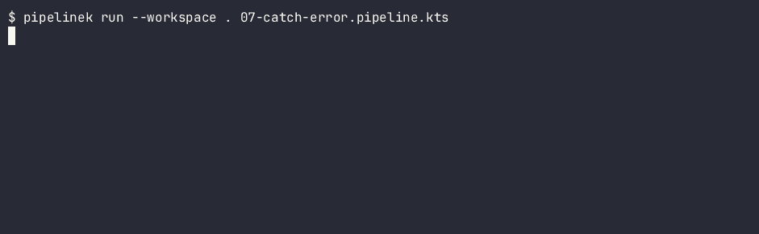

# PipelineK

[](https://github.com/Rubentxu/pipeline-kotlin/releases)
[](LICENSE)


**Español** · [English](README.md)

**Un motor CI/CD local-first con un DSL de Kotlin familiar con Jenkins.** Escribes un fichero
`.pipeline.kts` y PipelineK lo compila, valida y ejecuta **en tu máquina**. Sin controller, sin agente,
sin estado remoto, sin phone-home.

```kotlin
// pipeline.kts
pipeline {
    stages {
        stage("build") {
            sh("./gradlew --no-daemon build")
            sh("test -f build/libs/*.jar")
            echo("PIPELINE-OK")
        }
    }
}
```

```bash
pipelinek validate pipeline.kts
pipelinek run --workspace . pipeline.kts
```

Si conoces Jenkins, ya sabes leer esto. Si conoces Kotlin, ya sabes arreglarlo.

---

## Qué hace

**Compila tu pipeline antes de ejecutar nada.** Tu fichero es Kotlin de verdad, compilado por el
compilador de Kotlin de verdad. Un error de tipos significa que no se ejecuta nada: el error te llega
en el editor, no medio minuto dentro de un run.

```bash
$ pipelinek run examples/01-hello.pipeline.kts
[INFO]  RunStarted runId=… 
[INFO]  StageStarted stage=01-hello
[INFO]  StepStarted step=echo
PIPELINE-OK
[INFO]  StepFinished step=echo outcome=success
[INFO]  RunFinished outcome=success
$ echo $?
0
```

**Lo deja todo registrado, así que un crash no es un run perdido.** Cada operación se journaliza con
una huella SHA-256 de sus entradas. Si el proceso muere, el siguiente run **reconoce** lo ya ocurrido
en vez de repetirlo a ciegas.

```bash
pipelinek run --db journal.db pipeline.kts          # primera vez
pipelinek run --db journal.db pipeline.kts --resume # reanuda
```

**Le habla a otros procesos.** Cada paso emite sus propios eventos tipados, para que un sistema
externo pueda observar y reaccionar desde otro proceso. Esto es semántica, no líneas de log.

```bash
pipelinek events --db journal.db <run-id> --kind StepFailed
```

**Conoce Jenkins.** Los pasos atómicos y de bloque llevan los nombres y el comportamiento que esperas:
`sh`, `echo`, `dir`, `timeout`, `retry`, `catchError`, `waitUntil`, `milestone`, `stash`, `cleanWs`.
Ver los [Ejemplos](#ejemplos) más abajo: hay diez que se ejecutan contra el binario publicado.

### Las tres ideas que explican el resto

1. **Falla cerrado.** Ante una duda, **parar**. Un Step desconocido, un token desconocido, una versión
   de schema incompatible: todo se rechaza antes de producir cualquier efecto. Por eso un plugin
   desconocido nunca se ignora en silencio.
2. **Los eventos son semántica, no logs.** Un Step cuyo único efecto observable es su valor de retorno
   se considera incompleto.
3. **El estado se persiste, y por eso un run se puede reanudar.** Las huellas del journal son lo que
   hace posible "reengancharse, no relanzar".

### Y qué no hace

| ✅ Hace | ❌ No hace |
|---|---|
| Compila, valida e inspecciona `.pipeline.kts` | **No** hay CI remota en este repositorio |
| Ejecución durable con journal SQLite (`--db`), reanudable | **No** hay controller ni ejecución remota: el control plane es otro proyecto |
| Stream de eventos tipado, consultable con `pipelinek events` | **No** hay Jenkins ni Kubernetes: eso es de `pipelinek-fabric` |
| DSL familiar con Jenkins | **No** hay demonio: una ejecución por invocación |
| Bloques `script {}` con control de flujo Kotlin real | **No** está "listo para producción": la puerta de producto está bloqueada |
| Plugins externos que aportan Steps *y* eventos **sin tocar el core** | `agent`, `load`, `node`, `ansiColor` y el retrofit de `retry` **no funcionan**: sintaxis aceptada que falla siempre de forma cerrada |
| Credenciales locales cifradas, con redacción en el log | **No** es un sustituto de un plan de control remoto |

> **Estado.** Release actual: **`0.47.0`**, que trae `pipelinek-0.47.0.zip` y un manifiesto `SHA256SUMS`,
> así que su digest es verificable por el consumidor. **No hay CI remota desde el 2026-09-30**, así que
> "CI verde" no es una evidencia disponible aquí: la verificación es local, manual y atada a un commit.
> La puerta de producto está `BLOCKED_EXTERNAL`.

---

## Ejemplos

Diez pipelines ejecutables en [`examples/`](examples/), cada uno ejecutado contra el binario publicado
por `examples/run.sh`, que comprueba el exit code, el outcome terminal y —en los interesantes— el
contrato de eventos.

```bash
pipelinek run --workspace /tmp/pk-example examples/03-shell.pipeline.kts   # binario instalado
examples/run.sh 03-shell.pipeline.kts   # repo clonado: comprueba exit + outcome
examples/run.sh                        # los diez
```

| Ejemplo | Qué muestra | Exit |
|---|---|---|
| `01-hello.pipeline.kts` | Mínimo: un stage, un `echo` | `0` |
| `02-multi-stage.pipeline.kts` | Los stages corren en orden de declaración | `0` |
| `03-shell.pipeline.kts` | Procesos reales del SO con `sh`, incluido un bucle `for` de shell | `0` |
| `04-kotlin-control-flow.pipeline.kts` | Control de flujo Kotlin dentro de `script {}` | `0` |
| `05-failing-step.pipeline.kts` | `sh("exit 3")` → `StepFailed(kind=SCRIPT)`; el stage siguiente **no corre** | `1` |
| `06-durable.pipeline.kts` | Ejecución durable con `--db`: journal, huellas, reanudación tras crash | `0` |
| `07-catch-error.pipeline.kts` | `catchError` anidado: `FAILURE` interno → `UNSTABLE` externo, el run sigue | `0` |
| `08-parallel.pipeline.kts` | Dos ramas concurrentes; el segundo run reutiliza en vez de relanzar | `0` |
| `09-retry.pipeline.kts` | `retry(3) { }`: el primer intento falla, el segundo funciona | `0` |
| `10-timeout.pipeline.kts` | `timeout(2, "SECONDS")` aborta un `sh` que se pasa de tiempo | `1` |

Merece la pena leer dos completos, porque son los que muestran lo que hace que PipelineK sea
PipelineK.

**Fallar a propósito, y parar ahí** (`examples/05-failing-step.pipeline.kts`):

```kotlin
pipeline {
    stages {
        stage("ok")     { sh("echo first stage runs") }
        stage("fails")  { sh("exit 3") }               // ← el shell sale con 3
        stage("after")  { sh("echo never-reached") }   // ← nunca se ejecuta
    }
}
```

Exit code `1`, outcome `failure`, y el stage `after` no produce ningún evento. Un Step fallido detiene el
run — no sigue rodando por lo que queda.

**Manejo de errores anidado** (`examples/07-catch-error.pipeline.kts`):

```kotlin
pipeline {
    stages {
        stage("catch-demo") {
            catchError(buildResult = "UNSTABLE", stageResult = "UNSTABLE") {   // exterior
                catchError(buildResult = "FAILURE", stageResult = "FAILURE") { // interior
                    sh("exit 1")                     // falla
                }                                     // el interior lo pasa a FAILURE
            }                                         // el exterior lo degrada a UNSTABLE
            echo("continues after nested catch")     // el run sigue
        }
    }
}
```

Exit code `0`, outcome **`unstable`**: el run terminó, pero marcado como no-del-todo-verde. Ese tercer
estado es la razón por la que `0` no siempre significa `success`.

Detalle completo, incluidas las limitaciones conocidas de cada ejemplo:
[`examples/README.md`](examples/README.md).

**Mira los diez en vez de leer sobre ellos** —
[`docs/user/examples.es.md`](docs/user/examples.es.md) ejecuta cada pipeline contra el binario real,
un GIF animado por pipeline, con el código de salida en pantalla. Aquí va el que merece verse primero,
porque `unstable` es un estado que la mayoría de sistemas de CI no tiene:



Cada GIF declara en la página qué deja fuera — el array JSON de eventos de stdout — y
[`examples/run.sh`](examples/run.sh) es la comprobación que hay detrás, no las imágenes.

---

## Cómo funciona

```text
   📄 TU pipeline.kts                 La receta. Kotlin real, compilado de verdad.
            │
            ▼
   🧪 COMPILADOR DE SCRIPTS           Si no compila tipado, NO se ejecuta nada.
      (Kotlin24ScriptingHost)
            │
            ▼
   🧱 DEFINICIÓN COMPILADA            Entendida y validada. Inmutable:
      (CompiledPipeline)               inspeccionable antes de ejecutar nada.
            │
            ▼
   📖 REGISTRO DE STEPS               "¿qué pasos conozco?" — falla cerrado si no.
      (registro + plugins)             Un Step desconocido se rechaza ANTES de cualquier efecto.
            │
            ▼
   🧭 COORDINADOR DURABLE             El único bucle de control. Decide.
            │
            ▼
   ⚙️ MOTOR DE DISPATCH               Ejecuta lo decidido:
      (StepDispatchEngine)             journal → replay → efecto → evento → resultado.
            │                         Un Step pide capacidades por nombre,
            │                         nunca "un contexto".
            ├────────────► 🗄️ EVENT STORE   SQLite · JSON · en memoria
            ▼
   📤 SALIDA                          pipelinek events  ·  pipelinek console
```

Las dependencias apuntan siempre hacia dentro: los adaptadores dependen de contratos, los contratos del
núcleo, y `pipeline-domain` no depende de nada — un fitness test lo vigila.

Lo que se publica es sólo el contrato. `pipeline-events` lleva el contrato del plano de eventos sin
SQLite ni ficheros; `pipeline-events-store` lleva el journal y el cursor y **no se publica**. Esa
separación es la que permite que otro runtime implemente el mismo contrato.

---

## Instalación

Un único ZIP canónico por release. Todos los canales consumen los mismos bytes y verifican el mismo
SHA-256; ningún canal reconstruye PipelineK. Esa regla está decidida en
[`ADR-0089`](docs/v2/04-adrs/ADR-0089-distribution-artifact-authority-sdkman.md) y en
[`DISTRIBUTION_RELEASE_SPEC.md`](docs/v2/03-specifications/DISTRIBUTION_RELEASE_SPEC.md).

| Opción | Cómo |
|---|---|
| **ZIP canónico** | Descarga `pipelinek-0.47.0.zip` de la release, verifica su digest y descomprime. Java 21+, Linux/macOS/WSL |
| **Instalador multi-versión** | `scripts/install-pipelinek.sh` — `install` / `use` / `list` / `uninstall` / `doctor`. Allowlist de URL fail-closed, digest verificado, sin `sudo` |
| **Bootstrap `curl \| sh`** | `scripts/install-pipelinek-curl.sh` — POSIX `sh`, 13 códigos de salida nombrados, verifica el instalador antes de delegar. **Aún no usable**: ninguna release publica el instalador como asset (`…/download/v0.47.0/install-pipelinek.sh` da 404), así que sale con `10` en vez de instalar |
| **asdf** | `asdf plugin add pipelinek https://github.com/rubentxu/asdf-pipelinek.git` y luego `asdf install pipelinek 0.47.0`. Descarga el ZIP de la release, comprueba su SHA-256 contra el `SHA256SUMS` publicado y falla cerrado si no coincide. Nunca compila. Necesita JDK 21+ en el `PATH`. **[Míralo funcionar](docs/user/examples.es.md#00--instalar-con-asdf)** |
| **mise** | `mise use -g pipelinek@0.47.0`. La entrada del registro resuelve (`mise ls-remote pipelinek` lista 0.40.0–0.47.0); aquí **no** se completó un `mise install`, así que trátalo como no verificado de extremo a extremo |

```bash
VERSION=0.47.0
curl -fL -o "pipelinek-${VERSION}.zip" \
  "https://github.com/Rubentxu/pipeline-kotlin/releases/download/v${VERSION}/pipelinek-${VERSION}.zip"
echo "2fa2d272e3b0ad385ef780e165028efaa83f92804a123f1836e17e0690d3301c  pipelinek-${VERSION}.zip" | sha256sum -c -
unzip "pipelinek-${VERSION}.zip"
./pipelinek-${VERSION}/bin/pipelinek doctor
```

<details>
<summary>Página de instalación completa, requisitos y trampas</summary>

Requisitos: **Java 21+** (certificado en Temurin 21.0.8 y 24.0.2), Linux / macOS / Windows vía WSL,
~92 MB para la distribución. Una ejecución por invocación; sin demonio.

El ZIP se ejecuta desde donde lo desempaquetes, así que no necesita tocar el `PATH` ni usar `sudo`. El
instalador multi-versión deja las versiones bajo `~/.local/share/pipelinek/` y nunca escribe en `/usr`
ni en `/opt`.

<details>
<summary>Dos trampas que conviene saber antes de empezar</summary>

**1. Los flags van antes del script.** El parser se detiene en el primer token que no sea `--`, así que
`run pipeline.kts --db x` **ignora `--db x` en silencio**. Escribe `run --db x pipeline.kts`.

**2. En este repositorio, el wrapper de Gradle vive en `v2/`.** En la raíz no hay `./gradlew`:

```bash
cd v2 && ./gradlew check        # ✅
v2/gradlew -p v2 check          # ✅
./gradlew -p v2 check           # ❌ no existe
```

</details>

</details>

---

## Códigos de salida

| Código | Significado |
|---|---|
| `0` | `SUCCESS` o `UNSTABLE` |
| `1` | `FAILURE` / `ABORTED`, o error de compilación, o argumentos CLI inválidos |
| `2` | Invocación o admisión: script no encontrado, `validate` fallido, `--resume` sin `--db`, un Step no canónico |
| `3` | Artefacto sin `Implementation-Version`, o credenciales sin passphrase |
| `4` | Almacén de credenciales adulterado |

Detalle en [`docs/user/cli-reference.md`](docs/user/cli-reference.md).

---

## Documentación

**Empieza aquí → [`docs/user/README.es.md`](docs/user/README.es.md) · [English](docs/user/README.md)**

Tres rutas según por qué estés aquí, y un registro de qué construcciones del DSL están **probadas**
frente a merely **declaradas**.

| Ruta | Para quién |
|---|---|
| **A** | Quiero ejecutar pipelines — instalación, primeros pasos, DSL, referencia del CLI |
| **B** | Quiero operarlo en condiciones — workspace, credenciales, eventos y diagnóstico |
| **C** | Quiero contribuir con código — `CONTEXT.md`, constitución semántica, `AGENTS.md` |

---

## Desarrollo local

```bash
cd v2 && ./gradlew :pipeline-application:installDist
# → v2/pipeline-application/build/install/pipelinek/bin/pipelinek
```

| Tarea | Qué hace |
|---|---|
| `cd v2 && ./gradlew check` | Gate normal |
| `cd v2 && ./gradlew check --rerun-tasks` | Gate completo desde cero |
| `cd v2 && ./gradlew :pipeline-application:test --tests 'CanonicalInMemoryCliTest'` | Bucle rápido de un test |
| `cd v2 && ./gradlew :pipeline-architecture-tests:test` | Sólo los fitness tests de arquitectura (47 clases `FArch*`, ~510 casos) |

Requiere JDK 21 y Gradle 8.14.5 vía el wrapper, que **sólo existe en `v2/gradlew`**. Opcionalmente
`just` + `devbox`.

Dos cosas que le cuestan una hora a la gente aquí: nunca lances dos Gradle a la vez sobre un checkout
(hay un `FileLock` que falla rápido), y lee siempre `^e: ` antes de creer cualquier resultado de test —
si la compilación de los tests falló, Gradle ejecuta la clase compilada *anterior* e informa de su
resultado.

### Dónde se trackea el trabajo de ingeniería

| Si quieres saber… | Lee |
|---|---|
| Qué se está construyendo y en qué orden | [`docs/v2/05-roadmap/ROADMAP.md`](docs/v2/05-roadmap/ROADMAP.md) |
| Por qué existe el trabajo de la fundación local | [`LOCAL_FOUNDATION_CONSOLIDATION.md`](docs/v2/05-roadmap/LOCAL_FOUNDATION_CONSOLIDATION.md) — el roadmap de consolidación LFC, con el progreso por fase |
| Qué se decidió, y por qué | [`docs/v2/04-adrs/`](docs/v2/04-adrs/) |
| Qué está realmente verificado | [`docs/v2/07-uat/`](docs/v2/07-uat/) — la evidencia es por commit y nunca se hereda |

---

## Contribuir

Lee [`CONTEXT.md`](CONTEXT.md) primero (45 líneas), y después
[`docs/pipelinek-semantic-evolution/01-semantic-constitution.md`](docs/pipelinek-semantic-evolution/01-semantic-constitution.md).
Esos dos son donde vive el vocabulario y las leyes.

Cinco conceptos que hay que interiorizar:

1. **Falla cerrado.** Un hueco silencioso es peor que un valor erróneo: el valor se comprueba, el hueco no.
2. **Un recibo es evidencia de su propio SHA y no hereda nada.** Mueve el código y la evidencia caducó.
3. **Un test que no puede fallar no es un test.**
4. **Compilar no es conservar.** Cada construcción del DSL necesita un carrier tipado, un desugar puro con tests de equivalencia, o una negativa que falle cerrado.
5. **Mutación > revisión** — y mutar de más también es un defecto.

Hay una **disciplina de work units** y una puerta de calidad en [`AGENTS.md`](AGENTS.md). Léela antes
de escribir código: no todo cambio entra por la puerta grande, y algunos necesitan trazabilidad
explícita a un criterio de salida.

---

## Agradecimientos

- Al equipo de Kotlin, por un lenguaje excelente.
- A [Jenkins Pipeline](https://www.jenkins.io/doc/book/pipeline/) y GitHub Actions, por el modelo
  mental al que este DSL pretende parecerse.

## Licencia

[MIT](LICENSE) © Rubén Torres.