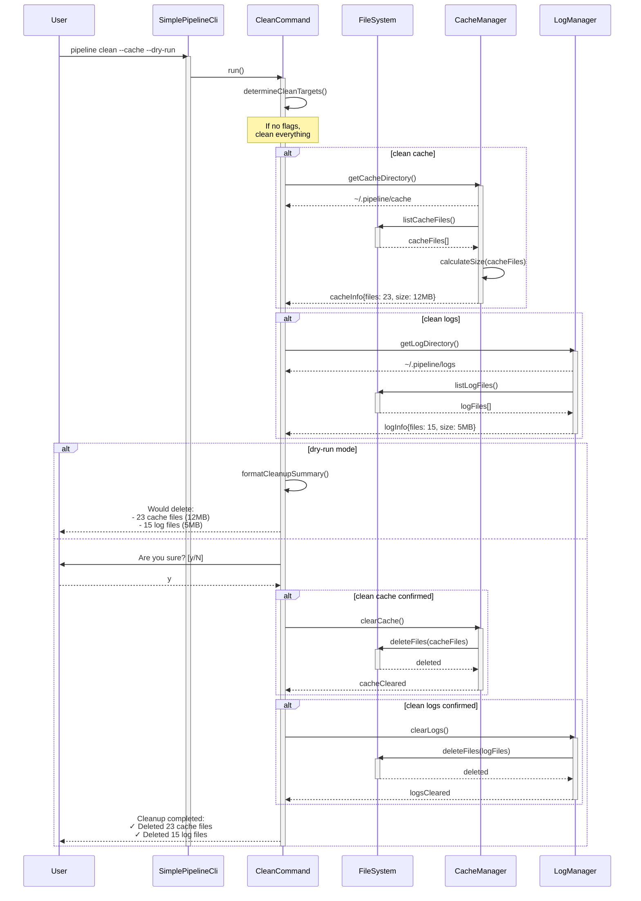
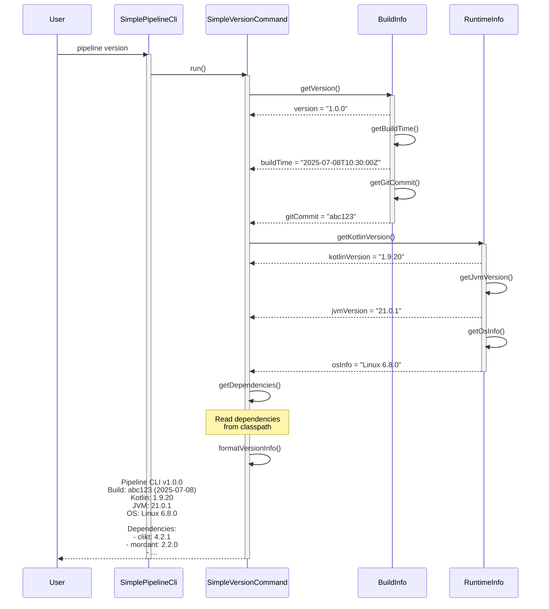

# Pipeline CLI Use Cases - Sequence Diagrams

This document describes the main use cases of the Pipeline CLI using sequence diagrams in Mermaid format.

## Table of Contents

1. [Execute a Pipeline](#execute-a-pipeline)
2. [Validate a Pipeline](#validate-a-pipeline)
3. [List Pipelines](#list-pipelines)
4. [Clean Cache and Logs](#clean-cache-and-logs)
5. [Show Version](#show-version)

## Execute a Pipeline

This diagram shows the complete flow when a user executes the `pipeline run <script>` command.

```mermaid
sequenceDiagram
    participant User
    participant CLI as SimplePipelineCli
    participant RunCmd as SimpleRunCommand
    participant ConfigLoader
    participant Runner as PipelineScriptRunner
    participant Engine as PipelineDslEngine
    participant Pipeline
    participant StageExecutor
    participant StepsBlock
    participant Shell
    participant Agent as DockerAgent

    User->>CLI: pipeline run build.pipeline.kts -v
    activate CLI
    
    CLI->>RunCmd: run()
    activate RunCmd
    
    RunCmd->>RunCmd: validateScriptPath()
    alt file does not exist
        RunCmd-->>User: Error: Script not found
        deactivate RunCmd
        deactivate CLI
    end
    
    RunCmd->>ConfigLoader: loadConfig(configPath)
    activate ConfigLoader
    ConfigLoader-->>RunCmd: PipelineConfig
    deactivate ConfigLoader
    
    RunCmd->>Runner: evalWithScriptEngineManager(scriptPath, config)
    activate Runner
    
    Runner->>Engine: compile(scriptSource)
    activate Engine
    Note over Engine: Compiles .kts script<br/>with Kotlin Scripting API
    Engine->>Engine: applySecurityPolicies()
    Engine->>Engine: cacheCompiledScript()
    Engine-->>Runner: CompiledScript
    deactivate Engine
    
    Runner->>Pipeline: PipelineDefinition.build()
    activate Pipeline
    Note over Pipeline: Builds pipeline structure<br/>from DSL
    Pipeline-->>Runner: Pipeline instance
    
    Runner->>Pipeline: executeStages()
    
    loop for each stage
        Pipeline->>StageExecutor: run(stage)
        activate StageExecutor
        
        StageExecutor->>Agent: prepare()
        activate Agent
        Note over Agent: Starts Docker container
        Agent-->>StageExecutor: ready
        
        StageExecutor->>StepsBlock: execute()
        activate StepsBlock
        
        loop for each step
            alt sh step type
                StepsBlock->>Shell: execute(command)
                activate Shell
                Shell->>Agent: runInContainer(command)
                Agent-->>Shell: output/exitCode
                Shell-->>StepsBlock: result
                deactivate Shell
            else echo step type
                StepsBlock->>StepsBlock: log(message)
            else writeFile step type
                StepsBlock->>StepsBlock: writeSecure(file, content)
            end
        end
        
        StepsBlock-->>StageExecutor: stageResult
        deactivate StepsBlock
        
        StageExecutor->>Agent: cleanup()
        Agent-->>StageExecutor: done
        deactivate Agent
        
        StageExecutor-->>Pipeline: stageResult
        deactivate StageExecutor
        
        alt stage failed
            Pipeline->>Pipeline: runPostExecution(failure)
            Pipeline-->>Runner: FAILURE
            Runner-->>RunCmd: exitCode(1)
            RunCmd-->>User: Pipeline failed at stage X
            deactivate Pipeline
            deactivate Runner
            deactivate RunCmd
            deactivate CLI
        end
    end
    
    Pipeline->>Pipeline: runPostExecution(success)
    Pipeline-->>Runner: SUCCESS
    deactivate Pipeline
    
    Runner-->>RunCmd: exitCode(0)
    deactivate Runner
    
    RunCmd-->>User: Pipeline completed successfully
    deactivate RunCmd
    deactivate CLI
```

## Validate a Pipeline

This diagram shows the validation process when executing `pipeline validate <script>`.

```mermaid
sequenceDiagram
    participant User
    participant CLI as SimplePipelineCli
    participant ValCmd as ValidateCommand
    participant Validator as PipelineValidator
    participant Engine as PipelineDslEngine
    participant DSLValidator
    participant SecurityValidator

    User->>CLI: pipeline validate deploy.pipeline.kts --detailed
    activate CLI
    
    CLI->>ValCmd: run()
    activate ValCmd
    
    ValCmd->>ValCmd: checkFileExists()
    alt file does not exist
        ValCmd-->>User: Error: Script not found
        deactivate ValCmd
        deactivate CLI
    end
    
    ValCmd->>Validator: validate(scriptPath, options)
    activate Validator
    
    Validator->>Engine: parseOnly(scriptSource)
    activate Engine
    Note over Engine: Syntax analysis<br/>without execution
    
    alt syntax error
        Engine-->>Validator: SyntaxError(line, column, message)
        Validator-->>ValCmd: ValidationResult(failed, syntaxErrors)
        ValCmd-->>User: Syntax Error at line X: message
        deactivate Engine
        deactivate Validator
        deactivate ValCmd
        deactivate CLI
    end
    
    Engine-->>Validator: ParsedAST
    deactivate Engine
    
    alt not syntaxOnly
        Validator->>DSLValidator: validateStructure(AST)
        activate DSLValidator
        Note over DSLValidator: Validates DSL structure:<br/>- pipeline block exists<br/>- agent defined<br/>- stages not empty
        DSLValidator-->>Validator: structureErrors[]
        deactivate DSLValidator
        
        Validator->>SecurityValidator: validateSecurity(AST)
        activate SecurityValidator
        Note over SecurityValidator: Validates security:<br/>- No dangerous imports<br/>- No reflection<br/>- No System access
        SecurityValidator-->>Validator: securityWarnings[]
        deactivate SecurityValidator
    end
    
    Validator->>Validator: compileValidationReport()
    Validator-->>ValCmd: ValidationResult
    deactivate Validator
    
    alt detailed mode
        ValCmd->>ValCmd: formatDetailedReport()
        ValCmd-->>User: Detailed validation report<br/>✓ Syntax: OK<br/>✓ Structure: OK<br/>⚠ Warnings: 2
    else
        ValCmd-->>User: ✓ Pipeline is valid
    end
    
    deactivate ValCmd
    deactivate CLI
```

## List Pipelines

This diagram shows how the `pipeline list` command works.

```mermaid
sequenceDiagram
    participant User
    participant CLI as SimplePipelineCli
    participant ListCmd as ListCommand
    participant FileSystem
    participant TableRenderer

    User->>CLI: pipeline list --all --detailed
    activate CLI
    
    CLI->>ListCmd: run()
    activate ListCmd
    
    ListCmd->>FileSystem: getCurrentDirectory()
    activate FileSystem
    FileSystem-->>ListCmd: currentPath
    
    alt all flag
        ListCmd->>FileSystem: findFiles("*.kts")
        Note over FileSystem: Search all .kts files
    else
        ListCmd->>FileSystem: findFiles("*.pipeline.kts")
        Note over FileSystem: Search only .pipeline.kts
    end
    
    FileSystem-->>ListCmd: fileList[]
    deactivate FileSystem
    
    ListCmd->>ListCmd: filterPipelineFiles(fileList)
    Note over ListCmd: If --all, verify they<br/>contain "pipeline {"
    
    alt no files found
        ListCmd-->>User: No pipeline scripts found
        deactivate ListCmd
        deactivate CLI
    end
    
    alt detailed mode
        loop for each file
            ListCmd->>FileSystem: getFileInfo(file)
            activate FileSystem
            FileSystem-->>ListCmd: size, lastModified, permissions
            deactivate FileSystem
            
            ListCmd->>ListCmd: extractPipelineInfo(file)
            Note over ListCmd: Read first lines<br/>to extract stages
        end
        
        ListCmd->>TableRenderer: renderDetailedTable(pipelineInfoList)
        activate TableRenderer
        TableRenderer-->>ListCmd: formattedTable
        deactivate TableRenderer
        
        ListCmd-->>User: Detailed pipeline list table
    else
        ListCmd->>ListCmd: formatSimpleList(fileList)
        ListCmd-->>User: Simple file list
    end
    
    deactivate ListCmd
    deactivate CLI
```

## Clean Cache and Logs

This diagram shows the cleanup process with the `pipeline clean` command.



## Show Version

This diagram shows the simple flow of the `pipeline version` command.



## Notes on the Diagrams

### Conventions Used

- **Participants**: Each main system component is represented as a participant
- **Activations**: Shown with `activate`/`deactivate` to indicate when a component is active
- **Alternative Flows**: `alt`/`else` blocks are used to show different execution paths
- **Loops**: `loop` blocks are used for repetitive operations
- **Notes**: Explanatory notes are included to clarify complex processes

### Code References

The diagrams reference the following main classes from the project:

- `SimplePipelineCli`: `/pipeline-cli/src/main/kotlin/dev/rubentxu/pipeline/cli/Main.kt`
- `SimpleRunCommand`: Pipeline execution command
- `ValidateCommand`: Validation command
- `PipelineDslEngine`: DSL compilation engine
- `Pipeline`: Runtime representation of the pipeline
- `StageExecutor`: Individual stage executor