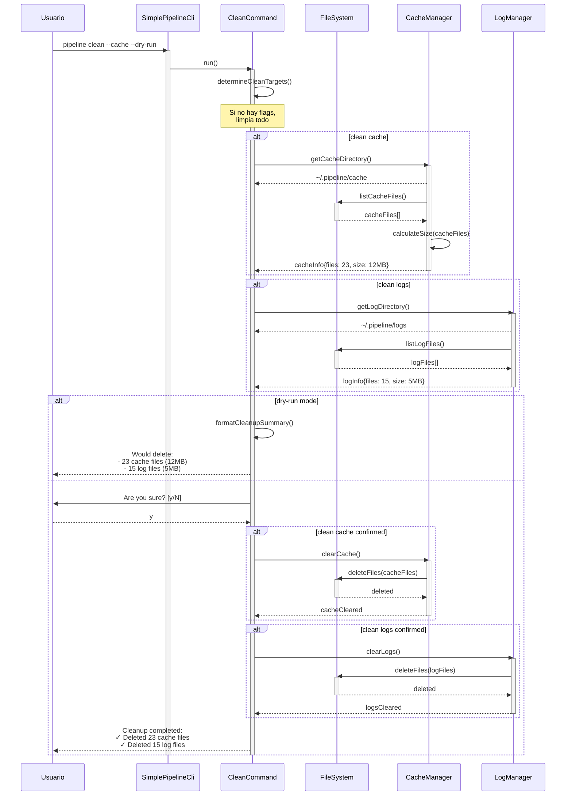
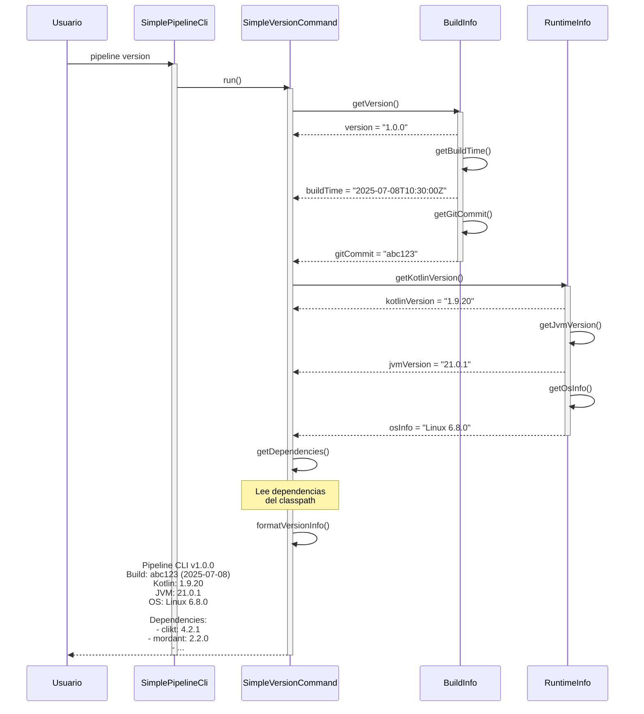

# Casos de Uso del CLI de Pipeline - Diagramas de Secuencia

Este documento describe los principales casos de uso del CLI de Pipeline mediante diagramas de secuencia en formato Mermaid.

## Tabla de Contenidos

1. [Ejecutar un Pipeline](#ejecutar-un-pipeline)
2. [Validar un Pipeline](#validar-un-pipeline)
3. [Listar Pipelines](#listar-pipelines)
4. [Limpiar Caché y Logs](#limpiar-caché-y-logs)
5. [Mostrar Versión](#mostrar-versión)

## Ejecutar un Pipeline

Este diagrama muestra el flujo completo cuando un usuario ejecuta el comando `pipeline run <script>`.

```mermaid
sequenceDiagram
    participant Usuario
    participant CLI as SimplePipelineCli
    participant RunCmd as SimpleRunCommand
    participant ConfigLoader
    participant Runner as PipelineScriptRunner
    participant Engine as PipelineDslEngine
    participant Pipeline
    participant StageExecutor
    participant StepsBlock
    participant Shell
    participant Agent as DockerAgent

    Usuario->>CLI: pipeline run build.pipeline.kts -v
    activate CLI
    
    CLI->>RunCmd: run()
    activate RunCmd
    
    RunCmd->>RunCmd: validateScriptPath()
    alt archivo no existe
        RunCmd-->>Usuario: Error: Script no encontrado
        deactivate RunCmd
        deactivate CLI
    end
    
    RunCmd->>ConfigLoader: loadConfig(configPath)
    activate ConfigLoader
    ConfigLoader-->>RunCmd: PipelineConfig
    deactivate ConfigLoader
    
    RunCmd->>Runner: evalWithScriptEngineManager(scriptPath, config)
    activate Runner
    
    Runner->>Engine: compile(scriptSource)
    activate Engine
    Note over Engine: Compila el script .kts<br/>con Kotlin Scripting API
    Engine->>Engine: applySecurityPolicies()
    Engine->>Engine: cacheCompiledScript()
    Engine-->>Runner: CompiledScript
    deactivate Engine
    
    Runner->>Pipeline: PipelineDefinition.build()
    activate Pipeline
    Note over Pipeline: Construye la estructura<br/>del pipeline desde el DSL
    Pipeline-->>Runner: Pipeline instance
    
    Runner->>Pipeline: executeStages()
    
    loop por cada stage
        Pipeline->>StageExecutor: run(stage)
        activate StageExecutor
        
        StageExecutor->>Agent: prepare()
        activate Agent
        Note over Agent: Inicia contenedor Docker
        Agent-->>StageExecutor: ready
        
        StageExecutor->>StepsBlock: execute()
        activate StepsBlock
        
        loop por cada step
            alt step tipo sh
                StepsBlock->>Shell: execute(command)
                activate Shell
                Shell->>Agent: runInContainer(command)
                Agent-->>Shell: output/exitCode
                Shell-->>StepsBlock: result
                deactivate Shell
            else step tipo echo
                StepsBlock->>StepsBlock: log(message)
            else step tipo writeFile
                StepsBlock->>StepsBlock: writeSecure(file, content)
            end
        end
        
        StepsBlock-->>StageExecutor: stageResult
        deactivate StepsBlock
        
        StageExecutor->>Agent: cleanup()
        Agent-->>StageExecutor: done
        deactivate Agent
        
        StageExecutor-->>Pipeline: stageResult
        deactivate StageExecutor
        
        alt stage failed
            Pipeline->>Pipeline: runPostExecution(failure)
            Pipeline-->>Runner: FAILURE
            Runner-->>RunCmd: exitCode(1)
            RunCmd-->>Usuario: Pipeline failed at stage X
            deactivate Pipeline
            deactivate Runner
            deactivate RunCmd
            deactivate CLI
        end
    end
    
    Pipeline->>Pipeline: runPostExecution(success)
    Pipeline-->>Runner: SUCCESS
    deactivate Pipeline
    
    Runner-->>RunCmd: exitCode(0)
    deactivate Runner
    
    RunCmd-->>Usuario: Pipeline completed successfully
    deactivate RunCmd
    deactivate CLI
```

## Validar un Pipeline

Este diagrama muestra el proceso de validación cuando se ejecuta `pipeline validate <script>`.

```mermaid
sequenceDiagram
    participant Usuario
    participant CLI as SimplePipelineCli
    participant ValCmd as ValidateCommand
    participant Validator as PipelineValidator
    participant Engine as PipelineDslEngine
    participant DSLValidator
    participant SecurityValidator

    Usuario->>CLI: pipeline validate deploy.pipeline.kts --detailed
    activate CLI
    
    CLI->>ValCmd: run()
    activate ValCmd
    
    ValCmd->>ValCmd: checkFileExists()
    alt archivo no existe
        ValCmd-->>Usuario: Error: Script no encontrado
        deactivate ValCmd
        deactivate CLI
    end
    
    ValCmd->>Validator: validate(scriptPath, options)
    activate Validator
    
    Validator->>Engine: parseOnly(scriptSource)
    activate Engine
    Note over Engine: Análisis sintáctico<br/>sin ejecución
    
    alt error de sintaxis
        Engine-->>Validator: SyntaxError(line, column, message)
        Validator-->>ValCmd: ValidationResult(failed, syntaxErrors)
        ValCmd-->>Usuario: Syntax Error at line X: message
        deactivate Engine
        deactivate Validator
        deactivate ValCmd
        deactivate CLI
    end
    
    Engine-->>Validator: ParsedAST
    deactivate Engine
    
    alt not syntaxOnly
        Validator->>DSLValidator: validateStructure(AST)
        activate DSLValidator
        Note over DSLValidator: Valida estructura DSL:<br/>- pipeline block existe<br/>- agent definido<br/>- stages no vacío
        DSLValidator-->>Validator: structureErrors[]
        deactivate DSLValidator
        
        Validator->>SecurityValidator: validateSecurity(AST)
        activate SecurityValidator
        Note over SecurityValidator: Valida seguridad:<br/>- No imports peligrosos<br/>- No reflection<br/>- No acceso a System
        SecurityValidator-->>Validator: securityWarnings[]
        deactivate SecurityValidator
    end
    
    Validator->>Validator: compileValidationReport()
    Validator-->>ValCmd: ValidationResult
    deactivate Validator
    
    alt detailed mode
        ValCmd->>ValCmd: formatDetailedReport()
        ValCmd-->>Usuario: Detailed validation report<br/>✓ Syntax: OK<br/>✓ Structure: OK<br/>⚠ Warnings: 2
    else
        ValCmd-->>Usuario: ✓ Pipeline is valid
    end
    
    deactivate ValCmd
    deactivate CLI
```

## Listar Pipelines

Este diagrama muestra cómo funciona el comando `pipeline list`.

```mermaid
sequenceDiagram
    participant Usuario
    participant CLI as SimplePipelineCli
    participant ListCmd as ListCommand
    participant FileSystem
    participant TableRenderer

    Usuario->>CLI: pipeline list --all --detailed
    activate CLI
    
    CLI->>ListCmd: run()
    activate ListCmd
    
    ListCmd->>FileSystem: getCurrentDirectory()
    activate FileSystem
    FileSystem-->>ListCmd: currentPath
    
    alt all flag
        ListCmd->>FileSystem: findFiles("*.kts")
        Note over FileSystem: Busca todos los archivos .kts
    else
        ListCmd->>FileSystem: findFiles("*.pipeline.kts")
        Note over FileSystem: Busca solo .pipeline.kts
    end
    
    FileSystem-->>ListCmd: fileList[]
    deactivate FileSystem
    
    ListCmd->>ListCmd: filterPipelineFiles(fileList)
    Note over ListCmd: Si --all, verifica que<br/>contengan "pipeline {"
    
    alt no files found
        ListCmd-->>Usuario: No pipeline scripts found
        deactivate ListCmd
        deactivate CLI
    end
    
    alt detailed mode
        loop por cada archivo
            ListCmd->>FileSystem: getFileInfo(file)
            activate FileSystem
            FileSystem-->>ListCmd: size, lastModified, permissions
            deactivate FileSystem
            
            ListCmd->>ListCmd: extractPipelineInfo(file)
            Note over ListCmd: Lee primeras líneas<br/>para extraer stages
        end
        
        ListCmd->>TableRenderer: renderDetailedTable(pipelineInfoList)
        activate TableRenderer
        TableRenderer-->>ListCmd: formattedTable
        deactivate TableRenderer
        
        ListCmd-->>Usuario: Detailed pipeline list table
    else
        ListCmd->>ListCmd: formatSimpleList(fileList)
        ListCmd-->>Usuario: Simple file list
    end
    
    deactivate ListCmd
    deactivate CLI
```

## Limpiar Caché y Logs

Este diagrama muestra el proceso de limpieza con el comando `pipeline clean`.



## Mostrar Versión

Este diagrama muestra el flujo simple del comando `pipeline version`.



## Notas sobre los Diagramas

### Convenciones Utilizadas

- **Participantes**: Cada componente principal del sistema está representado como un participante
- **Activaciones**: Se muestran con `activate`/`deactivate` para indicar cuando un componente está activo
- **Flujos Alternativos**: Se usan bloques `alt`/`else` para mostrar diferentes caminos de ejecución
- **Bucles**: Se usan bloques `loop` para operaciones repetitivas
- **Notas**: Se incluyen notas explicativas para clarificar procesos complejos

### Referencias al Código

Los diagramas hacen referencia a las siguientes clases principales del proyecto:

- `SimplePipelineCli`: `/pipeline-cli/src/main/kotlin/dev/rubentxu/pipeline/cli/Main.kt`
- `SimpleRunCommand`: Comando de ejecución de pipelines
- `ValidateCommand`: Comando de validación
- `PipelineDslEngine`: Motor de compilación DSL
- `Pipeline`: Representación en tiempo de ejecución del pipeline
- `StageExecutor`: Ejecutor de etapas individuales