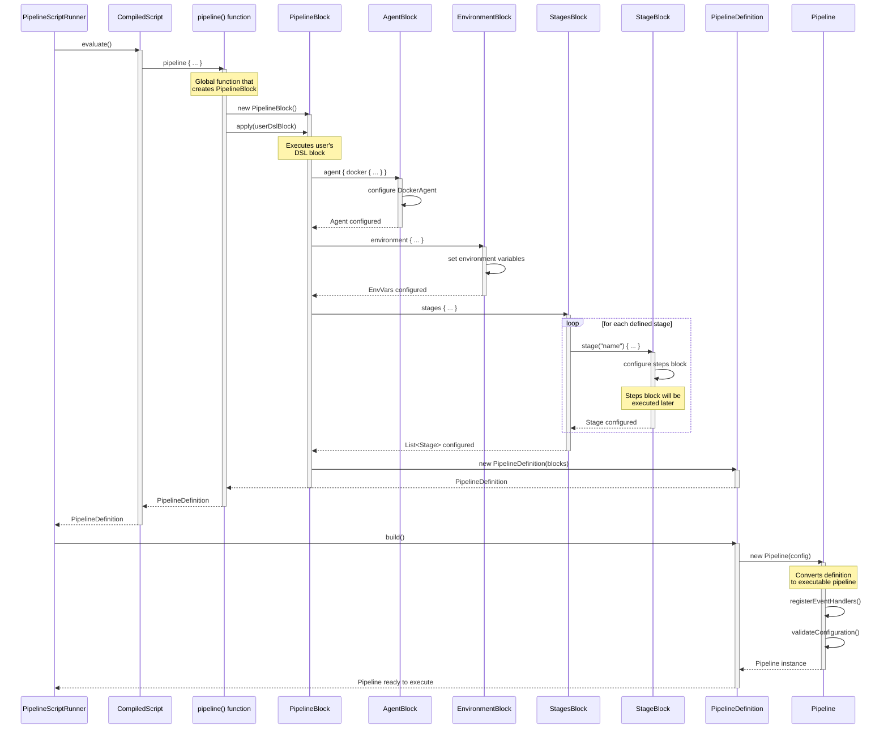
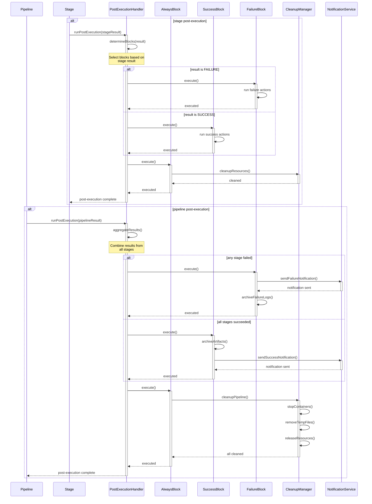

# Pipeline DSL Execution Flow - Sequence Diagrams

This document describes the internal execution flow of the Pipeline DSL, from compilation to step execution.

## Table of Contents

1. [DSL Compilation](#dsl-compilation)
2. [Pipeline Construction](#pipeline-construction)
3. [Stage Execution](#stage-execution)
4. [Step Execution](#step-execution)
5. [Plugin System](#plugin-system)
6. [Post-Execution Handling](#post-execution-handling)

## DSL Compilation

This diagram shows how a pipeline script is compiled from source code to an executable script.

```mermaid
sequenceDiagram
    participant ScriptRunner as PipelineScriptRunner
    participant Engine as PipelineDslEngine
    participant KotlinScript as Kotlin Scripting API
    participant Cache as ScriptCache
    participant SecurityPolicy
    participant Compiler as KotlinCompiler

    ScriptRunner->>Engine: compile(scriptSource)
    activate Engine
    
    Engine->>Cache: getCached(scriptHash)
    activate Cache
    alt script in cache
        Cache-->>Engine: CompiledScript
        Engine-->>ScriptRunner: CompiledScript (cached)
        deactivate Cache
        deactivate Engine
    else not in cache
        Cache-->>Engine: null
        deactivate Cache
        
        Engine->>SecurityPolicy: createSecurityConfiguration()
        activate SecurityPolicy
        Note over SecurityPolicy: Define policies:<br/>- No System.exit()<br/>- No reflection<br/>- No file access outside workspace
        SecurityPolicy-->>Engine: SecurityConfig
        deactivate SecurityPolicy
        
        Engine->>KotlinScript: createCompilationConfiguration()
        activate KotlinScript
        Note over KotlinScript: Configure:<br/>- Implicit receivers (PipelineBlock)<br/>- Default imports<br/>- Security restrictions
        
        KotlinScript->>Compiler: compile(script, configuration)
        activate Compiler
        
        alt compilation error
            Compiler-->>KotlinScript: CompilationError
            KotlinScript-->>Engine: ScriptCompilationException
            Engine-->>ScriptRunner: throw CompilationException
            deactivate Compiler
            deactivate KotlinScript
            deactivate Engine
        end
        
        Compiler-->>KotlinScript: CompiledScript
        deactivate Compiler
        
        KotlinScript-->>Engine: CompiledScript
        deactivate KotlinScript
        
        Engine->>Cache: store(scriptHash, CompiledScript)
        activate Cache
        Cache-->>Engine: stored
        deactivate Cache
        
        Engine-->>ScriptRunner: CompiledScript
        deactivate Engine
    end
```

## Pipeline Construction

This diagram shows how the pipeline structure is built from the compiled DSL.



## Stage Execution

This diagram shows how pipeline stages are executed sequentially.

```mermaid
sequenceDiagram
    participant PipelineRunner
    participant Pipeline
    participant EventBus
    participant StageExecutor
    participant Agent
    participant StageBlock
    participant StepsBlock
    participant PostExecution

    PipelineRunner->>Pipeline: executeStages()
    activate Pipeline
    
    Pipeline->>EventBus: emit(PipelineStarted)
    activate EventBus
    EventBus-->>Pipeline: event dispatched
    deactivate EventBus
    
    Pipeline->>Pipeline: initializeGlobalAgent()
    
    loop for each stage
        Pipeline->>EventBus: emit(StageStarted)
        activate EventBus
        EventBus-->>Pipeline: event dispatched
        deactivate EventBus
        
        Pipeline->>StageExecutor: run(stage, context)
        activate StageExecutor
        
        StageExecutor->>Agent: getOrCreate()
        activate Agent
        alt agent does not exist
            Agent->>Agent: createDockerContainer()
            Agent->>Agent: startContainer()
        end
        Agent-->>StageExecutor: agent ready
        deactivate Agent
        
        StageExecutor->>StageBlock: new StageBlock(stage)
        activate StageBlock
        
        StageExecutor->>StageBlock: apply(stage.dslBlock)
        Note over StageBlock: Execute stage's<br/>DSL block
        
        StageBlock->>StepsBlock: steps { ... }
        activate StepsBlock
        Note over StepsBlock: Execute all<br/>defined steps
        
        alt step fails
            StepsBlock-->>StageBlock: StepFailedException
            StageBlock-->>StageExecutor: StageFailure
            deactivate StepsBlock
            deactivate StageBlock
            
            StageExecutor->>PostExecution: runStagePost(failure)
            activate PostExecution
            PostExecution-->>StageExecutor: post executed
            deactivate PostExecution
            
            StageExecutor-->>Pipeline: StageFailure
            deactivate StageExecutor
            
            Pipeline->>EventBus: emit(StageFailed)
            Pipeline->>Pipeline: stopExecution()
            Pipeline-->>PipelineRunner: FAILURE
            deactivate Pipeline
        else steps successful
            StepsBlock-->>StageBlock: success
            deactivate StepsBlock
            
            StageBlock-->>StageExecutor: StageSuccess
            deactivate StageBlock
            
            StageExecutor->>PostExecution: runStagePost(success)
            activate PostExecution
            PostExecution-->>StageExecutor: post executed
            deactivate PostExecution
            
            StageExecutor-->>Pipeline: StageSuccess
            deactivate StageExecutor
            
            Pipeline->>EventBus: emit(StageCompleted)
        end
    end
    
    Pipeline->>EventBus: emit(PipelineCompleted)
    Pipeline-->>PipelineRunner: SUCCESS
    deactivate Pipeline
```

## Step Execution

This diagram details how different types of steps are executed within a stage.

```mermaid
sequenceDiagram
    participant StepsBlock
    participant StepFactory
    participant ShStep
    participant EchoStep
    participant WriteFileStep
    participant Shell
    participant Logger
    participant FileSystem
    participant SecurityManager
    participant Agent

    StepsBlock->>StepsBlock: executeSteps()
    activate StepsBlock
    
    loop for each defined step
        alt sh step type
            StepsBlock->>StepFactory: createShStep(command)
            activate StepFactory
            StepFactory->>ShStep: new ShStep(command)
            StepFactory-->>StepsBlock: ShStep
            deactivate StepFactory
            
            StepsBlock->>ShStep: execute(context)
            activate ShStep
            
            ShStep->>Shell: new Shell(workingDir)
            activate Shell
            
            ShStep->>SecurityManager: validateCommand(command)
            activate SecurityManager
            alt command not allowed
                SecurityManager-->>ShStep: SecurityException
                ShStep-->>StepsBlock: StepFailedException
                deactivate SecurityManager
                deactivate ShStep
                deactivate Shell
            end
            SecurityManager-->>ShStep: command validated
            deactivate SecurityManager
            
            ShStep->>Shell: execute(command, agent)
            
            Shell->>Agent: runInContainer(command)
            activate Agent
            Note over Agent: Execute command<br/>in Docker container
            Agent-->>Shell: CommandResult(output, exitCode)
            deactivate Agent
            
            alt exitCode != 0
                Shell-->>ShStep: CommandFailedException
                ShStep-->>StepsBlock: StepFailedException
                deactivate Shell
                deactivate ShStep
            end
            
            Shell-->>ShStep: output
            deactivate Shell
            
            ShStep-->>StepsBlock: stepResult
            deactivate ShStep
            
        else echo step type
            StepsBlock->>StepFactory: createEchoStep(message)
            activate StepFactory
            StepFactory->>EchoStep: new EchoStep(message)
            StepFactory-->>StepsBlock: EchoStep
            deactivate StepFactory
            
            StepsBlock->>EchoStep: execute(context)
            activate EchoStep
            
            EchoStep->>Logger: log(level, message)
            activate Logger
            Logger-->>EchoStep: logged
            deactivate Logger
            
            EchoStep-->>StepsBlock: success
            deactivate EchoStep
            
        else writeFile step type
            StepsBlock->>StepFactory: createWriteFileStep(file, content)
            activate StepFactory
            StepFactory->>WriteFileStep: new WriteFileStep(file, content)
            StepFactory-->>StepsBlock: WriteFileStep
            deactivate StepFactory
            
            StepsBlock->>WriteFileStep: execute(context)
            activate WriteFileStep
            
            WriteFileStep->>SecurityManager: validateFilePath(file)
            activate SecurityManager
            alt path outside workspace
                SecurityManager-->>WriteFileStep: SecurityException
                WriteFileStep-->>StepsBlock: StepFailedException
                deactivate SecurityManager
                deactivate WriteFileStep
            end
            SecurityManager-->>WriteFileStep: path validated
            deactivate SecurityManager
            
            WriteFileStep->>FileSystem: writeFile(file, content)
            activate FileSystem
            FileSystem-->>WriteFileStep: file written
            deactivate FileSystem
            
            WriteFileStep-->>StepsBlock: success
            deactivate WriteFileStep
        end
    end
    
    StepsBlock-->>StepsBlock: all steps completed
    deactivate StepsBlock
```

## Plugin System

This diagram shows how plugins are discovered and loaded in the system.

```mermaid
sequenceDiagram
    participant Pipeline
    participant PluginManager
    participant ServiceLoader
    participant MavenResolver
    participant PluginRegistry
    participant ClassLoader as PluginClassLoader
    participant Plugin as StepPlugin
    participant SecurityValidator

    Pipeline->>PluginManager: loadPlugins(pluginConfig)
    activate PluginManager
    
    PluginManager->>PluginManager: loadBuiltInPlugins()
    
    PluginManager->>ServiceLoader: load(Step.class)
    activate ServiceLoader
    Note over ServiceLoader: Search for Step<br/>implementations in classpath
    ServiceLoader->>ServiceLoader: findServiceProviders()
    ServiceLoader-->>PluginManager: List<Step> builtInSteps
    deactivate ServiceLoader
    
    alt external plugins configured
        PluginManager->>MavenResolver: resolve(pluginDependencies)
        activate MavenResolver
        
        loop for each dependency
            MavenResolver->>MavenResolver: downloadArtifact(groupId, artifactId, version)
            Note over MavenResolver: Download JAR from<br/>Maven repository
            
            MavenResolver->>SecurityValidator: validateJar(jarFile)
            activate SecurityValidator
            SecurityValidator->>SecurityValidator: checkSignature()
            SecurityValidator->>SecurityValidator: verifySHA256()
            alt jar invalid
                SecurityValidator-->>MavenResolver: SecurityException
                MavenResolver-->>PluginManager: PluginLoadException
                deactivate SecurityValidator
                deactivate MavenResolver
            end
            SecurityValidator-->>MavenResolver: jar validated
            deactivate SecurityValidator
        end
        
        MavenResolver-->>PluginManager: List<File> pluginJars
        deactivate MavenResolver
        
        loop for each plugin jar
            PluginManager->>PluginClassLoader: new URLClassLoader(jarUrl, parent)
            activate PluginClassLoader
            Note over PluginClassLoader: Create isolated<br/>ClassLoader for plugin
            
            PluginManager->>ServiceLoader: load(Step.class, classLoader)
            activate ServiceLoader
            ServiceLoader->>PluginClassLoader: loadClass("META-INF/services/Step")
            PluginClassLoader-->>ServiceLoader: service definitions
            
            ServiceLoader->>Plugin: newInstance()
            activate Plugin
            Plugin-->>ServiceLoader: Step instance
            deactivate Plugin
            
            ServiceLoader-->>PluginManager: List<Step> pluginSteps
            deactivate ServiceLoader
            deactivate PluginClassLoader
        end
    end
    
    PluginManager->>PluginRegistry: registerSteps(allSteps)
    activate PluginRegistry
    
    loop for each step
        PluginRegistry->>PluginRegistry: validateStepName(step.name)
        alt duplicate name
            PluginRegistry-->>PluginManager: DuplicateStepException
        end
        
        PluginRegistry->>PluginRegistry: register(stepName, stepInstance)
    end
    
    PluginRegistry-->>PluginManager: registration complete
    deactivate PluginRegistry
    
    PluginManager-->>Pipeline: plugins loaded
    deactivate PluginManager
```

## Post-Execution Handling

This diagram shows how post-execution actions are handled at different levels.



## Architecture Notes

### Design Principles

1. **Separation of Concerns**: Each component has a clear and well-defined responsibility
2. **Security by Default**: All operations go through security validations
3. **Extensibility**: The plugin system allows adding new steps without modifying the core
4. **Isolation**: Plugins run in separate ClassLoaders to avoid conflicts

### Key Security Points

- **Script Sandboxing**: Scripts run with restrictive policies
- **Command Validation**: sh commands are validated before execution
- **Agent Isolation**: Commands execute in Docker containers
- **Plugin Validation**: Plugin JARs are verified before loading

### Implementation References

- `PipelineDslEngine`: Main compilation engine
- `Pipeline`: Execution orchestrator
- `StageExecutor`: Individual stage executor
- `StepsBlock`: Step container and executor
- `PluginManager`: Plugin system manager