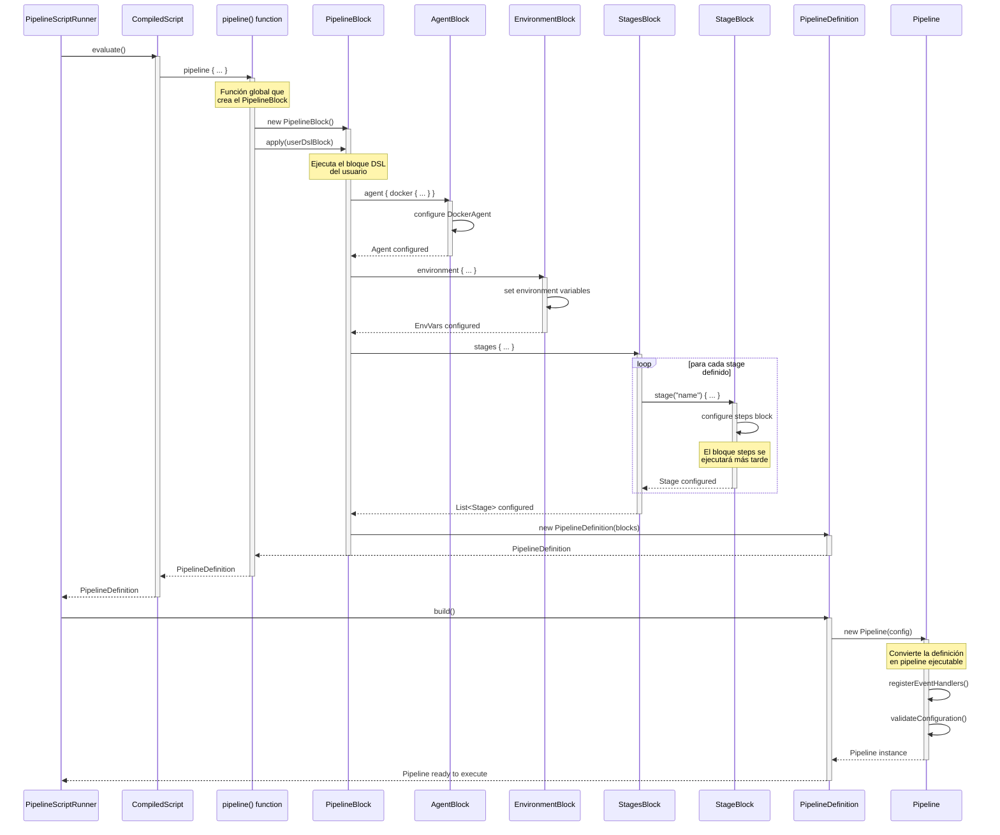
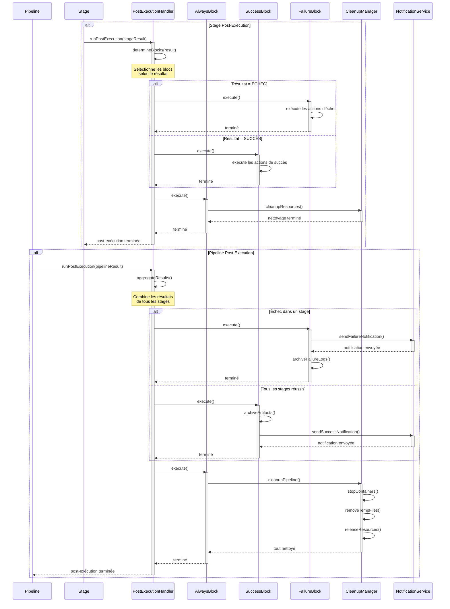

# Flujo de Ejecución del Pipeline DSL - Diagramas de Secuencia

Este documento describe el flujo de ejecución interno del Pipeline DSL, desde la compilación hasta la ejecución de los steps.

## Tabla de Contenidos

1. [Compilación del DSL](#compilación-del-dsl)
2. [Construcción del Pipeline](#construcción-del-pipeline)
3. [Ejecución de Stages](#ejecución-de-stages)
4. [Ejecución de Steps](#ejecución-de-steps)
5. [Sistema de Plugins](#sistema-de-plugins)
6. [Manejo de Post-Ejecución](#manejo-de-post-ejecución)

## Compilación del DSL

Este diagrama muestra cómo se compila un script de pipeline desde el código fuente hasta un script ejecutable.

```mermaid
sequenceDiagram
    participant SR as ScriptRunner
    participant E as Engine
    participant C as Cache
    participant SP as SecurityPolicy
    participant KS as KotlinScript
    participant CP as Compiler

    SR->>E: compile(scriptSource)
    activate E

    E->>C: getCached(scriptHash)

    alt Cached
        C-->>E: CompiledScript
        E-->>SR: CompiledScript (cached)
        deactivate E
    else Not Cached
        C-->>E: null

        E->>SP: createSecurityConfig()
        activate SP
        SP-->>E: SecurityConfig
        deactivate SP

        E->>KS: createConfig()
        activate KS
        KS-->>E: CompilationConfig
        deactivate KS

        E->>CP: compile(script, config)
        activate CP

        alt Compilation Error
            CP-->>E: CompilationError
            deactivate CP
            E-->>SR: throw Exception
            deactivate E
        else Success
            CP-->>E: CompiledScript
            deactivate CP

            E->>C: store(scriptHash, script)
            C-->>E: stored

            E-->>SR: CompiledScript
            deactivate E
        end
    end
```

## Construcción del Pipeline

Este diagrama muestra cómo se construye la estructura del pipeline a partir del DSL compilado.



## Ejecución de Stages

Este diagrama muestra cómo se ejecutan las stages del pipeline secuencialmente.



## Ejecución de Steps

Este diagrama detalla cómo se ejecutan los diferentes tipos de steps dentro de un stage.

```mermaid
sequenceDiagram
    participant PipelineRunner
    participant Pipeline
    participant EventBus
    participant StageExecutor
    participant Agent
    participant StageBlock
    participant StepsBlock
    participant PostExecution

    PipelineRunner->>Pipeline: executeStages()
    activate Pipeline

    Pipeline->>EventBus: emit(PipelineStarted)
    activate EventBus
    EventBus-->>Pipeline: event dispatched
    deactivate EventBus

    Pipeline->>Pipeline: initializeGlobalAgent()

    loop for each stage
        Pipeline->>EventBus: emit(StageStarted)
        activate EventBus
        EventBus-->>Pipeline: event dispatched
        deactivate EventBus

        Pipeline->>StageExecutor: run(stage, context)
        activate StageExecutor

        StageExecutor->>Agent: getOrCreate()
        activate Agent
        alt agent does not exist
            Agent->>Agent: createDockerContainer()
            Agent->>Agent: startContainer()
        end
        Agent-->>StageExecutor: agent ready
        deactivate Agent

        StageExecutor->>StageBlock: new StageBlock(stage)
        activate StageBlock

        StageExecutor->>StageBlock: apply(stage.dslBlock)
        note over StageBlock: Executes the stage's<br/>DSL block

        StageBlock->>StepsBlock: steps { ... }
        activate StepsBlock
        note over StepsBlock: Executes all defined<br/>steps

        alt step fails
            StepsBlock-->>StageBlock: StepFailedException
            deactivate StepsBlock
            StageBlock-->>StageExecutor: StageFailure
            deactivate StageBlock

            StageExecutor->>PostExecution: runStagePost(failure)
            activate PostExecution
            PostExecution-->>StageExecutor: post executed
            deactivate PostExecution

            StageExecutor-->>Pipeline: StageFailure
            deactivate StageExecutor

            Pipeline->>EventBus: emit(StageFailed)
            Pipeline->>Pipeline: stopExecution()
            Pipeline-->>PipelineRunner: FAILURE
            deactivate Pipeline
        else successful steps
            StepsBlock-->>StageBlock: success
            deactivate StepsBlock
            StageBlock-->>StageExecutor: StageSuccess
            deactivate StageBlock

            StageExecutor->>PostExecution: runStagePost(success)
            activate PostExecution
            PostExecution-->>StageExecutor: post executed
            deactivate PostExecution

            StageExecutor-->>Pipeline: StageSuccess
            deactivate StageExecutor

            Pipeline->>EventBus: emit(StageCompleted)
        end
    end

    Pipeline->>EventBus: emit(PipelineCompleted)
    Pipeline-->>PipelineRunner: SUCCESS
    deactivate Pipeline
```

## Sistema de Plugins

Este diagrama muestra cómo se descubren y cargan los plugins en el sistema.

```mermaid

```

## Manejo de Post-Ejecución

Este diagrama muestra cómo se manejan las acciones post-ejecución en diferentes niveles.

```mermaid
sequenceDiagram
    participant Pipeline
    participant Stage
    participant PostExecutor as PostExecutionHandler
    participant AlwaysBlock
    participant SuccessBlock
    participant FailureBlock
    participant CleanupManager
    participant NotificationService

    alt stage post-execution
        Stage->>PostExecutor: runPostExecution(stageResult)
        activate PostExecutor
    
        PostExecutor->>PostExecutor: determineBlocks(result)
        Note over PostExecutor: Selecciona bloques según<br/>el resultado del stage
    
        alt result is FAILURE
            PostExecutor->>FailureBlock: execute()
            activate FailureBlock
            FailureBlock->>FailureBlock: run failure actions
            FailureBlock-->>PostExecutor: executed
            deactivate FailureBlock
        else result is SUCCESS
            PostExecutor->>SuccessBlock: execute()
            activate SuccessBlock
            SuccessBlock->>SuccessBlock: run success actions
            SuccessBlock-->>PostExecutor: executed
            deactivate SuccessBlock
        end
    
        PostExecutor->>AlwaysBlock: execute()
        activate AlwaysBlock
        AlwaysBlock->>CleanupManager: cleanupResources()
        activate CleanupManager
        CleanupManager-->>AlwaysBlock: cleaned
        deactivate CleanupManager
        AlwaysBlock-->>PostExecutor: executed
        deactivate AlwaysBlock
    
        PostExecutor-->>Stage: post-execution complete
        deactivate PostExecutor
    end
  
    alt pipeline post-execution
        Pipeline->>PostExecutor: runPostExecution(pipelineResult)
        activate PostExecutor
    
        PostExecutor->>PostExecutor: aggregateResults()
        Note over PostExecutor: Combina resultados de<br/>todos los stages
    
        alt any stage failed
            PostExecutor->>FailureBlock: execute()
            activate FailureBlock
        
            FailureBlock->>NotificationService: sendFailureNotification()
            activate NotificationService
            NotificationService-->>FailureBlock: notification sent
            deactivate NotificationService
        
            FailureBlock->>FailureBlock: archiveFailureLogs()
            FailureBlock-->>PostExecutor: executed
            deactivate FailureBlock
        else all stages succeeded
            PostExecutor->>SuccessBlock: execute()
            activate SuccessBlock
        
            SuccessBlock->>SuccessBlock: archiveArtifacts()
            SuccessBlock->>NotificationService: sendSuccessNotification()
            activate NotificationService
            NotificationService-->>SuccessBlock: notification sent
            deactivate NotificationService
        
            SuccessBlock-->>PostExecutor: executed
            deactivate SuccessBlock
        end
    
        PostExecutor->>AlwaysBlock: execute()
        activate AlwaysBlock
    
        AlwaysBlock->>CleanupManager: cleanupPipeline()
        activate CleanupManager
        CleanupManager->>CleanupManager: stopContainers()
        CleanupManager->>CleanupManager: removeTempFiles()
        CleanupManager->>CleanupManager: releaseResources()
        CleanupManager-->>AlwaysBlock: all cleaned
        deactivate CleanupManager
    
        AlwaysBlock-->>PostExecutor: executed
        deactivate AlwaysBlock
    
        PostExecutor-->>Pipeline: post-execution complete
        deactivate PostExecutor
    end
```

## Notas sobre la Arquitectura

### Principios de Diseño

1. **Separación de Responsabilidades**: Cada componente tiene una responsabilidad clara y bien definida
2. **Seguridad por Defecto**: Todas las operaciones pasan por validaciones de seguridad
3. **Extensibilidad**: El sistema de plugins permite agregar nuevos steps sin modificar el core
4. **Aislamiento**: Los plugins se ejecutan en ClassLoaders separados para evitar conflictos

### Puntos Clave de Seguridad

- **Sandboxing de Script**: Los scripts se ejecutan con políticas restrictivas
- **Validación de Comandos**: Los comandos sh se validan antes de ejecutarse
- **Aislamiento de Agente**: Los comandos se ejecutan en contenedores Docker
- **Validación de Plugins**: Los JARs de plugins se verifican antes de cargarse

### Referencias de Implementación

- `PipelineDslEngine`: Motor de compilación principal
- `Pipeline`: Orquestador de la ejecución
- `StageExecutor`: Ejecutor de stages individuales
- `StepsBlock`: Contenedor y ejecutor de steps
- `PluginManager`: Gestor del sistema de plugins
