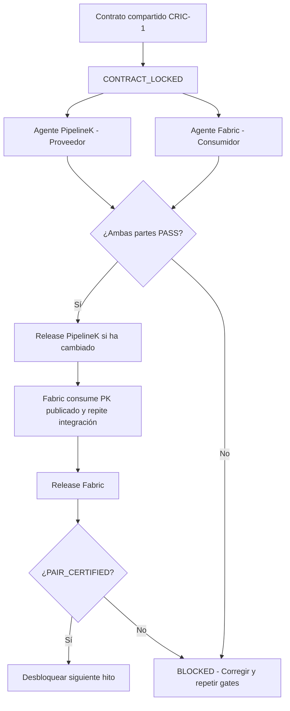
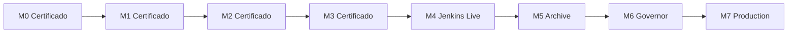

# Paquete PipelineK — Runtime Evolution (perspectiva conjunta PK × Fabric)

**Destino:** [Rubentxu/pipeline-kotlin](https://github.com/Rubentxu/pipeline-kotlin) ·
**contraparte obligatoria:** [Rubentxu/pipelinek-fabric](https://github.com/Rubentxu/pipelinek-fabric).

Paquete de **implementación documental**, no código. Baseline comprobada al
2026-10-10: PK `65f97430` = `origin/main` (HEAD tras el cierre de B1 + el feature
doc M0); tag publicado `v0.48.0-rc2` peel `74c5331e`; Fabric `e6e4fd3e` (medido
en el package base, revalidar antes de cada agente). Contiene solo specs/ADR y
aceptación de propiedad PipelineK, referencias compartidas imprescindibles y
**un gate de pareja idéntico al paquete Fabric**.

Este documento es la perspectiva **conjunta** del flujo. El package Fabric
(`pipelinek-fabric`) contiene la misma coordinación, más el lado consumidor
y la matriz de hitos. Ambos deben leerse juntos: este README NO reemplaza al
`coordination/INTERFACE_CONTRACT.md` ni al `PAIR_RELEASE_FLOW.md`.

## 1. Flujo de trabajo entre los dos agentes

El desarrollo en ramas puede continuar en paralelo. Lo que queda bloqueado es la
**promoción del hito**, la **certificación del par** y el **inicio integrado del
siguiente**. Si Fabric no cambia un contrato de PipelineK, no hace falta generar
un release artificial de PipelineK: se reutiliza su versión publicada anterior, pero
se vuelve a probar con la nueva versión de Fabric.

## 2. Cadena de certificación M0 → M7

Para certificar M3, por ejemplo, hay que aportar el recibo de M2. El verificador
comprueba su identificador y SHA-256. No se admite pasar directamente de M1 a M3.
Si falla una comprobación, devuelve `BLOCKED` en vez de certificar el par.

## 3. Responsabilidades por hito

| Hito | Agente PipelineK | Agente Fabric | Publicación |
|---|---|---|---|
| M0 | Verifica ABI y capacidades | Corrige ACK, deduplicación y spool | Fabric + certificación cruzada |
| M1 | Runtime y lectores live | Adaptador incremental real | PK → Fabric |
| M2 | Proporciona inspección/recovery si falta | Worker reconciliador | Fabric, PK si cambia |
| M3 | Garantiza lectura y retención necesarias | Replicación durable multistream | Fabric, PK si cambia |
| M4 | Mantiene ABI compatible | Jenkins Live y Stage View | Fabric |
| M5 | Retención/pinning si se requiere | Archivo local/S3 | Fabric, PK si cambia |
| M6 | Contexto y presión local | Governor, fairness y filtros | Fabric, PK si cambia |
| M7 | Seguridad y telemetría | Certificación integrada | Ambos si cambian |

En cada ZIP se incluye el prompt específico para su agente. Así, el agente de
Fabric no puede trasladar accidentalmente responsabilidades distribuidas al
motor PipelineK, y el de PipelineK no introduce dependencias de Jenkins, S3 o
gRPC en el core.

## 4. Gate común que no se puede saltar

El mecanismo se basa en cuatro elementos incluidos en ambos ZIP.

| Elemento | Función |
|---|---|
| `INTERFACE_CONTRACT.md` | Define la semántica que deben respetar los dos proyectos |
| `PAIR_RELEASE_FLOW.md` | Establece el orden de desarrollo, pruebas y publicación |
| `verify_pair_gate.py` | Comprueba contratos, releases, SHA y evidencias |
| `PAIR_RECEIPT.json` | Certificación de un par exacto PipelineK + Fabric |

El certificado `PAIR_RECEIPT.json` exige comprobar:

- Los commits y tags remotos exactos de ambos proyectos.
- La integración de cada release en `main`.
- Que Fabric ha compilado y ejecutado pruebas contra el artefacto publicado de
  PipelineK, **no** `mavenLocal`.
- Que se han realizado los UAT/AAT obligatorios del hito.
- Que el SHA-256 del contrato compartido coincide.
- Que los artefactos y evidencias corresponden a los commits certificados.

## 5. Punto de partida comprobado (revalidar antes de cada agente)

| Repositorio | `main` observado | Tag publicado |
|---|---|---|
| `Rubentxu/pipeline-kotlin` | `65f97430` (HEAD actual tras B1 cerrado) | `v0.48.0-rc2` peel `74c5331e` |
| `Rubentxu/pipelinek-fabric` | `e6e4fd3e` (revalidar) | (revalidar contra `git ls-remote origin refs/tags`) |

El primer paso del agente será reconciliarlas contra el HEAD de trabajo y las
versiones realmente publicadas, antes de adoptar el contrato y comenzar M0.

## 6. Bloqueo GitHub

El verificador bloquea la admisión y promoción dentro del flujo de agentes, pero
un script local por sí solo no impide un `git push` manual. Para bloqueo técnico
real se documenta en `coordination/REQUIRED_GITHUB_PROTECTION.md` la configuración
de reglas de protección para las ramas de integración y los tags, con estados
de CI publicados desde un runner de confianza:

- `cross-repo/candidate-interop`
- `cross-repo/previous-pair-certified`
- `ci/local-release-admission`

Esto mantiene la política de CI local sin introducir GitHub Actions. La
configuración **no se modifica** en este paquete — debe aplicarse al integrar.

## Ruta de lectura local (sigue vigente)

1. `coordination/INTERFACE_CONTRACT.md` + `coordination/PAIR_RELEASE_FLOW.md`:
   regla que BLOQUEA progreso descoordinado.
2. `roadmap/PIPELINEK-ROADMAP.md`: tareas PK por M0–M7 y handoffs.
3. `specifications/`: live Output/Event y seguridad/telemetría local.
4. `adrs/`: runtime boundary, observación durable, presión y seguridad (propuestas).
5. `acceptance/UAT.md` + `acceptance/AAT.md` + `acceptance/FITNESS.md`.
6. `agent/PIPELINEK-AGENT-HANDOFF.md` para ejecutar sin invadir Fabric.
7. `reference/`: contexto integral de la propuesta previa conservado (baseline,
   contratos, decisiones y fuentes). No reimplementar documentación de Fabric en
   PK.

## Cross gate

Cualquier discrepancia de SHA256 del contrato, cambio de ABI no ensayado, PK
artifact sin publicar, Fabric consumer sin pruebas, falta de tag remoto,
UAT/AAT sin evidencia o secuencia de release violada ⇒ `BLOCKED`. El producto
PK autónomo puede evolucionar de forma independiente; esta iniciativa solo
promociona M(n+1) cuando el PAIR de M(n) tiene recibo `PAIR_CERTIFIED`.

## Estado actual del lado PK (2026-10-10)

- **M0 lado PK: PREPARED**. WIP-0 a WIP-5 ejecutados (receipts en
  `docs/v2/07-uat/coordination-evolution/`).
- **M1–M7: BLOQUEADOS** por `PAIR_CERTIFIED` previo (PAIR_RELEASE_FLOW.md
  `--previous-receipt`).
- **Pending Fabric:** `FAB_CONSUMER_VERDICT.md` y `PAIR_RECEIPT.json` firmado
  por el Pair Integrator. Mientras tanto, el lado PK está hecho.
- **Handoff al Fabric Consumer Agent:** `handoff/PK_CONTRACT_HANDOFF.md`.
- **Feature doc:** `odd/tasks/pipelinek-coordinated-evolution.md` con el goal
  y los 14 WIPs.
