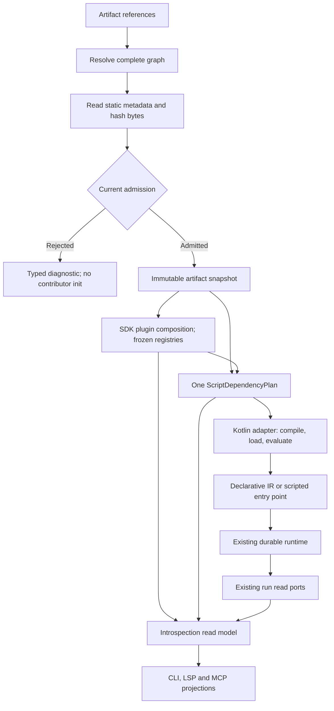

# Target architecture

## 1. Context

The target adds a tooling/read plane and a dependency/artifact plane around the existing V2 runtime. It does not replace the runtime.

## 2. Architectural layers

### Domain

Owns stable values and closed decision algebras only:

- library identity/release identity;
- artifact digest/provenance references;
- introspection DTO contracts where genuinely domain-independent;
- typed admission decision categories if they are shared by runtime/tooling.

No filesystem, network, classloading or JSON formatting.

### Application

Owns orchestration:

- compose `ScriptDependencyPlan`;
- resolve/admit artifacts through ports;
- compose runtime registries;
- build read-only introspection snapshots;
- adapt registry admission decisions to runtime execution preparation;
- expose application services for CLI/MCP/LSP adapters.

### Adapters

Own:

- Maven/local filesystem resolution;
- JAR static manifest reading;
- CLI rendering;
- JSON wire format;
- LSP protocol;
- MCP projection;
- signature/provenance verifiers when introduced.

## 3. Dependency laws

1. `pipeline-domain` must not depend on CLI/LSP/MCP/artifact resolver implementations.
2. Shared Library domain types must not depend on Step handlers or `ServiceLoader`.
3. Plugin manifest parsing must not initialize plugin contributor classes.
4. `IntrospectionService` may depend on read interfaces/registries, never on CLI parser classes.
5. CLI commands may call application services but do not contain plugin/Step semantic tables.
6. LSP and MCP are sibling adapters over the same introspection/invocation ports.
7. `ScriptDependencyPlan` owns the complete ordered dependency graph and immutable bytes for compile/evaluation. Compiler configuration and v2 identity consume the same frozen plan.
8. Runtime plugin discovery consumes the plugin subset of the plan; libraries are excluded by type.
9. `plan` and `why-not` consume the same preparation decision used by runtime admission.
10. Legacy V1 packages cannot gain new V2 production consumers; all current consumers are inventoried and reach zero before M9/M10.
11. Kotlin experimental/compiler objects stay in the current Kotlin adapter.
12. Compiled-artifact reuse cannot retain evaluated run state or bypass current admission.
13. Compiler configuration/identity have one effective-profile owner; tooling only projects facts.

## 4. Proposed modules

Prefer the smallest module increase that preserves boundaries. Candidate module structure:

| Candidate module | Boundary that must justify it |
| --- | --- |
| `pipeline-artifact-api` | Only if existing domain/application cannot cleanly own shared ports |
| `pipeline-artifact-local` | Local JAR/catalog transport adapter |
| `pipeline-artifact-maven` | Maven graph transport adapter |
| `pipeline-library-api` | Distinct library identity/manifest/requirements |
| `pipeline-introspection-api` | Stable read contracts only if cross-adapter reuse warrants it |
| `pipeline-lsp` | LSP protocol adapter |

Compiler profile, cache backend and session resources stay inside the existing scripting adapter. Do not create feature-named cache/engine modules without an actual dependency boundary.

Module creation is **not mandatory** if existing module boundaries already express the responsibility cleanly. A module must earn its existence with a dependency boundary, not by feature naming.

## 5. Performance model

Composition work happens once:

Resolve the full graph, read static metadata/hash bytes, apply current admission, freeze immutable inputs, build/freeze SDK registries and derive the dependency/introspection snapshots. The host then compiles or loads a compatible artifact and evaluates under a fresh invocation context. Runtime operations still use the existing durable spine. Cache hits repeat the applicable current admission checks.

Hot Step execution must not:

- scan JARs;
- parse manifests;
- run ServiceLoader;
- recompute catalog digests;
- resolve Maven coordinates;
- perform LSP metadata discovery.

## 6. Optimization ownership

[Spec 19](specifications/19-script-compilation-and-evaluation.md) defines phases; [spec 20](specifications/20-compiled-artifact-cache.md) defines conditional artifact reuse; [spec 21](specifications/21-compiler-session-lifecycle.md) defines optional session ownership. Resolver, compilation, class-loading, evaluated-plan and execution/recovery caches are distinct responsibilities. This programme excludes an evaluated-plan/configuration cache.
