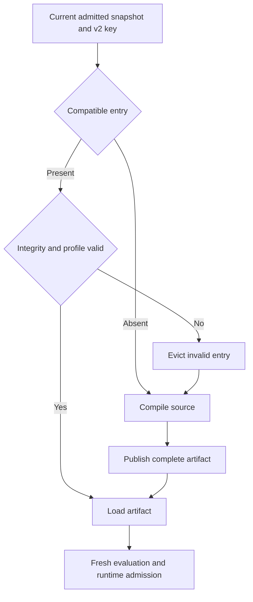

# Specification — Real compiled-artifact reuse

**Status:** Conditional proposal. **Owner:** Kotlin adapter cache boundary. **Decision:** ADR-EVO-012.

## 1. Entry criterion

Only after certified v2 identity, phase equivalence and measured value. Kotlin 2.4.10 can generate/save script classes; this does not prove round-trip reconstruction of PipelineK template/lowering/entry metadata. The spike must compile, save/load when proposed, evaluate and execute the real corpus. Unsupported metadata/representation yields NO-GO.

Experimental compiler objects/codecs stay adapter-private. Public types reuse existing identities/results/entry points. Empty JARs, serialized Success flags, cached evaluated PipelineSpec and fake serialization are not artifacts.

## 2. Stored values and exclusions — GR-010

An entry contains complete backend representation, v2 profile/format identity, output digests, compile diagnostics and immutable mapping/entry metadata. Memory entries may hold actual compiler artifacts under an owned resource scope.

Exclude run IDs, event sinks, credentials/handles, mutable registries, runtime objects, Step output/returnStdout, live coroutines, evaluated script instances and closures bound to previous invocations. First slice does not cache failures. Publish only complete successful compilations after integrity checks.

## 3. Lookup — GR-011/012

Invalid cache data is an optimization failure: discard/recompile from current admitted inputs, or report the resulting real compile failure. Invalid/revoked plugin/library admission is a product rejection, not permission to execute after recompiling. Recheck current admission before loading cached code. A hit never replaces capability/replay/recovery decisions.

## 4. Bounded memory slice

Conditional GO first. Bound retained entry count/bytes and account for loaded resources separately. Active invocations hold explicit leases; eviction retires resources and closes after the last borrower. Compile and evaluate independently with fresh run instances/contexts.

Characterize static state and parent-loader retention. If loaded-class reuse cannot preserve the supported isolation contract, reuse bytecode in fresh scopes or leave loaded-class reuse NO-GO. A cache in a one-shot CLI dies with that process.

## 5. Persistent slice: separate GO

Requires approved representation round-trip, ABI/profile/relocation tests and XDG storage outside the checkout. Namespace/key filename is not compatibility proof.

Required mechanics:

- immutable dependency snapshots: no digest-then-mutable-path reopening;
- metadata schema/format/profile, bounds and output digests;
- temporary entry on destination filesystem plus atomic final publication;
- readers never see partial entries;
- bounded, cancelable process-safe writer coordination;
- interrupted-writer recovery and temporary cleanup;
- integrity/compatibility before executable class loading;
- bounded retention respecting active leases;
- path-safe owner-scoped reads/writes; shared/remote executable caches excluded.

If durable cache persistence is promised, define/test file and directory synchronization. Otherwise crash may cause absence/recompile, never a partial hit. Checksums detect inconsistency, not authenticity against an attacker rewriting metadata and code. Local cache shares the existing user-owned code trust boundary; shared cache needs separate authenticated provenance/admission.

## 6. Concurrent requests

Same-key compatible requests share one actual compilation; each caller still evaluates with fresh context. Canceling one subscriber does not cancel another's required compilation. Last-subscriber cancellation cleans temporary state. Different profiles cannot share entries. Initially serialize backend compilation unless reentrancy is proved.

Coordination belongs to compiler cache/session internals, not a second pipeline scheduler.

## 7. Observation

Stable hit/miss/bypass/invalid-entry reasons, actual compiler count and phase durations are projected through existing tooling/evidence. Follow frozen registry/schema conventions for events; no extra journal or per-Step cache scan. Cached compile warnings remain visible with current source mapping; evaluation failures are never replayed from this cache.

## 8. Acceptance

Memory: UAT-052..058, UAT-062/063/064, applicable UAT-066/081/082 cases and AAT-021/022/023/025/028. Persistence additionally: UAT-059/065/066 and AAT-024, covering new-process warm load, killed writer, corrupted metadata/payload and installation relocation. The traceability matrix declares applicable gates. Timing alone does not prove a hit; count real compiler calls. NO-GO means explicitly undelivered optimization.
