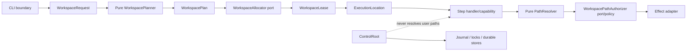
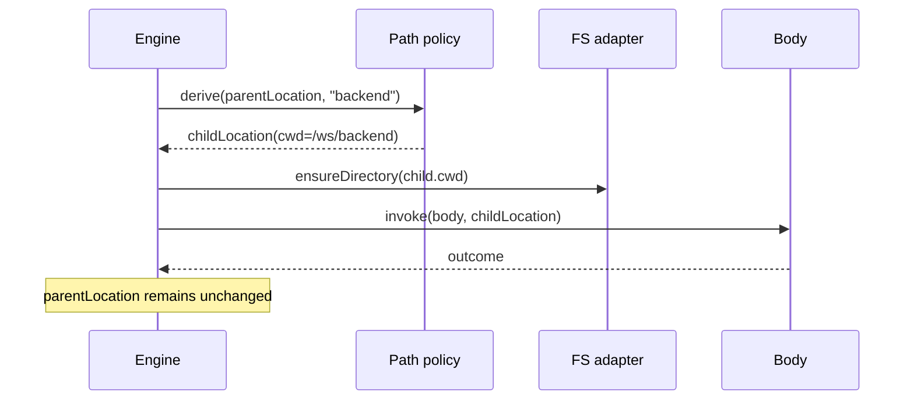

# 03 — Modelo de dominio y arquitectura

## 1. Diseño objetivo



Principio: **functional core, effectful shell**.

## 2. ADTs sugeridos

### 2.1 WorkspaceRequest

```kotlin
sealed interface WorkspaceRequest {
    data object AttachInvocationDirectory : WorkspaceRequest
    data class AttachExplicit(val path: Path) : WorkspaceRequest
    data object ManagedIsolated : WorkspaceRequest
}
```

### 2.2 WorkspaceLease

En lugar de `ownership` + `lifecycle` como dos flags que permiten combinaciones ilegales:

```kotlin
sealed interface WorkspaceLease {
    val root: WorkspaceRoot
    val allocation: WorkspaceAllocationPolicy

    data class Attached(
        override val root: WorkspaceRoot,
        override val allocation: WorkspaceAllocationPolicy = WorkspaceAllocationPolicy.RunShared,
        val source: AttachedSource,
    ) : WorkspaceLease

    data class Managed(
        override val root: WorkspaceRoot,
        override val allocation: WorkspaceAllocationPolicy,
        val leaseId: WorkspaceLeaseId,
    ) : WorkspaceLease
}

sealed interface AttachedSource {
    data object InvocationDirectory : AttachedSource
    data class Explicit(val requested: Path) : AttachedSource
}
```

La forma `Attached` implica que PipelineK **no es propietario de la raíz**. `Managed` implica lifecycle controlado.

### 2.3 Value objects

```kotlin
@JvmInline
value class WorkspaceRoot private constructor(val value: Path)

@JvmInline
value class WorkingDirectory private constructor(val value: Path)

@JvmInline
value class WorkspaceLeaseId(val value: String)
```

Los factories normalizan/validan. Los constructores públicos no deben aceptar paths arbitrarios no normalizados.

### 2.4 ExecutionLocation

```kotlin
data class ExecutionLocation(
    val workspace: WorkspaceLease,
    val cwd: WorkingDirectory,
)
```

Ley estructural:

```text
cwd ∈ workspace.root
```

### 2.5 WorkspaceAllocationPolicy

```kotlin
sealed interface WorkspaceAllocationPolicy {
    data object RunShared : WorkspaceAllocationPolicy
    data object StageIsolated : WorkspaceAllocationPolicy
    data object BranchIsolated : WorkspaceAllocationPolicy
}
```

`BranchIsolated` puede permanecer sin wiring hasta que exista necesidad; incluirlo sólo si el roadmap quiere congelar ya la extensibilidad. Si se prefiere YAGNI estricto, omitirlo y añadirlo cuando toque.

## 3. Decisión pura de CLI

No se debe dispersar la semántica entre `CliParser`, `Main`, `CompositionRoot` y `WorkspaceResolver`.

```kotlin
data class WorkspaceCliInput(
    val invocationDirectory: Path,
    val workspaceFlag: String?,
    val isolated: Boolean,
)

sealed interface WorkspaceRequestDecision {
    data class Accepted(val request: WorkspaceRequest) : WorkspaceRequestDecision
    data class Rejected(val error: WorkspaceCliError) : WorkspaceRequestDecision
}
```

`decideWorkspaceRequest(input)` es pura y tiene tabla exhaustiva:

| `--workspace` | `--isolated` | Resultado |
|---|---:|---|
| null | false | AttachInvocationDirectory |
| path | false | AttachExplicit(path) |
| null | true | ManagedIsolated |
| path | true | Rejected(MutuallyExclusive) |

## 4. WorkspacePlanner vs WorkspaceAllocator

### WorkspacePlanner — dominio/aplicación pura

Decide:

- tipo de lease;
- allocation policy;
- requirements (`mustExist`, `createManaged`, etc.).

No crea directorios.

### WorkspaceAllocator — port

```kotlin
interface WorkspaceAllocator {
    fun acquire(plan: WorkspacePlan): WorkspaceAcquireResult
    fun release(lease: WorkspaceLease, outcome: RunOutcome): WorkspaceReleaseResult
}
```

El adaptador local usa `Files.*`.

Esta separación permite que en el futuro Docker/Kubernetes/Dagger/remote runner implementen la misma intención sin contaminar el dominio actual.

## 5. `dir` como derivación pura

```kotlin
fun deriveDirectory(
    parent: ExecutionLocation,
    raw: String,
): Either<WorkspacePathError, ExecutionLocation>
```

No toca filesystem salvo que el interpreter decida crear el target después de autorizarlo.



## 6. Capabilities objetivo

### 6.1 Nueva authority

Preferencia:

```kotlin
val EXECUTION_LOCATION_CAPABILITY =
    StepCapability("runtime.execution-location")
```

con:

```kotlin
ExecutionLocation(workspace, cwd)
```

### 6.2 Migración de `WorkspaceIdentity`

`WORKSPACE_IDENTITY_CAPABILITY` no debe seguir portando un campo `workspaceRoot` que a veces es cwd.

Transición:

1. Introducir `EXECUTION_LOCATION_CAPABILITY` aditivamente.
2. Los nuevos/migrados Steps consumen la nueva capability.
3. El bridge legado deriva `WorkspaceIdentity` **sólo con el root real**, nunca con cwd.
4. Cuando no queden consumidores públicos certificados, deprecar/eliminar el alias legado según compatibilidad binaria.

## 7. `ShOptions` objetivo

`workspaceRoot` es una preocupación de contexto, no una opción del proceso shell.

Objetivo final:

```kotlin
data class ProcessExecutionOptions(
    val cwd: Path,
    val captureStdout: Boolean,
    val timeoutMs: Long?,
    val env: Map<String, SecretHandle>,
    val sandbox: SandboxConfig,
)
```

Durante la migración, `ShOptions` puede sobrevivir como carrier compatible, pero debe construirse desde `ExecutionLocation` en un único seam.

No deben convivir indefinidamente:

```text
ExecutionLocation.cwd
ShOptions.workingDirectory?
ShOptions.workspaceRoot usado como cwd
```

## 8. PathResolver

```kotlin
sealed interface PathAnchor {
    data object CurrentDirectory : PathAnchor
    data object WorkspaceRoot : PathAnchor
}

data class PathRequest(
    val raw: String,
    val anchor: PathAnchor,
    val absolutePolicy: AbsolutePathPolicy,
)
```

Función pura para resolución léxica:

```kotlin
fun resolveLexically(
    location: ExecutionLocation,
    request: PathRequest,
): Either<WorkspacePathError, ResolvedWorkspacePath>
```

El chequeo de symlinks requiere I/O y vive en un authorizer/adapter posterior.

## 9. Seguridad: dos boundaries

### WIDE boundary

`workspace.root` es la frontera autorizada inmutable.

### LOCAL base

`cwd` es sólo la base contextual para rutas relativas.

Nunca usar `cwd` como nueva frontera de seguridad. Eso evita el bug conceptual ya observado históricamente: entrar en `dir` no debe impedir acceder a un hermano permitido si el contrato del Step lo admite, ni debe ampliar la frontera fuera del workspace.

## 10. Stores internos

Stash/archive/report/journal tienen storage durable fuera del workspace, pero su **source/target de usuario** se resuelve mediante `ExecutionLocation`.

Ejemplo:

```text
stash source    -> cwd / workspace policy
stash durable   -> controlRoot/stashes/... (port interno)

archive source  -> anchor definido por contrato
archive durable -> controlRoot/artefacts/...
```

No mezclar ambas rutas en un mismo `PathAnchor`.

## 11. Context propagation

El canonical engine ya dispone de overlays/contexto inmutable. La evolución debe converger con esa arquitectura:

```text
ExecutionContext
  ├── Cwd overlay
  ├── Environment overlay
  ├── Deadline overlay
  └── Credential overlay

ExecutionLocation
  ├── WorkspaceLease (stable)
  └── cwd (derived)
```

A medio plazo puede existir una única proyección tipada del contexto runtime, pero esta WU no debe fusionar por fuerza todos los overlays si eso aumenta el blast radius.

## 12. Arquitectura emergente

La abstracción está deliberadamente preparada para:

- host local;
- scratch gestionado;
- container workspace;
- Kubernetes agent;
- remote worker;
- Dagger-like Directory/Workdir;

sin introducir ninguna de esas implementaciones ahora.

La regla de extensibilidad es: **nuevo allocator/adaptador; no nuevo significado de `workspaceRoot`.**
