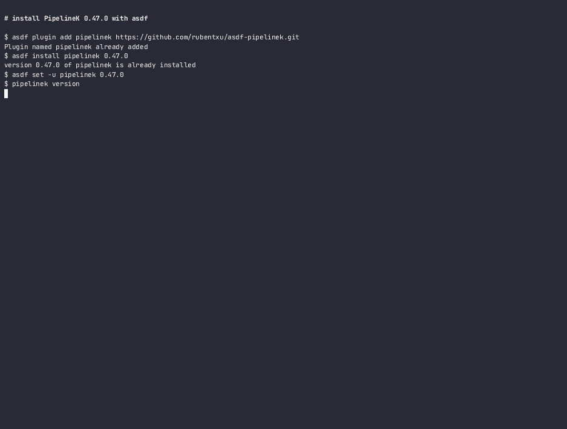
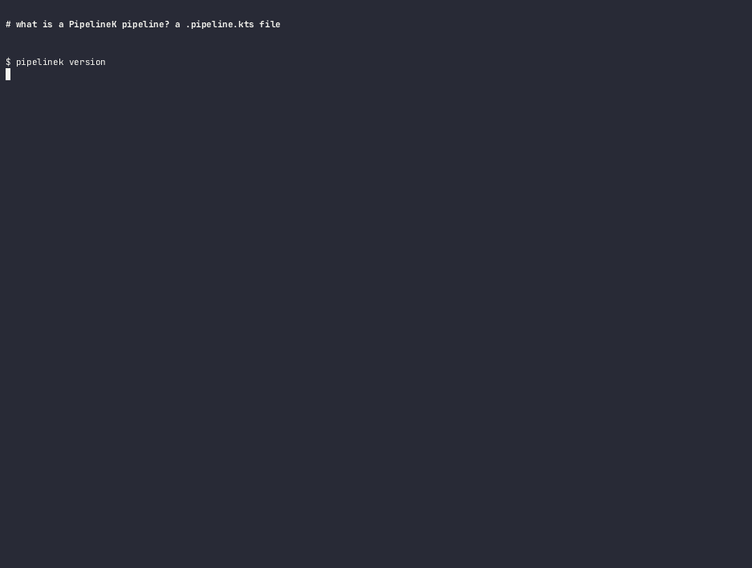
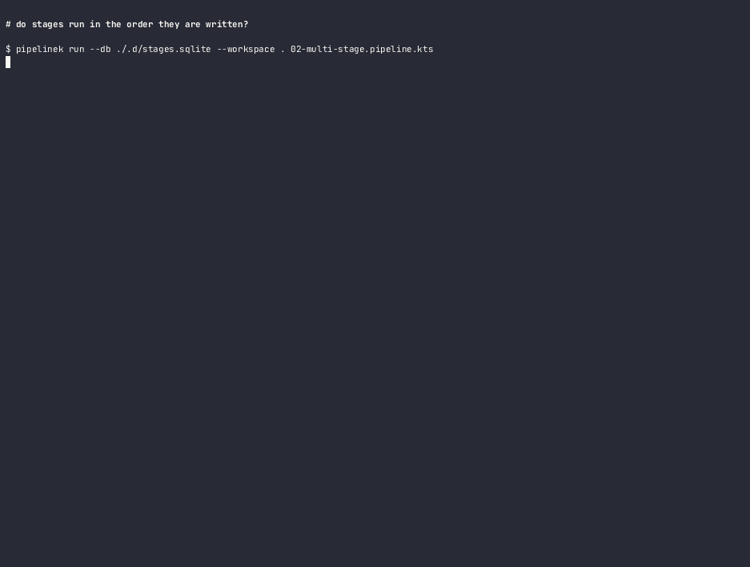
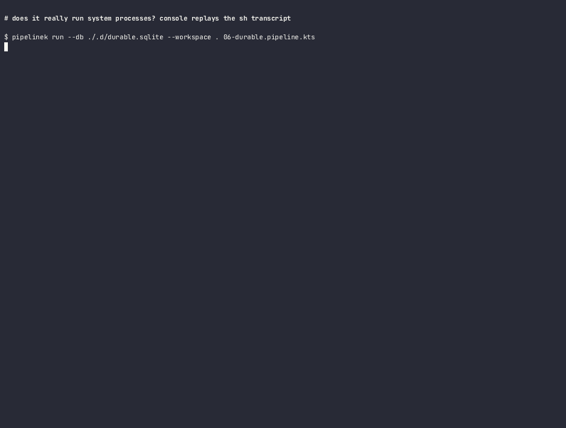
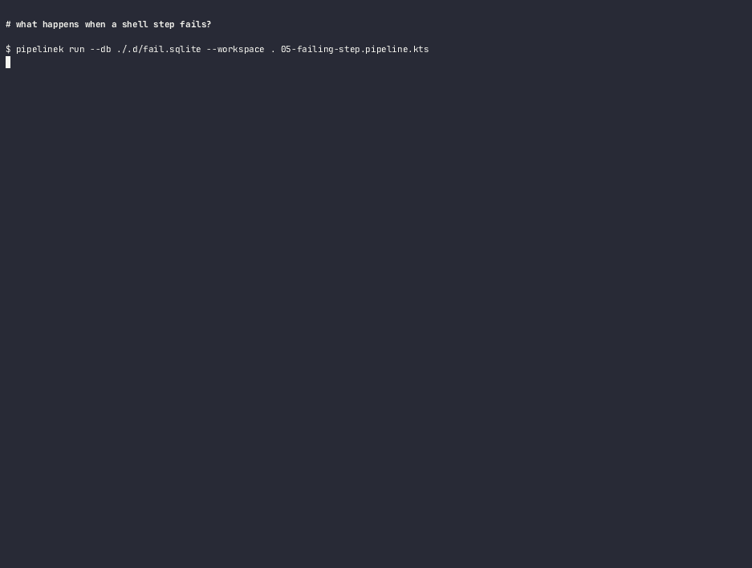
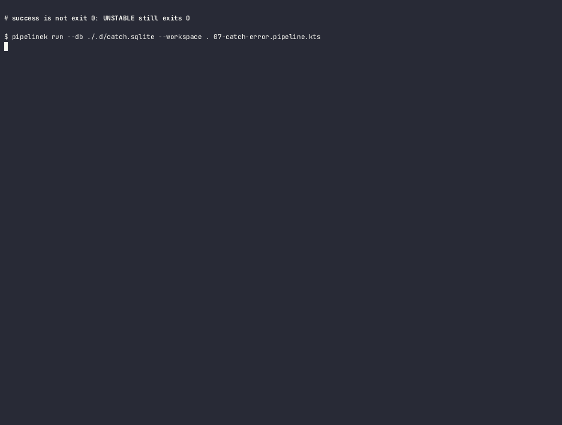
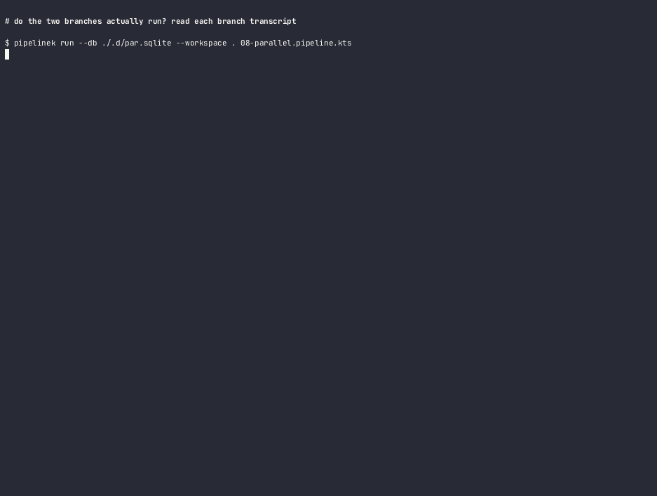
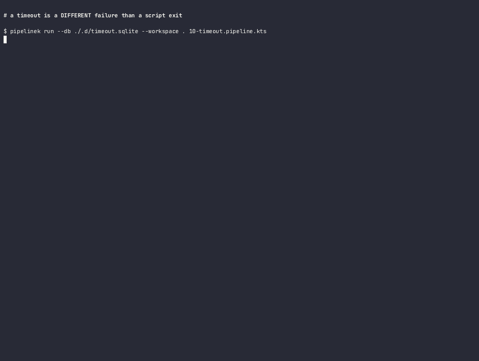

# PipelineK — Ejemplos grabados

**Grabado contra**: `pipelinek 0.47.0` instalado por asdf (`~/.asdf/installs/pipelinek/0.47.0`),
2026-10-06. No es una compilación de Gradle: nada de salida del compilador ni ruido de build.
**Ningún recibo publicado cubre estas grabaciones.** Este repositorio no tiene CI remota desde
2026-09-30, así que esta página no reclama ningún gate de producción. Ver
[`cli-reference.es.md`](cli-reference.es.md) → «Nota de autoridad».

No son capturas. Cada fotograma es el binario real escribiendo en una terminal real, con el shim de
`asdf` en el `PATH`. Nada está preparado ni editado a mano.

## Por qué cada uno es distinto

La primera versión de esta página grababa diez GIF que eran, en la práctica, la misma grabación diez
veces: mismo comando de versión, mismo `pipelinek run`, mismo `echo $?`. Lo único que cambiaba era
el nombre del fichero del pipeline. Eso no valía como documentación.

Cada demo de abajo responde ahora a **una pregunta concreta** y por tanto ejecuta **órdenes
distintas**. La pregunta se enuncia antes del GIF, para que sepas qué vas a ver y puedas juzgar si la
respuesta está en pantalla.

| # | Pregunta | Orden que la distingue |
|---|---|---|
| 00 | ¿Cómo lo instalo y está mi máquina bien? | `asdf install`, `pipelinek doctor` |
| 01 | ¿Qué es un pipeline y `validate` predice a `run`? | `validate` y luego `run` |
| 02 | ¿Las etapas se ejecutan en el orden que escribí? | `events` filtrado por etapa |
| 03 | ¿De verdad lanza procesos del sistema operativo? | transcripción con `console` |
| 05 | ¿Qué pasa cuando un shell falla? | `run` + `events`, con `StepFailed` |
| 07 | ¿Puede un pipeline acabar sin estar limpio y salir con 0? | `run`, con `UNSTABLE` |
| 08 | ¿Las ramas van realmente en paralelo? | `console` sobre las dos ramas |
| 10 | ¿Un timeout es solo otro fallo? | `run`, con `[TIMEOUT]` |

No hay demo para `06-durable` ni para `09-retry`, y es una decisión deliberada, no un descuido. Medí
ambos y ninguno deja una señal que los distinga en el CLI:

- **`06-durable`**: un segundo run contra el mismo `--db` produce exactamente el mismo espinazo de
  eventos que el primero. Nada en pantalla dice «reutilizado».
- **`09-retry`**: los reintentos **no se registran como steps separados**. El run muestra un único par
  `StepStarted`/`StepFinished`, igual que un acierto al primer intento. El bucle de reintento es
  invisible desde fuera.

Publicar un GIF que no puede demostrar su propio tema repetiría el error original. Los dos pipelines
siguen siendo ejecutables en [`examples/`](../../examples/) y están cubiertos en prosa en
[`pipeline-dsl.es.md`](pipeline-dsl.es.md).

## Qué se ve en pantalla

Cada grabación muestra, en este orden:

1. La línea de `pipelinek version`, para que veas exactamente qué build se está ejecutando.
2. La orden, escrita en el prompt.
3. La salida completa: el array de eventos en **stdout**, la transcripción y el resumen en
   **stderr**, y la salida de consola capturada. No se filtra nada por legibilidad. `jq` se usa sólo
   como formateador de identidad, porque un sobre JSON de una sola línea a 140 columnas es ilegible y
   recorta `RunFinished`.
4. El código de salida real, leído de `${PIPESTATUS[0]}` cuando hay tubería — nunca de `$?`, que
   devolvería el de `jq`.

Sólo se quitan dos cosas de una grabación, y ambas son ruido de la máquina que graba, no de
PipelineK:

- Líneas `WARNING:` / `Picked up _JAVA_OPTIONS`, que el JDK de esta máquina emite y que contienen
  la ruta de instalación de quien graba.
- Líneas `mavis-trash:`, porque aquí `rm` está envuelto por una herramienta de papelera que imprime
  por stdout.

Todo lo demás — UUID, `occurredAt`, `eventId`, run ids — se deja. Es ruidoso, y es lo que el producto
produce realmente.

Una consecuencia se ve en todas las demos y conviene saber antes de copiar una orden: **los flags
van antes de la ruta del script**. `pipelinek run script.kts --db x` **ignora** `--db` en silencio;
`pipelinek run --db x script.kts` es la forma que funciona.

## 00 — Instalar con asdf

El plugin verifica el archivo contra el `SHA256SUMS` de la release y aborta si no coincide, así que
es una instalación con integridad comprobada, no una descarga.

```bash
asdf plugin add pipelinek https://github.com/rubentxu/asdf-pipelinek.git
asdf install pipelinek 0.47.0
asdf set -u pipelinek 0.47.0
pipelinek version
pipelinek doctor
```



`doctor` imprime tres líneas y nada más. La línea `workdir:` es una sonda real de escritura: crea
un fichero en el directorio actual y lo borra.

## 01 — El mínimo, y lo que `validate` no te dice



Lo interesante aquí es la diferencia entre `validate` y `run`. `validate` imprime
`VALIDATION SUCCESSFUL` para scripts que `run` después rechaza con exit `2`, porque `validate` nunca
llega al puente canónico donde se rechazan construcciones como `git()`, `load()`, `node {}` y
`ansiColor {}`. **La comprobación real es `run`.** Explicación completa en
[`cli-reference.es.md`](cli-reference.es.md) → «`validate` frente a `run`».

## 02 — ¿El orden que escribiste es el orden que se ejecuta?



Esta demo deja deliberadamente de ser sólo un `run`. Lee el historial del journal con `events` y lo
filtra a los subjects de etapa, para ver el orden en el historial registrado en lugar de deducirlo de
la salida. **El pipeline no se re-ejecuta.**

## 03 — Procesos reales del sistema operativo



Lo más útil de esta página. La salida de un step `sh` **no** aparece en el flujo de eventos: sólo
los steps `echo` emiten `EchoOutputCaptured`. Para ver qué imprimió realmente un shell, hay que leer
su transcripción durable:

```bash
pipelinek console --control-dir ./.d/durable-shell "$RUN_ID" "$OP_ID"
```

El `opId` se compone del subject del evento en un run lineal, tal y como describe la trampa 7 de
[`cli-reference.es.md`](cli-reference.es.md).

## 05 — Un step que falla detiene el run



En pantalla hay dos cosas. La línea del motivo nombra el fallo con su tipo —
`cause [SCRIPT]: shell exited with code 3` — y el flujo de eventos termina con `StepFailed` y
**nunca abre la etapa siguiente**. El run sale con `1`.

## 07 — No limpio no es lo mismo que fallido



Esta es la demo que más probablemente sorprende, y es la razón por la que la tabla de códigos de salida de
[`cli-reference.es.md`](cli-reference.es.md) incluye `Unstable` como `0`. Un pipeline puede terminar
**inestable** — no limpio, pero tampoco fallido — y el proceso sigue saliendo con `0`. Si tu CI
decide sólo por el código de salida, este es el caso que te va a morder.

## 08 — Ramas que sí van en paralelo



Las dos salidas de rama, recuperadas de los dos ficheros de stream distintos. Los `opId` llevan los
segmentos `-b` y `-bp`, y **no se pueden componer desde el historial de eventos**: allí sólo se
registran `stage` y `step`. Los nombres de los ficheros de stream del directorio de control son la
única fuente. Ésta es la razón de que la trampa 7 de la referencia del CLI advierta contra componer
el id a mano.

## 10 — Un timeout es su propio tipo de fallo



El mismo código de salida que la demo 05, con otro motivo: `cause [TIMEOUT]: durable shell timed
out`. El tipo de fallo forma parte del mensaje precisamente para que puedas distinguir un timeout de
un comando que devolvió un estado distinto de cero.

## Cómo se grabaron

- **Binario**: el `0.47.0` instalado por asdf, no el `installDist` de Gradle. Antes de cada grabación
  se verificó el shim con `pipelinek version`.
- **Lienzo**: 140x45 a 12 fps. Los 12 fps son deliberados: a los 50 fps por defecto las mismas
  grabaciones ocupan 1317 KB; a 12 fps ocupan 705 KB, sin pérdida visible en salida de terminal,
  porque el texto de terminal cambia a ráfagas y no de forma continua.
- **Las rutas del journal llevan siempre componente de directorio.** `--db run.sqlite` revienta —
  ver [`cli-reference.es.md`](cli-reference.es.md) → trampa 11.
- **El harnés de grabación falla cerrado.** Tres puertas abortan la construcción: un escaneo de
  fugas de rutas y hostname de esta máquina, una puerta de contenido que rechaza errores visibles y
  exige las cadenas que distinguen a esa demo concreta, y una puerta de distinción que falla si dos
  demos acaban con el mismo conjunto de órdenes. Esa tercera puerta es el test de regresión del
  problema que tenía esta página.
- **Los ficheros binarios se declaran en `.gitattributes`** como `binary`, que git documenta como
  equivalente a `-diff -merge -text`, para que no se intenten conversiones de fin de línea ni diffs
  textuales sobre ellos.

Regenerar estos GIF no está automatizado a propósito. Cada regeneración añade un juego nuevo de
blobs que Git conserva para siempre, y las grabaciones son correctas para el binario con el que se
hicieron.

## Siguiente

- [`installation.es.md`](installation.es.md) — las tres vías de instalación, verificadas.
- [`cli-reference.es.md`](cli-reference.es.md) — cada comando, flag y código de salida.
- [`events-and-troubleshooting.es.md`](events-and-troubleshooting.es.md) — leer un run fallido.
- [`README.es.md`](README.es.md) — el índice.