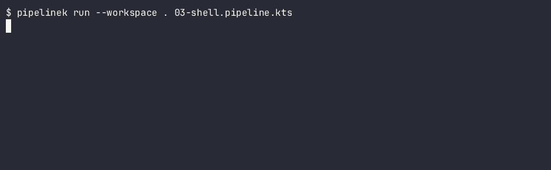
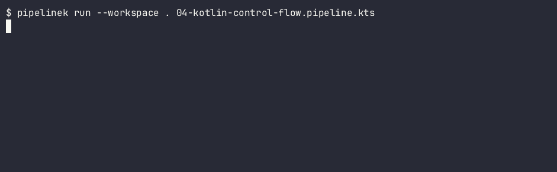
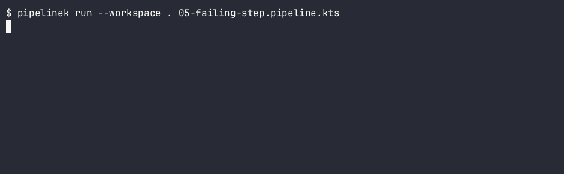
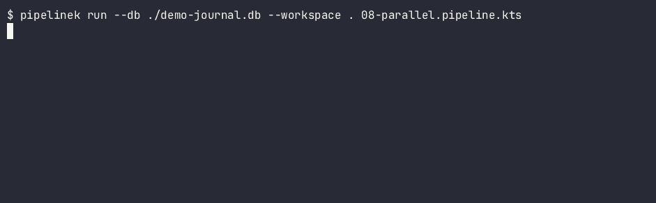
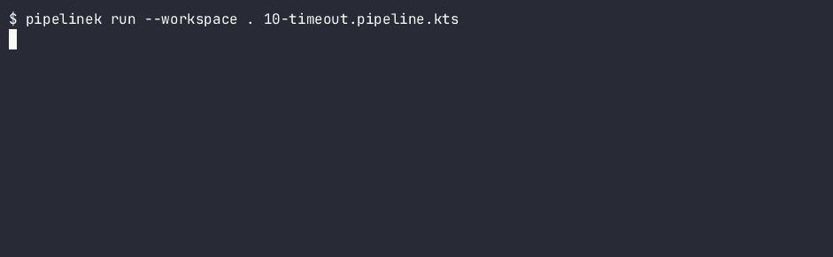

# PipelineK — Examples, recorded

**Recorded against**: `pipelinek 0.47.0`, built from the development branch, 2026-10-06
**Not verified against a published binary.** See [How these were recorded](#how-these-were-recorded).

Ten runnable pipelines live in [`examples/`](../../examples/). Each one runs against the **real
binary**, and this page shows you each of them running — the command, the outcome, and the exit
code.

| You want to see | Go to |
|---|---|
| The shortest pipeline that works | [01 — Hello](#01--hello) |
| Stages running in order | [02 — Multi-stage](#02--multi-stage) |
| Real OS processes | [03 — Shell](#03--shell) |
| Kotlin control flow inside a pipeline | [04 — Kotlin control flow](#04--kotlin-control-flow) |
| **A failure that stops the run** | [05 — Failing step](#05--failing-step) |
| Resuming from a journal | [06 — Durable](#06--durable) |
| **Recovering from a failure** | [07 — Catch error](#07--catch-error) |
| Two branches at once | [08 — Parallel](#08--parallel) |
| Retrying a flaky step | [09 — Retry](#09--retry) |
| **A timeout being enforced** | [10 — Timeout](#10--timeout) |

---

## What these GIFs show, and what they do not

Read this before you trust a frame.

**What you see** is real: the real `pipelinek` binary, the real pipeline file, the real outcome
line, and the real exit code.

**What you do not see** is the machine-readable event array. `pipelinek run` prints it on **stdout**
as a single JSON line, with a UUID and an ISO timestamp per event. It is deliberately absent from
these GIFs for two reasons: it is unreadable at GIF scale, and it changes on every single run, so a
demo containing it could never be regenerated the same way twice.

That array is not a log. It is the observability API, and it is the thing you will use in CI. It is
documented in full on
[Events and troubleshooting](events-and-troubleshooting.md), and `examples/run.sh` asserts on it.

The human summary line you *do* see comes from **stderr**:

```bash
# exactly what each GIF recorded
pipelinek run --workspace . 05-failing-step.pipeline.kts 2>&1 >/dev/null
echo $?
```

---

## Reproduce them yourself

A GIF is a picture of yesterday. This is the part you can trust today:

```bash
cd v2 && ./gradlew :pipeline-application:installDist
examples/run.sh                    # all ten, asserting exit code and event contract
examples/run.sh 05-failing-step.pipeline.kts   # just one
```

`examples/run.sh` is the real harness. It is not a GIF, it is a check: if the binary's behaviour
changes, it goes red. Read the full contract of each example, including its known limitations, in
[`examples/README.md`](../../examples/README.md).

---

## 01 — Hello

The minimum: one stage, one `echo`. Nothing to configure, nothing to depend on.


Outcome `success`, exit code `0`.

## 02 — Multi-stage

Three stages. They run in the order you declared them, not in alphabetical order — which is the
first thing people get wrong when they assume otherwise.


Outcome `success`, exit code `0`.

## 03 — Shell

`sh` spawns a real OS process, including a shell `for` loop. This is not an interpreter pretending;
it is your machine's shell.



Outcome `success`, exit code `0`.

## 04 — Kotlin control flow

Real Kotlin inside a `script {}` block: loops, conditionals, ordinary language features, in a
pipeline rather than next to it.



Outcome `success`, exit code `0`.

## 05 — Failing step

**The first one worth stopping at.** A stage runs, the next stage's `sh` exits `3`, and the run
stops. The stage after the failure never executes — it is not "logged and skipped", it does not
happen.



Outcome `failure`, exit code `1`. The reason line is `shell exited with code 3`: PipelineK reports
the code your process returned, it does not flatten every failure into a generic error.

## 06 — Durable

With `--db`, every operation is journaled in SQLite together with a fingerprint of its inputs. Kill
the run halfway and the next one picks up where it left off instead of starting over.


Outcome `success`, exit code `0`.

## 07 — Catch error

**The second one worth stopping at.** A nested `catchError`: the inner block turns a failure into
`FAILURE`, the outer one degrades it to `UNSTABLE`, and the run continues.


Outcome `unstable`, exit code **`0`**. This is why "exit code 0" is not the same as "success":
this run finished, and it is telling you it was not clean. Exit codes are in the
[CLI reference](cli-reference.md).

## 08 — Parallel

Two branches running concurrently. Run it a second time with the same `--db` and it reuses the
terminal result instead of relaunching the work — the fingerprint says the inputs did not change.



Outcome `success`, exit code `0`.

## 09 — Retry

`retry(3) { }`: the first attempt fails, the second succeeds. The marker file keeps the example
deterministic rather than relying on timing.


Outcome `success`, exit code `0`.

## 10 — Timeout

`timeout(2, "SECONDS")` aborts an over-running `sh`. Note *how* it fails: a timeout is a
`FAILURE`, not a silent kill.



Outcome `failure`, exit code `1`. The reason line reads `durable shell timed out`, which is a
different message from a plain script failure — because it is a different cause.

---

## How these were recorded

Stated so you can judge them: they were produced by [asciinema](https://asciinema.org/) capturing a
real session and [agg](https://github.com/asciinema/agg) rendering it. Both run from the user's home
directory and **nothing about the tooling is vendored into this repository** — no scripts, no
capture files, no binaries. Only the finished `.gif` files are checked in.

Two details that decide whether a recording like this is honest or noise:

- **stderr was recorded, stdout discarded.** Reason given above: stdout is the event array.
- **The recording filters the JDK's own warnings.** A JDK 23 or newer prints
  `WARNING: sun.misc.Unsafe …` including the absolute path of the installation, which leaks
  whoever recorded it. The project targets JDK 21, where that warning does not appear. PipelineK's
  own output is never filtered.

If a frame here disagrees with what you get on your machine, trust `examples/run.sh` over the GIF.

---

## Next

- [`quickstart.md`](quickstart.md) — write and run your first pipeline.
- [`pipeline-dsl.md`](pipeline-dsl.md) — every construct the DSL offers.
- [`events-and-troubleshooting.md`](events-and-troubleshooting.md) — the event array the GIFs omit.
- Hub: [`docs/user/README.md`](README.md).