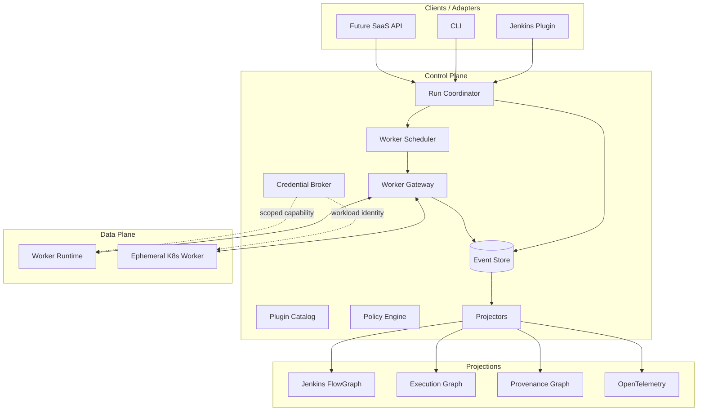

# Arquitectura V2

## Vista general



## Hexagonal boundaries

### Domain
Tipos puros:
- IDs y value objects;
- Run/Stage/Step/Attempt state machines;
- Worker/Lease/Capability;
- EventEnvelope payloads de dominio;
- graph entity/relation semantics;
- artifact/provenance identities;
- policies y error taxonomy.

No depende de frameworks.

### Application
Use cases y ports:
- StartRun;
- AcquireWorker;
- HandleWorkerEvent;
- CancelRun;
- RecoverRun;
- ForkRun;
- ResolveCredential;
- PublishArtifact;
- ProjectEvent.

### Adapters
Jenkins, Kubernetes, gRPC/WebSocket, SQLite/Postgres, object stores, graph stores, OpenTelemetry, credentials providers.

## Módulos objetivo

```text
pipeline-domain
pipeline-application
pipeline-dsl-api
pipeline-scripting-api
pipeline-scripting-kotlin24
pipeline-step-api
pipeline-step-codegen
pipeline-plugin-api
pipeline-protocol
pipeline-runtime
pipeline-event-store-api
pipeline-graph-api
pipeline-worker-runtime
pipeline-worker-gateway
pipeline-worker-kubernetes
pipeline-credentials-api
pipeline-artifacts-api
pipeline-jenkins-plugin
pipeline-jenkins-kubernetes-bridge
pipeline-cli
pipeline-lsp
pipeline-testkit
```

## Regla de dependencias

```text
adapters ───────► application ───────► domain
DSL facade ─────► step/application contracts
runtime ────────► application/domain
Jenkins ────────► application/protocol
Kubernetes ─────► worker/application ports
```

Prohibido:
- `domain -> Koin`;
- `domain -> Jenkins`;
- `domain -> Kubernetes client`;
- `domain -> Docker client`;
- `application -> concrete event/graph DB`.

## Controller vs worker

### Controller/control plane
- job/run lifecycle;
- queue/scheduler orchestration;
- RBAC/UI integration;
- event reducer/projectors;
- credentials authorization/broker;
- worker provisioning request;
- cancellation/approval/control steps.

### Worker
- checkout/workspace;
- Kotlin compile/evaluate;
- user DSL/runtime;
- shell/process/container execution;
- test result parsing local;
- artifact upload directo;
- local journal;
- logs/chunks/metrics;
- credential projection local.

## Ejecución de Steps por location

```kotlin
enum class ExecutionLocation {
    WORKER,
    CONTROLLER_CONTROL,
    EXTERNAL
}
```

No se intenta ejecutar todo remotamente por dogma. `input`/approval/job-trigger pueden ser control-plane operations; build workload permanece en worker.
