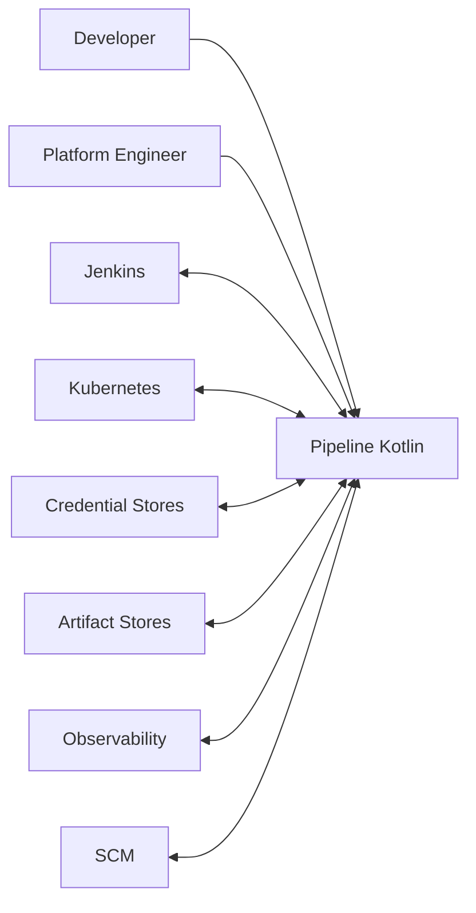
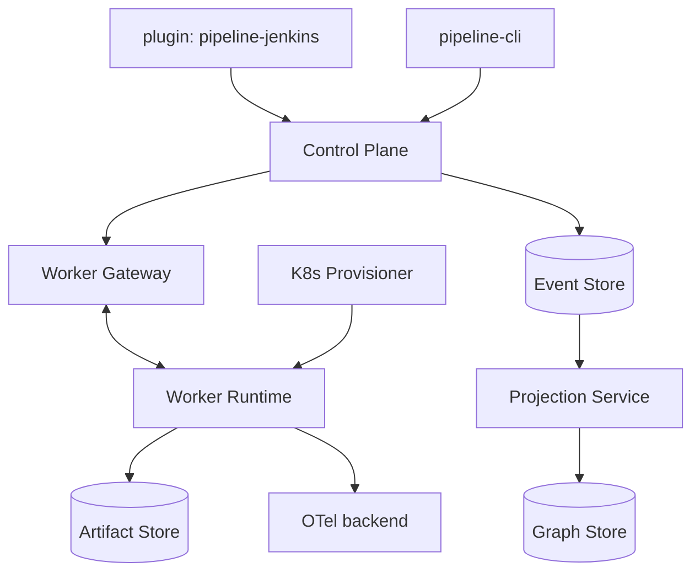
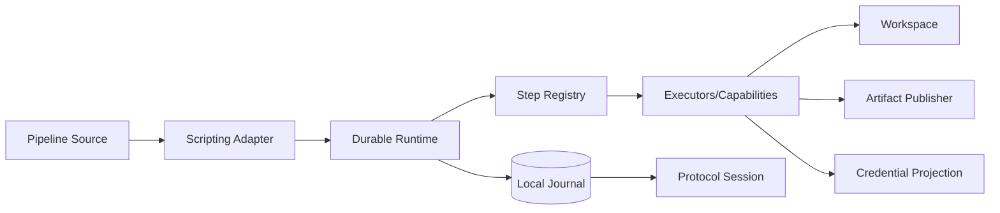
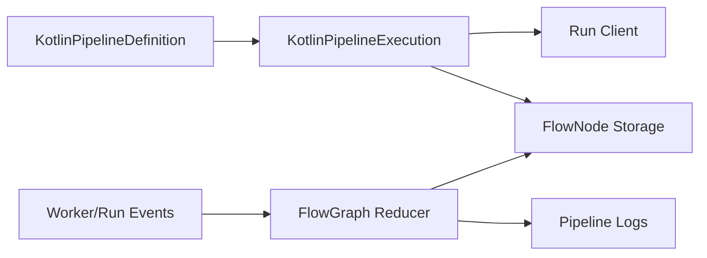

# C4 Model

## C1 — System Context

Pipeline Kotlin coordina y ejecuta CI/CD; Jenkins es un adapter/control plane posible, no el sistema dueño del runtime.

## C2 — Containers

## C3 — Worker Runtime

## C3 — Jenkins Adapter

`FlowExecution` no contiene el runtime Kotlin ni una continuation; conserva run identity, heads/projection state, last sequence y comandos de control.
