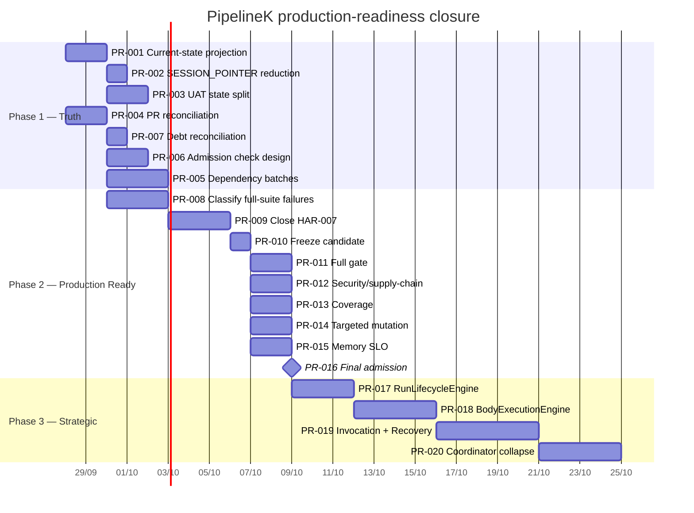
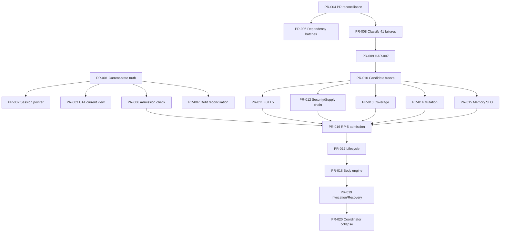

# Timeline and Dependencies

## Recommended calendar

## Dependency graph

## Critical path

`PR-004 → PR-008 → PR-009 → PR-010 → PR-011 → PR-016`

The documentation and admission-control work should execute in parallel with the early part of that path.
