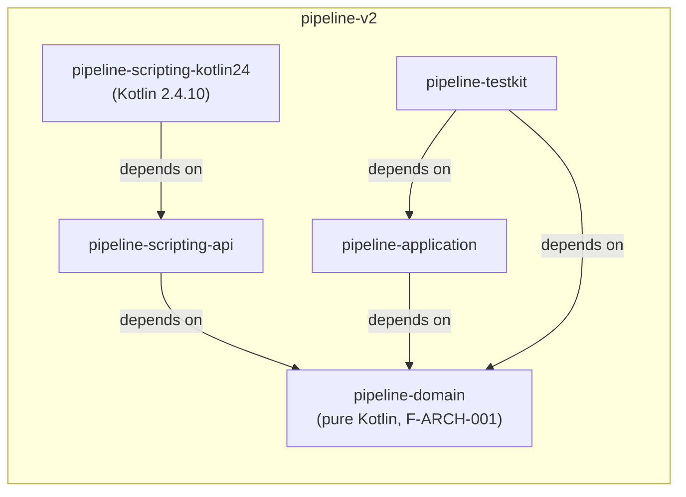

# V1 Component Inventory

**Cycle**: `p-733fb505b5a6bd2d/m0-r1-architecture-baseline`
**Authority**: [[ADR-GOV-001-docs-v2-ownership]], [[INC-005-compiler-plugin-k2-api-drift]], F-ARCH-001, F-ARCH-003, F-ARCH-004

## V1 Component Inventory

| Component | Current | V2 destination | Action | Milestone | blocks M0 |
|---|---|---|---|---|---|
| :core (root) | legacy DSL + service locator | domain/application split | REWRITE | M1–M3 | **no** |
| :core:dsl (PipelineDslEngine, builders) | legacy DSL | scripting-kotlin24 | REWRITE | M1–M2 | **no** |
| :core:dsl:engines DslManager | ServiceLocator | scripting/app use cases | RETIRE | M1 | **no** |
| :core:steps:registry UnifiedStepRegistry | reflection registry | KSP StepDescriptors | RETIRE | M2 | **no** |
| :core:steps:builtin echo/sh/error/sleep | builtin steps | Step SDK V2 | ADAPT | M2 | **no** |
| :core:runner, :core:context | dup runners + SL | RunCoordinator + ports | RETIRE | M1–M3 | **no** |
| :core:events (in-memory EventBus) | in-memory bus | durable journal + projections | RETIRE | M3 | **no** |
| :core:security SecurityManager sandbox | JVM SecurityManager | container sandbox | RETIRE | M5 | **no** |
| :core:compilation + :core:compiler | old pipeline | scripting-kotlin24 | REWRITE | M1 | **no** |
| :core:model:{config,job,pipeline,scm} | mixed models | typed resource manifests | ADAPT | M2 | **no** |
| :core:annotations (@Step etc.) | annotations | Step SDK annotations | KEEP concept | M2 | **no** |
| :core:pipeline:kotlin:extensions | stray DSL | scripting-api | ADAPT | M1 | **no** |
| :core:{logger,validation,library,error} | helpers | domain/application helpers | ADAPT | M1 | **no** |
| :core:plugins Koin wiring | Koin DI | composition-root adapter | ADAPT | M1 | **no** |
| :pipeline-cli AdvancedCommands | Clikt 2.8.0 wrapper | V2 CLI | ADAPT | M1 | **no** |
| :pipeline-config YAML maps | YAML maps | typed manifests | REWRITE | M5 | **no** |
| :pipeline-backend Docker/K8s adapters | backend/agent | capability adapters | ADAPT | M5 | **no** |
| :pipeline-lsp-server regex analyzer | regex analyzer | generated metadata + tooling | RETIRE | M2 | **no** |
| :pipeline-steps-system:plugin-annotations | @Step metadata | Step SDK annotations | KEEP | M2 | **no** |
| :pipeline-steps-system:gradle-plugin | Gradle plugin | Gradle plugin V2 | ADAPT | M2 | **no** |
| :pipeline-steps-system:compiler-plugin | FIR/IR plugin | diagnostics only, M2+ | **SPIKE** `**[QUARANTINE]**` (cites [[INC-005-compiler-plugin-k2-api-drift]]) | M2+ | **no** |
| :lib-examples (root, disabled) | DSL samples | V2 fixtures | ADAPT | M1 | **no** |

[^steps-system-note]: The bare container `:pipeline-steps-system` is not a build target; it is represented by its three children rows above (plugin-annotations, gradle-plugin, compiler-plugin).

## M0 Scope Manifest

| Milestone | In/Out | Rationale |
|---|---|---|
| M0-R1 (architecture-baseline docs) | **In** | This cycle: V1 inventory + KEEP/ADAPT/REWRITE/RETIRE/SPIKE classification + QUARANTINE, V2 lane definition, forbidden edges, agent scope firewall. |
| M0-R2 (V2 module skeleton) | **Out** | pipeline-domain/application/scripting-api/testkit with Kotlin 2.4.10/JVM 21 and zero compile excludes; owned by M0-R2. |
| M0-R3 (architecture fitness functions) | **Out** | Executable tests F-ARCH-001/002/003/004/011; owned by M0-R3. |
| M0-R4 (CI + compatibility baseline) | **Out** | V2 CI lane, no-excludes policy enforcement, Kotlin/JDK compatibility matrix; owned by M0-R4. |
| M0-R5 (baseline UAT) | **Out** | UAT-M0-001: HelloPipeline fixture/V2 minimal API reproducible build — NOT Custom Scripting, which is M1's UAT-COMP-001; owned by M0-R5. |

## V2 Module Skeleton



**Inward-edge invariant**: all arrows point toward `pipeline-domain`. No module depends on anything outside the inward-facing tree. This enforces F-ARCH-001 (framework-free domain).

## Forbidden Dependencies

| Forbidden edge | Reason |
|---|---|
| pipeline-* → :pipeline-steps-system:compiler-plugin | F-ARCH-004 + [[INC-005-compiler-plugin-k2-api-drift]] |
| pipeline-domain → Jenkins / Kubernetes / Koin / Docker / DB clients | F-ARCH-001 |
| pipeline-* (non-scripting) → kotlin.script.experimental.* | F-ARCH-003 |
| V2 → V1 implementations | seam spec (non-increasing coupling) |

**Exactly four forbidden edges** — no fifth. See `v2-module-skeleton` Requirement 2.

## Proposed Gradle Layout (proposal level)

```kotlin
// v2/settings.gradle.kts (includedBuild)
rootProject.name = "pipeline-v2"

include(":pipeline-domain")
include(":pipeline-application")
include(":pipeline-scripting-api")
include(":pipeline-scripting-kotlin24")
include(":pipeline-testkit")
include(":pipeline-architecture-tests")  // optional
```

V1 modules stay at their current root paths. V2 lives under an includedBuild so V1 CI does not block V2.

> **No `v2/` directory created this cycle.** The layout above is proposal-level only. M0-R2 owns the actual scaffold.
