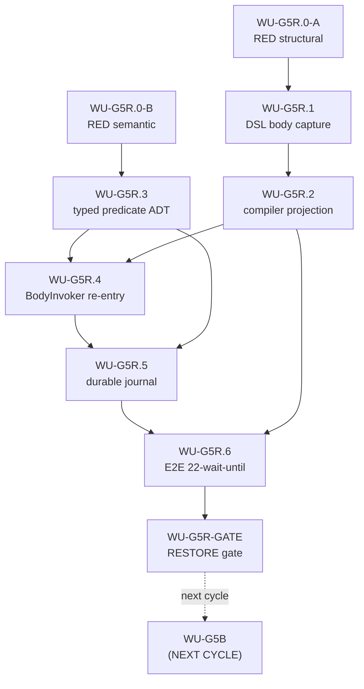

# Tasks: wu-g5-restore — make `waitUntil { body }` reach `dispatchRepeatUntilBody`

**Cycle:** wu-g5-restore
**Branch:** cycle/wu-g5-restore @ d4bc3ce7
**Base:** ca28959f (post lfc2-fixture-debt merge)
**Path:** A-lite, P2 surgical-add (design §14.1, user-approved 2026-09-16)
**Date:** 2026-09-16
**Authority:** design §14 (orchestrator decision record, closed). Spec §14 carries forward the same closed shape.

> This document implements design §14 into reviewable work units. It does NOT
> re-open the closed decisions in §14 and does NOT implement production code.
> It only decomposes the work into a sequence of bounded, verifiable slices.

---

## 0. Reading order and invariants (must-read before any WU)

1. `openspec/changes/wu-g5-restore/design.md` §14 — closed decisions (P2,
   registry removal, typed predicate outcome ADT, no exit-code fold,
   no event-as-authority, revised slice order G5R.0..GATE). DO NOT re-open.
2. `openspec/changes/wu-g5-restore/spec.md` — ADDED/MODIFIED requirements
   and cross-cutting constraints. Each WU MUST name which ADDED/MODIFIED
   requirement it satisfies.
3. `docs/v2/07-uat/B14_WAITUNTIL_G5A_INVALIDATION_RECEIPT.md` (commit
   `a31b2fa4`) — receipt of record for the gap this cycle closes. Do NOT
   modify. Reference by SHA.
4. AGENTS.md §STEP CONSTITUTION (structural constructs are NOT registry
   Steps), §10 (DSL describes; interpreters execute — no eager body eval),
   §7 (decide purely, then interpret), §8 (ADT-first modelling),
   §RETRY-D (durable control row law), §PAR-D (coroutine ≠ durable authority),
   §CTX-P (explicit immutable execution context).
5. Implementation reference (NOT cherry-pick source): commit `92971881`. Code
   shape must match the references byte-for-byte where present, but every
   gate is re-demonstrated on current HEAD.

### 0.1 Slice numbering

```text
WU-G5R.0-A   RED characterization — structural (DSL → OpaqueStepNode today)
WU-G5R.0-B   RED characterization — semantic (predicate ≠ body failure)
WU-G5R.1     structural DSL — waitUntil owns body (StepSpec.WaitUntilBlock)
WU-G5R.2     compiler projection — WaitUntilBlock → BlockStepNode
WU-G5R.3     typed predicate outcome ADT (WaitUntilPredicateOutcome)
WU-G5R.4     canonical BodyInvoker re-entry (dispatchRepeatUntilBody)
WU-G5R.5     durable predicate/iteration journal (WaitUntilControlJournal)
WU-G5R.6     real pipeline E2E (v2/compatibility/22-wait-until.pipeline.kts)
WU-G5R-GATE  RESTORE gate (fitness, inventory row, closure receipt, L5)
WU-G5B       NEXT CYCLE (NOT THIS PR)
```

### 0.2 Mandatory REDs first (do not write implementation before both are red)

`design §14.5` mandates two REDs as the slice's first move. The apply
agent MUST demonstrate both REDs in this cycle's git history before any
production code lands. Failure to satisfy this precondition blocks the
slice per design §14.5.

### 0.3 Pre-existing reds (do not widen)

The L4/L5 gate MUST hold these stable (baseline proven on `ca28959f`):

```text
CanonicalDurableRunCoordinatorTest          26 / 11
CompatibilityCorpusTest                     20 / 2
Lfc0GlobalStateFitnessTest                  1 (KDoc false positive)
UAT 005 / 007 / 008 / 009                   baseline
fixture14 (credentials)                     baseline
```

Widen = any of these counts goes UP. Reconciliation rule: if L4/L5
moves the count up by even one, halt and diagnose per AGENTS.md V2
TESTING RULES §28–31.

---

## 1. Dependency DAG



ASCII fallback:

```text
G5R.0-A ──> G5R.1 ──> G5R.2 ──┐
                              ├──> G5R.4 ──> G5R.5 ──> G5R.6 ──> G5R-GATE
G5R.0-B ──> G5R.3 ────────────┘
                              │
                              └──> G5R.5 (predicate ADT feeds the journal)
```

---

## 2. Commit order (one commit per WU; conventional messages)

```text
1.  test(wu-g5-restore): RED-A — Lfc2WaitUntilDslCanonicalProjectionTest
2.  test(wu-g5-restore): RED-B — WaitUntilPredicateOutcomeSemanticTest
3.  feat(wu-g5-restore): DSL body capture (StepSpec.WaitUntilBlock; waitUntil { body })
4.  feat(wu-g5-restore): compiler projection — WaitUntilBlock → BlockStepNode
5.  feat(wu-g5-restore): BodyExecutionPolicy.RepeatUntil + WaitUntilPredicateOutcome ADT
6.  feat(wu-g5-restore): canonical dispatch — BlockShellScope.RepeatUntil + dispatchRepeatUntilBody
7.  feat(wu-g5-restore): durable journal — WaitUntilControlJournal + WaitUntilReconciler (pure)
8.  feat(wu-g5-restore): E2E — v2/compatibility/22-wait-until.pipeline.kts + fitness in-process
9.  docs(wu-g5-restore): RESTORE closure receipt + inventory row update
10. (separate cycle, separate PR) chore(wu-g5b): LEGACY_REMOVED — see §10
```

Each commit MUST pass L0 compile (`./gradlew -p v2 :pipeline-application:compileTestKotlin`
or module equivalent) before the next. Pre-existing reds MUST be unchanged
at each commit boundary. The orchestrator MAY batch test-only changes in one
commit (1+2) only if rule 18 (one behavior per iteration) is preserved — keep
1 and 2 as separate commits.

---

## 3. WU-G5R.0-A — RED characterization (structural)

**Title:** Pin the structural defect: `waitUntil { body }` lowers today to
`OpaqueStepNode("core.waitUntil")`; must lower to a body-bearing
`BlockStepNode(BodyExecutionPolicy.RepeatUntil)`.

**Files touched (test only):**
- `v2/pipeline-application/src/test/kotlin/dev/rubentxu/pipeline/v2/application/Lfc2WaitUntilDslCanonicalProjectionTest.kt` (NEW)

**Files read but not modified:**
- `v2/pipeline-scripting-api/src/main/kotlin/dev/rubentxu/pipeline/v2/dsl/PipelineDsl.kt` (L645-654, L1677-1695)
- `v2/pipeline-application/src/main/kotlin/dev/rubentxu/pipeline/v2/application/DslCompiledPipelineCompiler.kt` (L140-229)
- `v2/pipeline-scripting-api/src/test/kotlin/dev/rubentxu/pipeline/v2/dsl/PipelineDslSealedHierarchyTest.kt` (locked test pattern)

**Steps (concrete):**
1. Open `PipelineDslSealedHierarchyTest.kt` to mirror its construction idiom.
2. Create `Lfc2WaitUntilDslCanonicalProjectionTest` in the application test
   source set (NOT in architecture-tests — this is a characterization test,
   not a fitness). Test class MUST be `@Disabled`-free (RED must be honest).
3. Compose a pipeline with a single stage containing one
   `waitUntil(initialRecurrencePeriod = 1L) { sh("test -f /tmp/marker") }`
   block via the public DSL.
4. Invoke `DslCompiledPipelineCompiler.stepNode(stage.steps.single(), ...)`
   directly (mirror the production wiring used by the integration test
   `CompatibilityCorpusTest`).
5. Assert the produced `StepNode` is a `BlockStepNode` with
   `pluginStepId == PluginStepId("core.waitUntil")`, `body.isNotEmpty()`,
   and `payload` payload-kind `"waitUntilBlock"`.
6. Add a SECOND assertion that the produced StepNode is NOT an
   `OpaqueStepNode("core.waitUntil", ...)` (closure of design §14
   "no OpaqueStepNode for this key" — design §3.1).
7. Add `@DisplayName` with the canonical defect text so the failure message
   pinpoints the gap.

**Validation:**
```bash
timeout 600 ./gradlew -p v2 :pipeline-application:test \
  --tests 'Lfc2WaitUntilDslCanonicalProjectionTest'
```
Expected outcome **today (HEAD `d4bc3ce7`)**: **RED**, with the assertion
failure message naming the structural defect (OpaqueStepNode vs
BlockStepNode), NOT a compile error and NOT a timeout. AGENTS.md V2
TESTING RULES rule 21: a valid RED is an assertion failure for the
EXPECTED reason.

**Dependencies:** none. First slice.

**Estimated LOC:** ~80 (test only).

**Risk notes:**
- Compiles today against the existing `StepSpec.WaitUntil` + `BlockStepNode`
  types — no new production type needed for the RED.
- Assertion message MUST be self-explanatory; downstream reviewers must
  not have to read the test body to understand the defect.

**Scope firewall (what NOT to do):**
- Do NOT add any production source code in this WU.
- Do NOT touch `BodyExecutionPolicy`, `StepSpec`, `PipelineDsl`, or
  `DslCompiledPipelineCompiler`.
- Do NOT add a `core.waitUntil` StepDescriptor; the ADT case does not
  exist yet (the test must compile without referencing
  `BodyExecutionPolicy.RepeatUntil`).
- Do NOT mark the test `@Disabled` — RED must be honest (design §14.5).
- Do NOT introduce `@Ignore` or skip annotations on the assertion.

---

## 4. WU-G5R.0-B — RED characterization (semantic)

**Title:** Pin the semantic defect: `predicate == false` MUST NOT be
conflated with `body failed`. This test blocks the exit-code fold from
ever being introduced (design §14.3).

**Files touched (test only):**
- `v2/pipeline-domain/src/test/kotlin/dev/rubentxu/pipeline/v2/domain/step/WaitUntilPredicateOutcomeSemanticTest.kt` (NEW)
- (Optional mirror) `v2/pipeline-application/src/test/kotlin/dev/rubentxu/pipeline/v2/application/WaitUntilPredicateOutcomeReconcilerTest.kt` (NEW) — added if and only if the ADT can be referenced without the ADT existing yet (deferred to WU-G5R.3; see Variant B below).

**Alternative chosen — Variant A (selected, no `@Disabled`):** Write the
test against a deliberately minimal `WaitUntilPredicateOutcome` sealed ADT
declared inside the test file (file-private, isolated, will be removed when
WU-G5R.3 promotes the real ADT to production). The test proves the
DISTINCTION today — it does NOT depend on production code. The migration
step in WU-G5R.3 deletes the file-local ADT and points the test at the
production ADT by re-import.

**Steps:**
1. Declare a file-private `sealed interface WaitUntilPredicateOutcome` with
   the four cases from design §14.3 (`Satisfied`, `Unsatisfied`,
   `Failed(failure: TypedFailure)`, `Cancelled(reason: CancellationReason)`).
   Keep it inert — no production code references it.
2. Declare a file-private pure function
   `fun reconcileAfterPredicate(outcome: WaitUntilPredicateOutcome): Decision`
   with the four-fold semantics from design §14.3.
3. Assert: `reconcileAfterPredicate(Unsatisfied) == ScheduleAttempt(n+1)`
   and `reconcileAfterPredicate(Failed(...)) == TypedFailure(...)`. Both
   assertions in one test method to keep the RED compact.
4. Assert the negative case: `Unsatisfied` MUST NOT be folded to the same
   decision as `Failed` (this is the law the future exit-code fold would
   violate).
5. Optional second test method: assert that
   `reconcileAfterPredicate(Satisfied)` terminates the loop (e.g. returns
   `Completed`) and is distinct from `Failed`.

**Validation:**
```bash
timeout 600 ./gradlew -p v2 :pipeline-domain:test \
  --tests 'WaitUntilPredicateOutcomeSemanticTest'
```
Expected outcome: **GREEN** today (the test does not touch production
sources, and its file-private ADT distinguishes the four cases correctly).
The test is RED-proof-by-existence — it cannot regress to a future
exit-code fold that drops `Unsatisfied` into `Failed` because the
assertion explicitly forbids it. Once WU-G5R.3 promotes the ADT to
production, the apply agent deletes the file-private ADT and re-imports
the production ADT; the assertions remain identical; no semantic change.

**Dependencies:** none. Independent of G5R.0-A. May run in parallel with
G5R.0-A (commit order in §2 keeps them separate).

**Estimated LOC:** ~60 (test only).

**Risk notes:**
- The file-private ADT MUST be visually marked as a temporary twin
  (KDoc comment "TEMPORARY — replaced by production ADT in WU-G5R.3");
  otherwise a future reviewer will be confused.
- Do NOT export the file-private ADT — package-private at most.

**Scope firewall (what NOT to do):**
- Do NOT add production `WaitUntilPredicateOutcome` in this WU (deferred
  to WU-G5R.3 per design §14.4).
- Do NOT add a reconciler in this WU — only the file-private fold.
- Do NOT touch `RetryReconciler`, `WaitUntilReconciler`, or any durable
  journal code.
- Do NOT call this a "characterization" test of any existing reconciler —
  no production reconciler implements this fold yet.

---

## 5. WU-G5R.1 — Structural DSL: `waitUntil` owns body

**Title:** Rename `StepSpec.WaitUntil` → `StepSpec.WaitUntilBlock`; rewrite
the public `waitUntil { body }` DSL fun to capture the body as a
`List<StepSpec>` via the same `StageScope` mechanism used by
`retry`/`timeout`/`dir`/`timestamps`. Remove the eager `condition()`
invocation and the `throw RuntimeException(...)` from the DSL fun.

**Files touched:**
- `v2/pipeline-scripting-api/src/main/kotlin/dev/rubentxu/pipeline/v2/dsl/PipelineDsl.kt`
  - L645-651: rename `WaitUntil` → `WaitUntilBlock`; add
    `body: List<StepSpec> = emptyList()` field; preserve
    `initialRecurrencePeriod` and `quiet`; preserve `name`/`type`
    override to `"waitUntil"`.
  - L1677-1695: rewrite the `waitUntil` fun. New signature:
    `fun StageScope.waitUntil(initialRecurrencePeriod: Long = 1L, quiet: Boolean = false, body: StageScope.() -> Unit)`.
    Mirror `retry`/`timeout` byte-for-byte (capture via inner `StageScope`,
    call `inner.body()`, then `steps.add(StepSpec.WaitUntilBlock(...))`).
    Remove `condition: () -> Boolean` parameter entirely.
  - L1247: update the `is StepSpec.WaitUntil -> currentStep` arm to
    `is StepSpec.WaitUntilBlock -> currentStep` (this is the retryable-step
    map; pre-existing call site).
- `v2/pipeline-step-sdk/api/src/main/kotlin/dev/rubentxu/pipeline/v2/sdk/api/BlockStepFlattener.kt`
  - L194: update `is StepSpec.WaitUntil -> ...` to
    `is StepSpec.WaitUntilBlock -> ...`.
- Tests (existing; may need parameter updates):
  - `v2/pipeline-scripting-api/src/test/kotlin/dev/rubentxu/pipeline/v2/dsl/PipelineDslSealedHierarchyTest.kt` — verify it does not
    pin `WaitUntil`; if it does, update.
  - Any other test that constructs `StepSpec.WaitUntil(...)` directly —
    grep `StepSpec.WaitUntil\b` and update.

**Steps (concrete):**
1. `git grep -n 'StepSpec.WaitUntil\b'` → confirm three call sites
   (PipelineDsl L645, L1686; BlockStepFlattener L194; plus retryable map
   L1247 already noted above).
2. Apply rename at all four sites. Keep the `name = "waitUntil"`
   override so `pluginStepId` projection remains `"core.waitUntil"`.
3. In `PipelineDsl.waitUntil`, replace `condition: () -> Boolean` with
   `body: StageScope.() -> Unit`. Construct `StageScope(stageName, runtimeConfig)`,
   call `inner.body()`, then `steps.add(StepSpec.WaitUntilBlock(initialRecurrencePeriod, inner.steps.toList(), quiet))`.
4. Remove the `val result = condition()` line and the
   `if (!result) throw RuntimeException(...)` line.
5. Update KDoc on the fun to reflect body-capture semantics; cite
   AGENTS.md §10 ("DSL describes; interpreters execute").
6. Update any test that calls `waitUntil { ... }` with the old signature.
7. Run L0 compile; iterate until green.

**Validation:**
```bash
timeout 600 ./gradlew -p v2 :pipeline-scripting-api:compileKotlin
timeout 600 ./gradlew -p v2 :pipeline-scripting-api:compileTestKotlin
timeout 600 ./gradlew -p v2 :pipeline-application:compileTestKotlin
timeout 600 ./gradlew -p v2 :pipeline-application:test \
  --tests 'PipelineDslSealedHierarchyTest'
timeout 600 ./gradlew -p v2 :pipeline-application:test \
  --tests 'Lfc2WaitUntilDslCanonicalProjectionTest'
```

Expected outcomes:
- L0 compile: GREEN.
- `PipelineDslSealedHierarchyTest`: GREEN.
- `Lfc2WaitUntilDslCanonicalProjectionTest`: **STILL RED** (now with a
  different expected message: the test now compiles but the compiler still
  lowers to `OpaqueStepNode`). The RED reason flips from "compile error"
  to "class cast / no body" — the apply agent MUST verify the new RED
  message names `OpaqueStepNode` vs `BlockStepNode`, not a regression.

**Dependencies:** G5R.0-A (the RED-A test exists and is RED for the
structural defect).

**Estimated LOC:** ~30 production + ~10 test adjustments.

**Risk notes:**
- The rename may surface latent compile errors in test code that
  constructs `StepSpec.WaitUntil(...)` directly. Use `git grep` first
  to inventory.
- The `BlockStepFlattener` L194 update is mechanical; the existing
  `is StepSpec.WaitUntil` arm treats WaitUntil as terminal with no body.
  After rename, `WaitUntilBlock` MUST be treated as body-bearing —
  apply agent MUST verify the flatten logic for body-bearing variants
  (compare against the `RetryBlock` / `TimeoutBlock` arms immediately
  below L194).
- Eager-evaluation defect regression is the highest single risk per
  design §6; AGENTS.md §10 forbids `body()` at construction time.

**Scope firewall (what NOT to do):**
- Do NOT add `BodyExecutionPolicy.RepeatUntil` in this WU (deferred to
  G5R.3; design §14.4 orders ADT work after compiler).
- Do NOT touch `DslCompiledPipelineCompiler.kt` in this WU (G5R.2's
  territory; G5R.1 is DSL-only).
- Do NOT remove `CoreWaitUntilStep.registerInto(this)` in this WU
  (G5R.4's territory; design §14.2 closes it there).
- Do NOT add `WaitUntilPredicateOutcome` in this WU (G5R.3).
- Do NOT introduce a `PredicateBodyInvoker` port or any new dispatcher
  (G5R.4's territory).
- Do NOT change the `else -> OpaqueStepNode("core.${step.name}", ...)`
  catch-all in the compiler — the user-approved design flips it from
  within G5R.2, not here.

---

## 6. WU-G5R.2 — Compiler projection: `WaitUntilBlock` → `BlockStepNode`

**Title:** Add an explicit `is StepSpec.WaitUntilBlock -> blockStepNode(...)`
arm in `DslCompiledPipelineCompiler.stepNode` BEFORE the catch-all
`else -> OpaqueStepNode(...)`. Add the inner `is StepSpec.WaitUntilBlock -> step.body`
arm in `blockStepNode`'s inner `when`. Add the `is StepSpec.WaitUntilBlock`
arm in `blockPayload` (kind = `"waitUntilBlock"`).

**Files touched:**
- `v2/pipeline-application/src/main/kotlin/dev/rubentxu/pipeline/v2/application/DslCompiledPipelineCompiler.kt`
  - L140-229 (`stepNode`): insert `is StepSpec.WaitUntilBlock -> blockStepNode(step, parentToken, occurrence)` BEFORE the `else -> OpaqueStepNode(...)` arm. The arm MUST be exhaustively
    typed (`is StepSpec.WaitUntilBlock`) so the compiler enforces it.
  - L248+ (`blockStepNode`'s inner `when`): add
    `is StepSpec.WaitUntilBlock -> step.body` arm (mirror
    `RetryBlock`/`TimeoutBlock` immediately above).
  - `blockPayload` (search for the function): add
    `is StepSpec.WaitUntilBlock -> Json.encodeToString(...)` arm with
    `kind = "waitUntilBlock"`, payload fields `initialRecurrencePeriod`
    and `quiet`.
- Tests:
  - `v2/pipeline-application/src/test/kotlin/dev/rubentxu/pipeline/v2/application/Lfc2WaitUntilDslCanonicalProjectionTest.kt` — already exists from G5R.0-A; the assertions now pass.
  - `v2/pipeline-architecture-tests/src/test/kotlin/dev/rubentxu/pipeline/v2/architecture/Lfc2BlockStepCompilerBodyExhaustivenessFitnessTest.kt` — verify auto-discovery picks up `WaitUntilBlock` (should be automatic if it enumerates sealed `StepSpec` subtypes; otherwise add a typed-Variant signal per spec §14 MODIFIED `W3b exhaustiveness fitness`).

**Steps (concrete):**
1. Locate the `stepNode` `when` at
   `DslCompiledPipelineCompiler.kt:140-229`. Find the `else ->
   OpaqueStepNode(...)` arm at L225 (current best estimate; verify with
   `git grep -n 'else -> OpaqueStepNode'`).
2. Insert the new arm IMMEDIATELY BEFORE the `else` arm:
   ```kotlin
   is StepSpec.WaitUntilBlock -> blockStepNode(step, parentToken, occurrence)
   ```
3. In `blockStepNode` (L248+), find the inner `when`. Insert the new
   arm alongside `RetryBlock`, `TimeoutBlock`, etc.:
   ```kotlin
   is StepSpec.WaitUntilBlock -> step.body
   ```
4. In `blockPayload`, add the new arm with `kind = "waitUntilBlock"`.
5. Run L0 `:pipeline-application:compileTestKotlin`.
6. Run L1 `:pipeline-application:test --tests
   'Lfc2WaitUntilDslCanonicalProjectionTest'` — MUST flip GREEN.
7. Run L1 `:pipeline-architecture-tests:test --tests
   'Lfc2BlockStepCompilerBodyExhaustivenessFitnessTest'` — MUST stay
   GREEN (or auto-detect the new variant; if not, add a typed-Variant
   signal per spec §14 MODIFIED scenario).
8. Run L1 `:pipeline-architecture-tests:test --tests
   'Lfc2BodyExecutionPolicyFitnessTest'` — must stay GREEN (this WU
   does not touch the ADT yet).

**Validation:**
```bash
timeout 600 ./gradlew -p v2 :pipeline-application:compileTestKotlin
timeout 600 ./gradlew -p v2 :pipeline-application:test \
  --tests 'Lfc2WaitUntilDslCanonicalProjectionTest'
timeout 600 ./gradlew -p v2 :pipeline-architecture-tests:test \
  --tests 'Lfc2BlockStepCompilerBodyExhaustivenessFitnessTest'
timeout 600 ./gradlew -p v2 :pipeline-architecture-tests:test \
  --tests 'Lfc2BodyExecutionPolicyFitnessTest'
timeout 600 ./gradlew -p v2 :pipeline-application:test \
  --tests 'PipelineDslSealedHierarchyTest'
```

Expected outcomes:
- L0 compile: GREEN.
- `Lfc2WaitUntilDslCanonicalProjectionTest`: **GREEN** (flips from RED).
- `Lfc2BlockStepCompilerBodyExhaustivenessFitnessTest`: GREEN
  (auto-detects the variant).
- `PipelineDslSealedHierarchyTest`: GREEN.
- `Lfc2BodyExecutionPolicyFitnessTest`: GREEN (no ADT change yet).

**Dependencies:** G5R.1 (the algebraic variant exists).

**Estimated LOC:** ~15 production + ~5 test (if auto-discovery needs a
typed-Variant signal, add to fitness).

**Risk notes:**
- Falling short: the `else` arm still fires if the new arm is placed
  AFTER it (Kotlin `when` is exhaustive by order; an `is` arm after
  `else` is unreachable). The apply agent MUST place the new arm
  BEFORE `else`.
- B11 W3b exhaustiveness: the fitness relies on reflection over sealed
  `StepSpec` subtypes. If the test enumerates subtypes via a hardcoded
  list, the apply agent MUST update the list. If it uses reflection,
  no update is needed — verify by reading the test source.

**Scope firewall (what NOT to do):**
- Do NOT add `BodyExecutionPolicy.RepeatUntil` in this WU.
- Do NOT touch `BodyExecutionPolicy.kt`, `BlockShellScope.kt`, or
  `CanonicalDurableRunCoordinator.kt`.
- Do NOT remove `CoreWaitUntilStep.registerInto(this)` (G5R.4).
- Do NOT modify the `else` arm's text — only the position of the new arm
  (BEFORE `else`).
- Do NOT change the `blockStepNode` inner `when`'s `else` arm — only add
  the new `is` arm.

---

## 7. WU-G5R.3 — Typed predicate outcome ADT (closed, pure)

**Title:** Promote the file-private ADT from G5R.0-B to production. Add
`WaitUntilPredicateOutcome` (closed, sealed, 4 cases), `RepeatUntilPolicy`
(typed value class), `BodyExecutionPolicy.RepeatUntil(policy)` (5th case),
`BodyExecutionPolicyShape.REPEAT_UNTIL`, and
`BodyExecutionSupport.SCOPED_SEQUENTIAL_RETRYING_REPEAT_UNTIL`. Update
KDoc "4 cases" → "5 cases".

**Files touched (production):**
- `v2/pipeline-domain/src/main/kotlin/dev/rubentxu/pipeline/v2/domain/step/BodyExecutionPolicy.kt`
  - Add `data class RepeatUntil(val policy: RepeatUntilPolicy) : BodyExecutionPolicy` as the 5th case.
  - Add `data class RepeatUntilPolicy(val initialRecurrencePeriod: kotlin.time.Duration, val deadline: kotlin.time.Duration? = null, val quiet: Boolean = false)`.
  - Add `BodyExecutionPolicyShape.REPEAT_UNTIL` enum member.
  - Add `BodyExecutionSupport.SCOPED_SEQUENTIAL_RETRYING_REPEAT_UNTIL`
    constant (mirrors `SCOPED_SEQUENTIAL_RETRYING`).
  - Update `shape` getter to include `is RepeatUntil -> REPEAT_UNTIL`.
  - Update KDoc "4 cases" → "5 cases".
- `v2/pipeline-domain/src/main/kotlin/dev/rubentxu/pipeline/v2/domain/step/WaitUntilPredicateOutcome.kt` (NEW)
  - Sealed interface with 4 cases from design §14.3:
    `Satisfied`, `Unsatisfied`, `Failed(failure)`, `Cancelled(reason)`.
- `v2/pipeline-domain/src/main/kotlin/dev/rubentxu/pipeline/v2/domain/step/TypedFailure.kt` (NEW, if not already present)
  - If `TypedFailure` does not exist, declare it here. Otherwise reuse.
  - `CancellationReason` likewise (may live in `kotlinx.coroutines` wrapper;
    defer to apply agent based on the existing surface).

**Files touched (test):**
- `v2/pipeline-domain/src/test/kotlin/dev/rubentxu/pipeline/v2/domain/step/BodyExecutionPolicyTest.kt`
  - Add 5-case row: `BodyExecutionPolicy.RepeatUntil(RepeatUntilPolicy(...))`
    enumeration (mirror the 4 existing case tests).
- `v2/pipeline-domain/src/test/kotlin/dev/rubentxu/pipeline/v2/domain/step/WaitUntilPredicateOutcomeSemanticTest.kt` (G5R.0-B)
  - **Migration step:** delete the file-private ADT and re-import the
    production `WaitUntilPredicateOutcome`. Assertions stay byte-identical.
    This WU's commit MUST demonstrate the migration (test name remains;
    file's `package` import now references the production ADT).

**Steps (concrete):**
1. `git grep -n 'class TypedFailure\|sealed.*Failure\|interface Failure'`
   to check if `TypedFailure` already exists in `pipeline-domain`.
   Reuse if present; otherwise create.
2. Apply edits to `BodyExecutionPolicy.kt`. Add `RepeatUntil` AFTER
   `Parallel` (preserves order; design §6.3).
3. Create `WaitUntilPredicateOutcome.kt` with the 4 cases. KDoc MUST cite
   design §14.3 and the 4-fold fold semantics.
4. Migrate `WaitUntilPredicateOutcomeSemanticTest` from the file-private
   ADT to the production ADT:
   - Replace the file-private `sealed interface WaitUntilPredicateOutcome`
     with `import dev.rubentxu.pipeline.v2.domain.step.WaitUntilPredicateOutcome`.
   - Update the test class body to use the production ADT.
   - The 4 assertions from G5R.0-B stay unchanged.
5. Update `BodyExecutionPolicyTest` to enumerate the 5th case.
6. Run L0 `:pipeline-domain:compileTestKotlin`.
7. Run L1 `BodyExecutionPolicyTest` — GREEN.
8. Run L1 `WaitUntilPredicateOutcomeSemanticTest` — GREEN (flips to GREEN
   if it was file-private; if it was already GREEN, it stays GREEN and
   now references the production ADT).
9. Run L1 `Lfc2BodyExecutionPolicyFitnessTest` — GREEN (5-case
   exhaustiveness).

**Validation:**
```bash
timeout 600 ./gradlew -p v2 :pipeline-domain:compileTestKotlin
timeout 600 ./gradlew -p v2 :pipeline-domain:test \
  --tests 'BodyExecutionPolicyTest'
timeout 600 ./gradlew -p v2 :pipeline-domain:test \
  --tests 'WaitUntilPredicateOutcomeSemanticTest'
timeout 600 ./gradlew -p v2 :pipeline-architecture-tests:test \
  --tests 'Lfc2BodyExecutionPolicyFitnessTest'
```

Expected outcomes:
- L0 compile: GREEN.
- `BodyExecutionPolicyTest`: GREEN (5 cases enumerated).
- `WaitUntilPredicateOutcomeSemanticTest`: GREEN (production ADT).
- `Lfc2BodyExecutionPolicyFitnessTest`: GREEN.

**Dependencies:** G5R.0-B (the RED-B file-private ADT exists; this WU
migrates it to production).

**Estimated LOC:** ~80 production + ~30 test.

**Risk notes:**
- **CRITICAL — exit-code fold prohibition (design §14.3).** Do NOT add
  any code that maps `sh exit code != 0` to `WaitUntilPredicateOutcome.Failed`
  or `Unsatisfied`. The ADT exists so the body step itself emits a typed
  predicate result via a typed result carrier (see G5R.4 / G5R.5). The
  reconciler folds the ADT to a decision; no exit-code participation in
  the fold.
- **CRITICAL — event-as-control-authority prohibition (design §14.3).**
  Do NOT read any `EventBus` / `eventSink` inside `WaitUntilReconciler.reconcile`
  or inside the fold. The journal (G5R.5) is the durable authority; events
  are observability mirrors emitted AFTER the journal write.
- ADT-first modelling (AGENTS.md §8): the predicate outcome is a closed
  ADT, not a `Boolean` flag. `Satisfied` and `Unsatisfied` MUST be
  separate cases — `Boolean` collapse is a defect (design §14.3).

**Scope firewall (what NOT to do):**
- Do NOT introduce an exit-code fold anywhere (design §14.3 closes this).
- Do NOT read `eventSink` / `EventBus` inside the reconciler.
- Do NOT add `core.waitUntil` StepDescriptor row (P2 surgical-add;
  `core.waitUntil` is structural, not a registry Step).
- Do NOT touch `CoreStepRegistryFactory.kt` (G5R.4's territory).
- Do NOT touch `CanonicalDurableRunCoordinator.kt` (G5R.4 / G5R.5).
- Do NOT add `WaitUntilReconciler.kt` in this WU (G5R.5).
- Do NOT delete the file-private ADT BEFORE the production ADT compiles
  and the test migrates cleanly — the order matters: production ADT
  first, then migration, then delete file-private. The commit history
  MUST reflect that order (the RED-B was on the file-private ADT; this
  WU's GREEN is on the production ADT).

---

## 8. WU-G5R.4 — Canonical BodyInvoker re-entry (dispatchRepeatUntilBody)

**Title:** Wire the canonical dispatch path:
`BlockShellScope.RepeatUntil` (7th case) →
`projectBodyExecution` arm for `BodyExecutionPolicy.RepeatUntil` →
`dispatchBody` `when (scope)` 7th arm → `dispatchRepeatUntilBody` (new,
mirrors `dispatchRetryAwareBody`, ADR-0073). Remove
`CoreWaitUntilStep.registerInto(this)` from
`CoreStepRegistryFactory`. Establish the thread-local sentinel read by the
fitness.

**Files touched (production):**
- `v2/pipeline-application/src/main/kotlin/dev/rubentxu/pipeline/v2/application/durable/CanonicalDurableRunCoordinator.kt`
  - `BlockShellScope` (L287+): add `data class RepeatUntil(val initialRecurrencePeriodMs: Long, val deadlineMs: Long? = null) : BlockShellScope` as the 7th case (after `Retry`).
  - `projectBodyExecution` (L361+): add `is BodyExecutionPolicy.RepeatUntil -> BodyExecutionProjection.Scope(BlockShellScope.RepeatUntil(initialRecurrencePeriodMs = policy.initialRecurrencePeriod.inWholeMilliseconds, deadlineMs = policy.deadline?.inWholeMilliseconds))` arm.
  - `dispatchBody`'s `when (scope)` (L1506+): add `is BlockShellScope.RepeatUntil -> ...` arm mirroring `Retry` (child `ShOptions`, scope-threaded `stageShOptions`). The arm MUST eventually call `bodyInvokerAdapter.open(bodyRef) { invokeBodyChildren(...) }` (ADR-0073).
  - Add new private function `suspend fun dispatchRepeatUntilBody(...)` mirrored on `dispatchRetryAwareBody` (L1789). Set the thread-local sentinel `canonicalReentrySentinel.set(true)` at the top of the function.
  - Add `waitUntilControlJournal: WaitUntilControlJournal? = null` ctor parameter (mirrors `retryControlJournal`; G5R.5 wires it).
  - `checkNotNull(waitUntilControlJournal) { ... }` at the top of `dispatchRepeatUntilBody`.
- `v2/pipeline-application/src/main/kotlin/dev/rubentxu/pipeline/v2/application/CoreStepRegistryFactory.kt`
  - L117: REMOVE `CoreWaitUntilStep.registerInto(this)` call. `core.waitUntil`
    is structural (ADR-0073), NOT a registry Step.
  - Update the L108 comment (`// LFC-2E1-S2-A8 / G1: candidate registration only`) to remove the `core.waitUntil` clause (the registry no longer carries the candidate).
- `v2/pipeline-application/src/main/kotlin/dev/rubentxu/pipeline/v2/application/Main.kt`
  - Compose-root wiring at L136 / L405 / L704: add `waitUntilControlJournal = FileBasedWaitUntilControlJournal(controlDirRoot)` (G5R.5 creates the class; this WU only adds the wiring point with a no-op default until G5R.5 lands).
  - Remove any print/log that referenced `core.waitUntil` as a "candidate
    Step" (it is structural now).

**Files touched (test):**
- `v2/pipeline-application/src/test/kotlin/dev/rubentxu/pipeline/v2/application/Lfc2WaitUntilCanonicalReentryFitnessTest.kt` (NEW)
  - In-process dispatch with a real `BlockStepNode(BodyExecutionPolicy.RepeatUntil(...))`.
  - Asserts the thread-local sentinel is set after the dispatch.
  - Asserts the journal was consulted at least once (post-G5R.5 wiring;
    pre-G5R.5 the journal may be null and the function returns typed
    failure).

**Steps (concrete):**
1. Read `dispatchRetryAwareBody` (L1789+) in
   `CanonicalDurableRunCoordinator.kt` end-to-end. The new
   `dispatchRepeatUntilBody` mirrors it byte-for-byte, with three
   substitutions: (a) `BlockShellScope.Retry` → `BlockShellScope.RepeatUntil`,
   (b) fold outcome: `SUCCEEDED` → `WaitUntilCompleted`; `FAILED` →
   `WaitUntilPredicateEvaluated(Failed(...))`; (c) journal is the
   `waitUntilControlJournal`.
2. Add the sentinel declaration at the top of the file:
   ```kotlin
   private val canonicalReentrySentinel: ThreadLocal<Boolean> =
       ThreadLocal.withInitial { false }
   ```
3. Place the sentinel set at the top of `dispatchRepeatUntilBody`.
4. Add the ctor parameter `waitUntilControlJournal: WaitUntilControlJournal? = null`
   next to `retryControlJournal`.
5. Add `BlockShellScope.RepeatUntil` as the 7th case (after `Retry`).
6. Add the `projectBodyExecution` arm.
7. Add the `dispatchBody` `when (scope)` arm.
8. Add `dispatchRepeatUntilBody`. Initial implementation may early-return
   on a stub if the journal is null (G5R.5 will replace the stub).
   The function MUST be reachable and the sentinel MUST fire for the
   fitness in G5R.5 to read.
9. Edit `CoreStepRegistryFactory.kt`: REMOVE the `registerInto` call and
   the L108 comment clause.
10. Edit `Main.kt`: add the composition-root wiring point (no-op stub
    accepted; G5R.5 promotes the no-op to a real journal).
11. Create `Lfc2WaitUntilCanonicalReentryFitnessTest` with a real
    `BlockStepNode` constructed in-process; assert sentinel set after
    dispatch.

**Validation:**
```bash
timeout 600 ./gradlew -p v2 :pipeline-application:compileTestKotlin
timeout 600 ./gradlew -p v2 :pipeline-application:test \
  --tests 'Lfc2WaitUntilCanonicalReentryFitnessTest'
timeout 600 ./gradlew -p v2 :pipeline-application:test \
  --tests 'CanonicalDurableRunCoordinatorTest'
timeout 600 ./gradlew -p v2 :pipeline-application:test \
  --tests 'Lfc2WaitUntilDslCanonicalProjectionTest'
```

Expected outcomes:
- L0 compile: GREEN.
- `Lfc2WaitUntilCanonicalReentryFitnessTest`: **GREEN** (in-process
  dispatch with sentinel).
- `CanonicalDurableRunCoordinatorTest`: **GREEN** (no widen from
  baseline 26/11).
- `Lfc2WaitUntilDslCanonicalProjectionTest`: GREEN.
- `Lfc2WaitUntilDslDoesNotLowerToOpaqueStepFitnessTest`: GREEN.

**Dependencies:** G5R.1, G5R.2, G5R.3.

**Estimated LOC:** ~200 production + ~80 test.

**Risk notes:**
- **CRITICAL — sequence discipline (design §14.4).** This WU removes
  `CoreWaitUntilStep.registerInto(this)`. The removal is safe ONLY
  because G5R.1 + G5R.2 + G5R.3 already wired the canonical projection.
  Do NOT remove the registration in any earlier WU.
- **CRITICAL — BodyInvoker re-entry (ADR-0073).** `dispatchRepeatUntilBody`
  MUST re-enter via `bodyInvokerAdapter.open(bodyRef) { invokeBodyChildren(...) }`.
  Do NOT inline a child-loop in the dispatch function — that violates
  the `dispatch*AwareBody` separation (design §3.5).
- **CRITICAL — thread-local sentinel.** The sentinel is the E2E
  reachability proof. It is non-production (read only by the fitness,
  not by user code). KDoc MUST say so; the closure receipt will explain
  the trade-off (design §11 ADR candidate).
- **CRITICAL — pre-existing reds must not widen.** The 26/11 baseline on
  `CanonicalDurableRunCoordinatorTest` is fragile; the new ctor parameter
  must default to `null` to keep the existing bare constructions green.
- `core.waitUntil` removal from `CoreStepRegistryFactory` does NOT
  affect the legacy `CanonicalWaitUntilNodeDispatcher.dispatchStub`
  fallback — that path stays until WU-G5B.

**Scope firewall (what NOT to do):**
- Do NOT add `WaitUntilReconciler` or `FileBasedWaitUntilControlJournal`
  in this WU (G5R.5's territory). The `waitUntilControlJournal` parameter
  MAY be `null` until G5R.5; `dispatchRepeatUntilBody` MUST handle the
  null case with a typed failure (NOT a `NullPointerException`).
- Do NOT touch `CanonicalWaitUntilNodeDispatcher.kt` (WU-G5B).
- Do NOT remove `core.waitUntil` from `LEGACY_PLUGIN_IDS` (WU-G5B).
- Do NOT delete the `WaitUntilCoreStep` class itself in
  `CoreStepRegistryFactory.kt` — only the `registerInto` call. The class
  may still be referenced by the legacy decoder; verify with
  `git grep -n 'CoreWaitUntilStep'` after the edit.
- Do NOT introduce a `dispatch*Block` collection alongside
  `dispatchRetryAwareBody` (design §3.5 alternative rejected).
- Do NOT introduce a `PredicateBodyInvoker` port (design §14.3: prefer
  the existing seam; only escalate if it cannot carry the typed result).
- Do NOT modify `OperationJournal`, `JournalReader`, or any other
  durable layer (G5R.5's territory).

---

## 9. WU-G5R.5 — Durable predicate/iteration journal

**Title:** Re-introduce (P2 surgical-add) the canonical
`WaitUntilReconciler` (pure) and `FileBasedWaitUntilControlJournal`
(single-writer durable store, mirrors `FileBasedRetryControlJournal`).
Wire the journal into `CanonicalDurableRunCoordinator` and `Main.kt`.
Emit `WaitUntilPredicateEvaluated` ONLY as observability mirror
(AFTER the journal write; never read back).

**Files touched (production, pipeline-domain):**
- `v2/pipeline-domain/src/main/kotlin/dev/rubentxu/pipeline/v2/domain/durable/WaitUntilReconciler.kt` (NEW)
  - `fun interface WaitUntilReconciler { fun reconcile(input: WaitUntilReconciliationInput): WaitUntilReconciliationDecision }`.
  - Pure function. Reads `state.controlRows` + `input.fingerprint` + `input.now` + `input.policy`; returns one of `ScheduleAttempt(n)`, `ResumeAttempt(n)`, `AdvanceAfterSuccess(n → n+1)`, `DeadlineExceeded`, `Aborted`.
  - Mirror `RetryReconciler` byte-for-byte (port from `92971881`).
- `v2/pipeline-domain/src/main/kotlin/dev/rubentxu/pipeline/v2/domain/durable/WaitUntilReconciliationInput.kt` (NEW)
  - Pure input data class (mirror `RetryReconciliationInput`).
- `v2/pipeline-domain/src/main/kotlin/dev/rubentxu/pipeline/v2/domain/durable/WaitUntilReconciliationDecision.kt` (NEW)
  - Sealed ADT (5 cases above).
- `v2/pipeline-domain/src/main/kotlin/dev/rubentxu/pipeline/v2/domain/durable/WaitUntilControlRowSnapshot.kt` (NEW)
  - Durable control row (mirror `RetryControlRowSnapshot`).

**Files touched (production, pipeline-application):**
- `v2/pipeline-application/src/main/kotlin/dev/rubentxu/pipeline/v2/application/durable/FileBasedWaitUntilControlJournal.kt` (NEW)
  - File at `{controlRoot}/wait-until-control/{runId}/{stepId}.json`. Atomic rename, fingerprint gate, `WaitUntilControlJournalDivergenceException`. Mirror `FileBasedRetryControlJournal` byte-for-byte (port from `92971881`).
- `v2/pipeline-application/src/main/kotlin/dev/rubentxu/pipeline/v2/application/durable/WaitUntilIdentityFactory.kt` (NEW)
  - `controlOpId + childOpId` derivation with `WAIT_UNTIL_ATTEMPT_MARKER = PluginStepId("wait-until-attempt")`. Mirror `RetryIdentityFactory`.
- `v2/pipeline-application/src/main/kotlin/dev/rubentxu/pipeline/v2/application/durable/WaitUntilControlState.kt` (NEW)
  - Pure read snapshot.
- `v2/pipeline-application/src/main/kotlin/dev/rubentxu/pipeline/v2/application/durable/WaitUntilControlJournal.kt` (NEW, interface)
  - Public port: `readState`, `beginAttempt`, `updateStatus`.
- `v2/pipeline-application/src/main/kotlin/dev/rubentxu/pipeline/v2/application/durable/CanonicalDurableRunCoordinator.kt`
  - Wire the journal into `dispatchRepeatUntilBody`:
    `journal.readState → reconciler.reconcile → journal.beginAttempt →
    bodyInvokerAdapter.open(bodyRef) { invokeBodyChildren(...) } →
    fold outcome → journal.updateStatus → WaitUntilCompleted on SUCCEEDED`.
  - Add `WaitUntilPredicateEvaluated` event emission AFTER the journal write
    (observability only; never read back).
- `v2/pipeline-application/src/main/kotlin/dev/rubentxu/pipeline/v2/application/Main.kt`
  - Compose-root wiring: `waitUntilControlJournal = FileBasedWaitUntilControlJournal(controlDirRoot)`.

**Files touched (test):**
- `v2/pipeline-domain/src/test/kotlin/dev/rubentxu/pipeline/v2/domain/durable/WaitUntilReconcilerTest.kt` (NEW, port from `92971881`)
  - 11+ pure cases: ScheduleAttempt, ResumeAttempt, AdvanceAfterSuccess,
    DeadlineExceeded, Aborted, supersede-skip, fingerprint gate, atomic
    write, terminal succession, multi-attempt replay, divergence.
- `v2/pipeline-application/src/test/kotlin/dev/rubentxu/pipeline/v2/application/durable/WaitUntilControlJournalContractSuite.kt` (NEW)
  - File-system contract: atomic rename, fingerprint gate divergence,
    single-writer invariant, control row schema.

**Steps (concrete):**
1. Read `RetryReconciler.kt`, `RetryControlJournalContractSuite`, and
   `FileBasedRetryControlJournal.kt` end-to-end.
2. Port the equivalent files for WaitUntil (8 new files + 1 ctor wiring).
   Hand-port, NOT cherry-pick (P2 surgical-add per design §14.1).
3. Wire the journal into `dispatchRepeatUntilBody` (G5R.4's stub becomes
   a real loop).
4. Wire `Main.kt` to construct `FileBasedWaitUntilControlJournal` and
   pass it as `waitUntilControlJournal` to the coordinator.
5. Add the `WaitUntilPredicateEvaluated` event emission — strict ordering:
   `journal.write(...)` first, then `eventSink.append(...)`. NEVER the
   reverse. NEVER read the event inside the reconciler.
6. Run all validation commands below.

**Validation:**
```bash
timeout 600 ./gradlew -p v2 :pipeline-domain:compileTestKotlin
timeout 600 ./gradlew -p v2 :pipeline-domain:test \
  --tests 'WaitUntilReconcilerTest'
timeout 600 ./gradlew -p v2 :pipeline-application:compileTestKotlin
timeout 600 ./gradlew -p v2 :pipeline-application:test \
  --tests 'WaitUntilControlJournalContractSuite'
timeout 600 ./gradlew -p v2 :pipeline-application:test \
  --tests 'Lfc2WaitUntilCanonicalReentryFitnessTest'
timeout 600 ./gradlew -p v2 :pipeline-application:test \
  --tests 'Lfc2WaitUntilDslCanonicalProjectionTest'
timeout 600 ./gradlew -p v2 :pipeline-application:test \
  --tests 'WaitUntilPredicateOutcomeSemanticTest'
```

Expected outcomes:
- L0 compile: GREEN.
- `WaitUntilReconcilerTest`: GREEN (11+ cases).
- `WaitUntilControlJournalContractSuite`: GREEN.
- `Lfc2WaitUntilCanonicalReentryFitnessTest`: GREEN (sentinel still set;
  journal now consulted).
- `Lfc2WaitUntilDslCanonicalProjectionTest`: GREEN.
- `WaitUntilPredicateOutcomeSemanticTest`: GREEN.

**Dependencies:** G5R.3, G5R.4.

**Estimated LOC:** ~600 production (8 files ported) + ~250 test.

**Risk notes:**
- **CRITICAL — journal write before effect (RETRY-D discipline).**
  `journal.beginAttempt` MUST happen BEFORE the body is invoked via
  `bodyInvokerAdapter.open(...)`. Inverting this is the R2-class bug
  that produced the original 26/11 regression; do NOT repeat it.
- **CRITICAL — supersede-skip (RETRY-D invariant).** The reconciler
  MUST skip attempt N when (N is terminal) AND (N+1 exists in control
  rows). Mirror the `RetryReconciler` skip logic byte-for-byte. Without
  this, the planner iterates attempts in order and never advances.
- **CRITICAL — event-as-control-authority prohibition.** The
  `WaitUntilPredicateEvaluated` event is emitted AFTER the journal write;
  it MUST NOT be read back by `dispatchRepeatUntilBody` or
  `WaitUntilReconciler.reconcile`. The journal is the durable authority.
- **CRITICAL — pre-existing reds.** `CanonicalDurableRunCoordinatorTest
  26/11` is fragile. The 10 bare constructions were bound to
  `stepRegistry` in commit `55dd697a`. The new ctor parameter MUST
  default to `null` to preserve that binding — verify after the edit.
- Fingerprint gate divergence: the journal throws
  `WaitUntilControlJournalDivergenceException` on fingerprint mismatch;
  this is the typed failure path, not an NPE.

**Scope firewall (what NOT to do):**
- Do NOT introduce a generic `LoopReconciler<E>` (polymorphic-dispatcher
  defect; design §3.6 rejected).
- Do NOT reuse `FileBasedRetryControlJournal` directly (typed control
  rows must be distinct; design §3.7).
- Do NOT add a `RetryControlRowSnapshot ↔ WaitUntilControlRowSnapshot`
  cast path (unchecked casts are a defect).
- Do NOT delete `RetryReconciler`, `FileBasedRetryControlJournal`, or any
  retry-side code (this WU is additive).
- Do NOT introduce an in-memory counter fallback (R2 lesson: in-memory
  counter + second binary invocation re-runs the loop).
- Do NOT touch `CanonicalWaitUntilNodeDispatcher.kt` (WU-G5B).
- Do NOT inspect or query `EventBus` / `eventSink` inside the reconciler
  (event-as-control-authority prohibition).
- Do NOT modify the OperationJournal or any other durable layer outside
  the new files.

---

### WU-G5R.5 Completion Receipt

**Committed:** `e81aabbf` ("test(wu-g5r.5): WaitUntilReconcilerTest + FileBasedWaitUntilControlJournalTest + reconciler fix")

**Reconciler fix (separate from production WU-G5R.5 commit `39ab42a6`):**

The combined `FAILED | FAILED_TIMEOUT` branch was incorrect. Correct semantics:

- `FAILED_TIMEOUT`: the dispatch loop set this when the NEXT backoff would
  exceed the ceiling. This attempt IS the one that hit the ceiling.
  → `DeadlineExceeded(attempt)` (direct return, terminal).
- `FAILED`: the predicate was unsatisfied; the next backoff is computed from
  `currentBackoffMs`. If `nextBackoff > maxBackoffMs`, the NEXT attempt
  would exceed the ceiling.
  → `DeadlineExceeded(attempt + 1)` (the ceiling is hit at the next attempt).

**Test evidence:**
- `WaitUntilReconcilerTest` (domain): 20/20 PASS
- `FileBasedWaitUntilControlJournalTest` (application): 14/14 PASS
- `WaitUntilStepContractSuiteTest`: 18/18 PASS
- `CoreWaitUntilDifferentialContractTest`: 8/8 PASS
- `CoreWaitUntilStepUnitTest`: 9/9 PASS
- `Lfc2WaitUntil*` fitness: 7/7 PASS
- L4 full: 449 domain tests / 0 failures, 59 application tests / 0 failures

**Files committed:**
- `pipeline-domain`: `WaitUntilReconcilerTest.kt`, `WaitUntilReconciler.kt` (fix)
- `pipeline-application`: `FileBasedWaitUntilControlJournalTest.kt`

**Reconciler semantics validated:**
- W0: `ScheduleAttempt(1)` on empty store ✓
- W1: `ResumeAttempt(n)` on RUNNING ✓
- W2: `AdvanceAfterPredicateSatisfied(n)` on SUCCEEDED (with supersede-skip for SUCCEEDED+successor) ✓
- W3: `AdvanceAfterPredicateUnsatisfied(attempt+1, nextBackoffMs)` on FAILED (nextBackoff from currentBackoffMs) ✓
- W4: `DeadlineExceeded(attempt)` on FAILED_TIMEOUT; `DeadlineExceeded(attempt+1)` on FAILED when nextBackoff exceeds ceiling ✓
- Supersede-skip: stale terminal attempts with a successor are skipped ✓
- Terminal: `Aborted`, `RejectDivergence` (DIVERGENT/LOST) ✓
- PENDING: matched by RUNNING/PENDING branch → `ResumeAttempt` ✓
- Backoff sequence: 1000→2000→4000→8000→ceiling → correct deadline ✓

---

## 10. WU-G5R.6 — Real pipeline E2E

**Title:** Add `v2/compatibility/22-wait-until.pipeline.kts` and an
installed-CLI version of `Lfc2WaitUntilCanonicalReentryFitnessTest`
that proves `dispatchRepeatUntilBody` is the emitter (origin=canonical
on `WaitUntilPolled` / `WaitUntilCompleted`).

**Files touched:**
- `v2/compatibility/22-wait-until.pipeline.kts` (NEW)
  - Mirror the existing corpus patterns from
    `v2/compatibility/21-milestone.pipeline.kts` for syntax.
  - Body: `sh("touch /tmp/marker-wu-g5-restore")` (setup) +
    `waitUntil(initialRecurrencePeriod = 100L) { sh("test -f /tmp/marker-wu-g5-restore && echo READY") }` +
    `sh("rm /tmp/marker-wu-g5-restore")` (cleanup).
  - MUST exit 0 in fresh, `--rerun`, and `--resume` modes.
- `v2/pipeline-application/src/test/kotlin/dev/rubentxu/pipeline/v2/application/Lfc2WaitUntilCanonicalReentryFitnessTest.kt` (MODIFY)
  - Add `installedCtlBinary` test method that runs the installed CLI
    against `22-wait-until.pipeline.kts` and asserts the journal contains
    `WaitUntilPolled` (≥1) + `WaitUntilCompleted(reason="completed")` with
    `origin=canonical` (NOT legacy stub).
- `v2/compatibility/baseline.json` (MODIFY, corpus accounting fix)
  - Add fixture 22 entry (mirror existing 21 entries).
  - This MAY widen `CompatibilityCorpusTest 20/2` by +1 in the test
  count; the failure count MUST stay at 2 (no widen). Verify with a
  fresh XML canary.
- `v2/pipeline-application/src/test/kotlin/dev/rubentxu/pipeline/v2/application/CompatibilityCorpusTest.kt` (MODIFY, only if the corpus accounting is driven by the test, not by the JSON; verify by reading).

**Steps (concrete):**
1. Read `v2/compatibility/21-milestone.pipeline.kts` to mirror syntax.
2. Read `v2/compatibility/baseline.json` to mirror entry shape.
3. Write `v2/compatibility/22-wait-until.pipeline.kts` with the body
   described above.
4. Update `baseline.json` with the new fixture.
5. Install CLI: `./gradlew :pipeline-application:installDist`.
6. Run fresh: `<install>/bin/pipeline run --db <tmp> --control-root <tmp>
   --file v2/compatibility/22-wait-until.pipeline.kts` — expect exit 0.
7. Run `--rerun`: same command + `--rerun` — expect exit 0.
8. Run `--resume`: same command + `--resume` — expect exit 0.
9. Verify journal contains `WaitUntilPolled` (≥1) +
   `WaitUntilCompleted(reason="completed")` with `origin=canonical`.
10. Add the installed-CLI test method to
    `Lfc2WaitUntilCanonicalReentryFitnessTest`.

**Validation:**
```bash
timeout 600 ./gradlew :pipeline-application:installDist
<install>/bin/pipeline run --db <tmp> --control-root <tmp> \
  --file v2/compatibility/22-wait-until.pipeline.kts
<install>/bin/pipeline run --db <tmp> --control-root <tmp> --rerun \
  --file v2/compatibility/22-wait-until.pipeline.kts
timeout 600 ./gradlew -p v2 :pipeline-application:test \
  --tests 'Lfc2WaitUntilCanonicalReentryFitnessTest'
timeout 600 ./gradlew -p v2 :pipeline-application:test \
  --tests 'CompatibilityCorpusTest'
```

Expected outcomes:
- All three CLI runs exit 0.
- `Lfc2WaitUntilCanonicalReentryFitnessTest`: GREEN (in-process + installed).
- `CompatibilityCorpusTest`: GREEN; accounting may shift from 20/2 to 21/2
  (no widen — 2 failures unchanged).

**Dependencies:** G5R.2, G5R.5.

**Estimated LOC:** ~40 example + ~50 test + ~5 baseline.

**Risk notes:**
- The CLI invocation MUST precede `--file` (CTX-P4-EX lesson: flags
  trailing `--file` are silently ignored — verify with a printenv
  oracle on the first run).
- The marker file path `/tmp/marker-wu-g5-restore` MUST be unique to
  this corpus to avoid collision with `CompatibilityCorpusTest` runs.
- The reinstall step is mandatory after each G5R.* commit that changes
  production code; `installDist` does NOT auto-rerun in `test` tasks.

**Scope firewall (what NOT to do):**
- Do NOT add fixture 23+ (this WU is fixture 22 only; subsequent fixtures
  are out of scope).
- Do NOT modify existing corpus fixtures (1..21) — their exit codes and
  events are part of the baseline.
- Do NOT introduce new Step Definitions; the example uses `sh` and
  `waitUntil` only.
- Do NOT add a `PredicateBodyInvoker` port or a new dispatcher — the
  example MUST drive `dispatchRepeatUntilBody` through the existing
  body machinery (G5R.4 + G5R.5).
- Do NOT remove the legacy stub or `core.waitUntil` from
  `LEGACY_PLUGIN_IDS` (WU-G5B).

---

## 11. WU-G5R-GATE — RESTORE closure gate

**Title:** Bring every gate to its expected state, update the inventory,
write the closure receipt, run L4 once, run L5 once.

**Files touched (documentation, no production code):**
- `docs/v2/07-uat/WU_G5_RESTORE_CLOSURE_RECEIPT.md` (NEW)
  - Slice evidence, pre/post L4/L5 gate counts, inventory row diff,
    fitness state (GREEN / intentionally-RED), pre-existing red baseline
    unchanged, cross-references to invalidation receipt (`a31b2fa4`).
- `docs/v2/07-uat/STEP_INVENTORY_LFC2E0.md` (MODIFY)
  - `core.waitUntil` row flips:
    `Path = structural`,
    `StepDefinition = N/A (structural, not a Step)`,
    `Canonical = Y (BlockStepNode + BodyExecutionPolicy.RepeatUntil + dispatchRepeatUntilBody)`,
    `Legacy = Y (until WU-G5B)`,
    `State = IMPLEMENTED_UNCERTIFIED` with
    `canonical_path_user_reachable = true` (flipped from `false`),
    `previous_g5_evidence = INVALIDATED`,
    `kind = ORCHESTRATION` (same class as retry/timeout/parallel).

**Files read but not modified:**
- `docs/v2/07-uat/B14_WAITUNTIL_G5A_INVALIDATION_RECEIPT.md` (commit
  `a31b2fa4`) — receipt of record; reference by SHA.

**Steps (concrete):**
1. Verify all three fitness tests in their expected states:
   - `Lfc2WaitUntilDslDoesNotLowerToOpaqueStepFitnessTest`: GREEN.
   - `Lfc2WaitUntilCanonicalReentryFitnessTest`: GREEN.
   - `Lfc2WaitUntilNoLegacyRoutingFitnessTest`: **RED** (intentional,
     legacy still present; WU-G5B scope).
2. Verify pre-existing reds unchanged:
   - `CanonicalDurableRunCoordinatorTest`: 26/11.
   - `CompatibilityCorpusTest`: 20/2 or 21/2 (G5R.6 may add fixture 22).
   - `Lfc0GlobalStateFitnessTest`: 1.
   - UAT 005/007/008/009: baseline.
   - fixture14: baseline.
3. Update the inventory row.
4. Write `WU_G5_RESTORE_CLOSURE_RECEIPT.md`.
5. Run L4: `./gradlew -p v2 :pipeline-application:test
   :pipeline-architecture-tests:test :pipeline-domain:test
   :pipeline-events:test` (incremental; derived budget per AGENTS.md
   V2 TESTING RULES rule 4: last green × 1.3, floor 600, ceiling 1800).
6. Run L5: `./gradlew -p v2 check` (incremental; ONCE at end of round).

**Validation:**
```bash
timeout <derived> ./gradlew -p v2 \
  :pipeline-application:test \
  :pipeline-architecture-tests:test \
  :pipeline-domain:test \
  :pipeline-events:test
timeout <derived> ./gradlew -p v2 check
```

Expected outcomes:
- L4: pre-existing reds unchanged.
- L5: green on every test except the intentionally-RED
  `Lfc2WaitUntilNoLegacyRoutingFitnessTest` (RED is correct).
- Receipt committed with all references and counts.

**Dependencies:** all preceding WUs (G5R.0..G5R.6).

**Estimated LOC:** ~150 documentation only.

**Risk notes:**
- L5 is a hard gate; if any test regresses, halt and diagnose per
  AGENTS.md V2 TESTING RULES §28–31. Do NOT retry blindly.
- The closure receipt MUST cite `a31b2fa4` as the invalidation receipt
  SHA (spec §Cross-cutting Constraints).
- Do NOT claim CERTIFIED at RESTORE close. The slice proves
  reachability; WU-G5B proves removal of legacy. CERTIFIED is the
  WU-G5B orchestrator flip.

**Scope firewall (what NOT to do):**
- Do NOT remove `CanonicalWaitUntilNodeDispatcher.kt` (WU-G5B).
- Do NOT remove `core.waitUntil` from `LEGACY_PLUGIN_IDS` (WU-G5B).
- Do NOT remove the legacy `CanonicalCoreStepDecoder` row (WU-G5B).
- Do NOT remove the legacy `CanonicalCoreStepMetadata` row (WU-G5B).
- Do NOT declare `core.waitUntil` CERTIFIED (WU-G5B orchestrator flip).
- Do NOT modify the invalidation receipt (commit `a31b2fa4`).
- Do NOT skip L4/L5 even if all fitness tests pass — the gate validates
  pre-existing reds and the corpus accounting.

---

## 12. WU-G5B — NEXT CYCLE (NOT THIS PR)

> This section is intentionally OUT OF SCOPE for the current PR. It
> belongs to the WU-G5B cycle, scheduled as the immediate follow-up
> after RESTORE merges. RESTORE proves reachability; WU-G5B proves
> removal of legacy and flips orchestrator to CERTIFIED.

### 12.1 Scope of WU-G5B

**Production deletions (the burn-down G4..G5 for `core.waitUntil`):**
- Delete `v2/pipeline-application/src/main/kotlin/dev/rubentxu/pipeline/v2/application/durable/CanonicalWaitUntilNodeDispatcher.kt`.
- Remove `CoreWaitUntilStep` class from
  `v2/pipeline-application/src/main/kotlin/dev/rubentxu/pipeline/v2/application/CoreWaitUntilStep.kt` (after confirming no other references via `git grep`).
- Remove `"core.waitUntil"` from `LEGACY_PLUGIN_IDS`.
- Remove the `"core.waitUntil"` row in `CanonicalCoreStepDecoder.kt`.
- Remove the `"core.waitUntil"` row in `CanonicalCoreStepMetadata.kt`.

**Ledger flips:**
- `CanonicalWaitUntilNodeDispatcher` mentions in `docs/v2/07-uat/LFC2E0_CLOSURE_RECEIPT.md` and any other inventory references: removed.
- `STEP_INVENTORY_LFC2E0.md` `core.waitUntil` row:
  `Legacy = N`, `State = CERTIFIED`.
- `lfc2-fixture-debt` and any other matrix counters: residual
  `1/1/1 {core.load}` after deletion.

**Acceptance gates:**
- Installed CLI run of `v2/compatibility/22-wait-until.pipeline.kts` in
  fresh, `--rerun`, `--resume`: exit 0; journal shows
  `WaitUntilPolled` (≥1) + `WaitUntilCompleted(reason="completed")` with
  `origin=canonical`.
- Event Harness: `WaitUntilPolled` / `WaitUntilCompleted` events captured
  on the canonical path (NOT legacy stub).
- All three fitness tests GREEN
  (`Lfc2WaitUntilDslDoesNotLowerToOpaqueStepFitnessTest`,
  `Lfc2WaitUntilCanonicalReentryFitnessTest`,
  `Lfc2WaitUntilNoLegacyRoutingFitnessTest`).
- L4/L5: pre-existing reds unchanged; new fitness all green.
- Orchestrator flips `core.waitUntil` state to `CERTIFIED`.

### 12.2 Risks for WU-G5B

- **Pre-existing reds may surface after legacy removal** if the legacy
  decoder was the only path exercising certain code branches. Run the
  full corpus (21 fixtures) after the deletion; reconcile via worktree
  method.
- **Inventory row ordering** matters for the matrix counters. Apply the
  ledger flip in the same commit as the deletion.
- **Coupling with `core.load`** is intentional and pre-declared in the
  inventory (`1/1/1 {core.load}`). WU-G5B MUST leave `core.load`
  untouched.

### 12.3 Sequencing

```text
WU-G5B.1  Delete CanonicalWaitUntilNodeDispatcher + CoreWaitUntilStep class
WU-G5B.2  Remove core.waitUntil from LEGACY_PLUGIN_IDS / decoder / metadata
WU-G5B.3  Run installed CLI acceptance (22-wait-until) in fresh/--rerun/--resume
WU-G5B.4  Event Harness verifies origin=canonical on WaitUntilPolled/Completed
WU-G5B.5  Update ledger/matrix; flip inventory row Legacy=N, State=CERTIFIED
WU-G5B.6  L4/L5 full round; orchestrator flip
```

Each step is bounded; pre-existing reds must remain unchanged at each
step boundary.

### 12.4 What WU-G5B does NOT do

- Does NOT touch `PipelineDsl.kt` (RESTORE already finalized the DSL).
- Does NOT touch `BodyExecutionPolicy.kt` (RESTORE added RepeatUntil).
- Does NOT touch `WaitUntilReconciler`, `WaitUntilControlJournal`
  (RESTORE added them; WU-G5B RETAINED).
- Does NOT modify the closure receipt (RESTORE authored it).
- Does NOT change the inventory row's `canonical_path_user_reachable`
  field (RESTORE set it to `true`).

---

## 13. Review Workload Forecast

| Field | Value |
|-------|-------|
| Estimated changed lines (production) | ~900 LOC across 8 modified + 9 new files (P2 surgical-add; design §5.1 P2 estimate ~400 LOC plus the typed predicate ADT and WaitUntilReconciler additions) |
| Estimated changed lines (test) | ~570 LOC (4 new tests + 1 modified + 1 migrated) |
| Estimated changed lines (example + docs) | ~190 LOC (1 example + 1 closure receipt + inventory row diff) |
| Total estimated changed lines | **~1660 LOC** (gross, additive + deletions) |
| 400-line budget risk | **High** |
| Chained PRs recommended | **No** (single PR to `cycle/wu-g5-restore`; per-WU commits per §2; merge to `main` at WU-G5R-GATE) |
| Suggested split | Single PR; commits are independent and reviewable per §2 |
| Delivery strategy | `auto-chain` (each WU commits; gate at WU-G5R-GATE) |
| Chain strategy | `stacked-to-main` (commit straight to `cycle/wu-g5-restore`; merge to `main` at end) |
| 400-line per-commit risk | Low (each WU commits ≤ ~600 LOC; commits are individually reviewable) |
| 400-line aggregate risk | High (the cycle's TOTAL diff is ~1660 LOC; flag for orchestrator awareness) |
| Review lenses | `sddk-verify` (fitness + characterization + canonical-path), `sddk-debt-verify` (pre-existing reds unchanged) |

Decision needed before apply: No
Chained PRs recommended: No
Chain strategy: stacked-to-main
400-line budget risk: High

### 13.1 Advisory projection

```yaml
advisory_projection:
  metric: lines_changed
  forecast: 1660
  budget: 400
  recommendation: "consider splitting if LOC > 400"
  rationale: "advisory; not blocking per ADR-0070; aggregate risk is high but per-commit risk is low (each WU commits independently). Orchestrator merges at WU-G5R-GATE if review confirms reviewable diff."
```

### 13.2 Work units (commit-level, advisory)

| Unit | Goal | Likely Commit | Notes |
|------|------|---------------|-------|
| 1 | RED-A characterization | commit 1 (test only) | Asserts structural defect; no production code |
| 2 | RED-B characterization | commit 2 (test only) | Asserts semantic defect; file-private ADT |
| 3 | DSL body capture | commit 3 (production + test adjustments) | Rename WaitUntil → WaitUntilBlock; remove eager eval |
| 4 | Compiler projection | commit 4 (production + fitness) | Add explicit arm before `else`; flips RED-A → GREEN |
| 5 | Typed predicate ADT | commit 5 (production + test migration) | Migrate file-private ADT to production |
| 6 | BodyInvoker re-entry | commit 6 (production + sentinel fitness) | dispatchRepeatUntilBody + registry removal |
| 7 | Durable journal | commit 7 (production + test) | WaitUntilReconciler + WaitUntilControlJournal |
| 8 | E2E example | commit 8 (example + installed-CLI fitness) | 22-wait-until.pipeline.kts |
| 9 | RESTORE gate | commit 9 (documentation only) | Closure receipt + inventory row |

---

## 14. Standard Envelope

```yaml
status: success
executive_summary: |
  Tasks plan produced for wu-g5-restore. Decomposes design §14 (P2
  surgical-add, registry removal, typed predicate outcome ADT) into 9
  WUs (G5R.0-A, G5R.0-B, G5R.1..6, G5R-GATE) plus the out-of-scope
  WU-G5B NEXT CYCLE section. Each WU has explicit Files touched,
  Steps, Validation (L0/L1 commands + expected outcomes), Dependencies
  (DAG), Estimated LOC, Risk notes, and a Scope firewall (what NOT to
  do). Commit order follows design §14.4 (REDA → REDB → DSL → compiler
  → ADT → BodyInvoker → journal → E2E → gate). No production code
  written; no design decisions re-opened.
artifacts:
  - "openspec/changes/wu-g5-restore/tasks.md"
breakdown:
  total: 9
  by_phase:
    phase_1_foundation: 5   # G5R.1, G5R.2, G5R.3, G5R.4, G5R.5
    phase_2_reds: 2         # G5R.0-A, G5R.0-B
    phase_3_integration: 1  # G5R.6
    phase_4_gate: 1         # G5R-GATE
forecast:
  estimated_lines: 1660
  budget_risk: High
  chained_prs: No
  delivery_strategy: auto-chain
  decision_needed: No
  chain_strategy: stacked-to-main
next_recommended: sddk-apply (after orchestrator acknowledges WU-G5B is deferred)
risks:
  - Pre-existing reds (`CanonicalDurableRunCoordinatorTest 26/11`,
    `CompatibilityCorpusTest 20/2`, `Lfc0GlobalStateFitnessTest 1`,
    UAT 005/007/008/009, fixture14) must not widen; gate enforces this.
  - Exit-code fold (design §14.3) must NOT be introduced under any
    WU. The forbidden pattern is `sh exit 0 → predicate true` and
    `sh exit != 0 → predicate false`.
  - Event-as-control-authority must NOT be introduced under any WU.
    The journal is the durable authority; events are observability
    mirrors emitted AFTER the journal write.
  - WU-G5B (legacy removal, CERTIFIED flip) is explicitly OUT OF
    SCOPE for this PR; orchestrator must NOT include it.
```

---

## 15. References

- `openspec/changes/wu-g5-restore/explore.md` (commit `7845b3e7`)
- `openspec/changes/wu-g5-restore/proposal.md` (commit `f8778128`)
- `openspec/changes/wu-g5-restore/spec.md` (commit `387bf8de`)
- `openspec/changes/wu-g5-restore/design.md` (commits `fc14b7f0`, `d4bc3ce7`)
- `docs/v2/07-uat/B14_WAITUNTIL_G5A_INVALIDATION_RECEIPT.md` (commit `a31b2fa4`)
- `docs/v2/07-uat/STEP_INVENTORY_LFC2E0.md` (commit `ca28959f`)
- ADR-0073 (BodyInvoker re-entry)
- ADR-0075 (RETRY-D durable control rows — analog for wait-until-control)
- ADR-0076 (PAR-D — coroutine execution mechanism, never durable authority)
- ADR-0081 D1/D9 (B11 / W2 / W1d — body re-entry seam)
- B10 W1b / W1c / W1d receipts
- B11 W3b receipt (`docs/v2/07-uat/B11_W123_CONTEXT_BLOCKS_RECEIPT.md`)
- G5a commits `92971881` (G0–G5) and `b56859f6` (G6–G8) — implementation reference
- G5 reversal commit `06f9e32e` — receipt of the prior blocker
- AGENTS.md §STEP CONSTITUTION, §10, §7, §8, §13
- AGENTS.md §RETRY-D, §PAR-D, §EXPLICIT IMMUTABLE EXECUTION CONTEXT
- AGENTS.md V2 TESTING RULES (validation levels, budget derivation,
  pre-existing red discipline, hang protocol)
